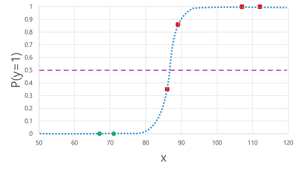
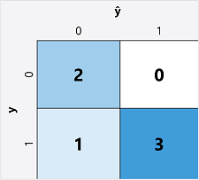
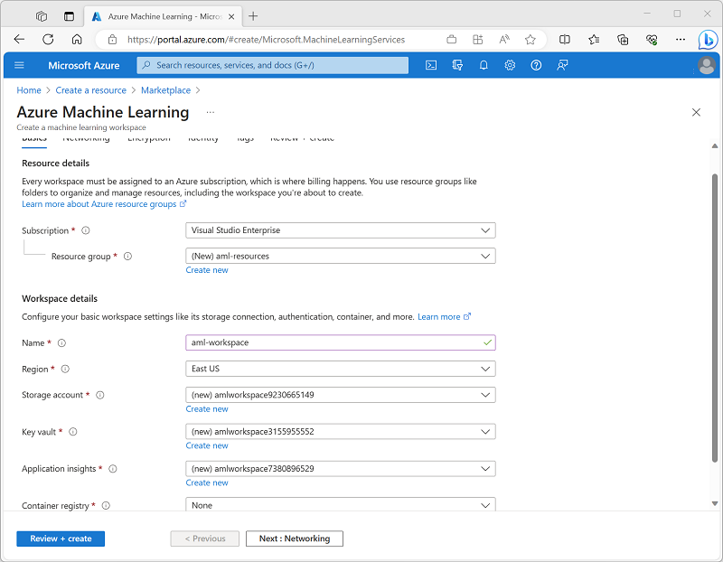

# Fundamentals of ML

## What is ML?
* ML is a technique that uses mathematics and statistics to create a model that can <b>predict unknown values</b>.
* For example, Cycle rental company could use historic data to train a model that predicts daily rental demand in order to make sure sufficient staff and cycles are available.
* To do this, create a ML model that takes information about a specific day (the day of week, weather, ...) as an <b>input (x)</b>, the number of rentals for that day is <b>the label (y)</b>, and predicts the expected number of rentals as an <b>output</b>.The function (f) that calculates the number of rentals based on the information about the day is encapsulated in a machine learning model. <b>f(x) = y (ML models in mathematical terms)</b>.
* Let's explore the steps involved in training and inferencing.
* 
    1. <b>The training data</b> consists of past observations. It contains, <b>the observed attributes or features value (x)</b> and <b>the known value (y)</b> to train a model to predict <b>(known as the label)</b>.
        1. an observation consists of multiple feature values, so x is actually a vector (an array with multiple values), like this: [x1,x2,x3,...].
        1. Exampe 1 - Ice cream sales : predict the number of ice cream sales based on the weather. The weather (x), and the number of ice creams sold on each day (y).
        1. Example 2 - Medical : to predict whether or not a patient is at risk of diabetes based on their clinical measurements. The patient's measurements (x)) and the likelihood of diabetes (y for example, 1 for at risk, 0 for not at risk).
        1. Example 3 - Antarctic research : to predict the species of a penguin based on its physical attributes. The key measurements (x) of the penguin (length of its flippers, width of its bill, and so on) and the species (y) (for example, 0 for Adelie, 1 for Gentoo, or 2 for Chinstrap).
    1. <b>An algorithm</b> is applied to the data to try to determine a relationship between the features and the label.
    1. <b>The result of the algorithm</b> is a model that encapsulates : y = f(x)
    1. <b>Now that the training phase</b> is complete, the trained model can be used for inferencing.

## Types of ML : supervised ML and unsupervised ML
    
1. <b>Supervised ML</b> in which the training data includes both feature values and known label values. Supervised ML is used to train models by determining a relationship between the features and labels in past observations, so that unknown labels can be predicted for features in future cases.
    1. <b>Regression</b> - the label predicted by the model is a numeric value. For example:
        1. <b>The number of ice creams sold</b> on a given day, based on the temperature, rainfall, and windspeed.
        1. <b>The selling price of a property</b> based on its size in square feet, the number of bedrooms it contains, and socio-economic metrics for its location.
        1. <b>The fuel efficiency (in miles-per-gallon) of a car</b> based on its engine size, weight, width, height, and length.
    2. <b>Classification</b> - the label represents a categorization, or class. 
        1. <b>Binary classification</b> - the model predicts a binary true/false or positive/negative prediction for a single possible class. For example:
            1. <b>Whether a patient is at risk</b> for diabetes based on clinical metrics like weight, age, blood glucose level, and so on.
            1. <b>Whether a bank customer will default</b> on a loan based on income, credit history, age, and other factors.
            1. <b>Whether a mailing list customer will respond</b> positively to a marketing offer based on demographic attributes and past purchases.
        1. <b>Multiclass classification</b> extends binary classification to predict a label that represents one of multiple possible classes. For example,
            1. The species of a penguin (Adelie, Gentoo, or Chinstrap) based on its physical measurements. A penguin can't be both a Gentoo and an Adelie. Use some algorithms to train multilabel classification models, in which there may be more than one valid label for a single observation.
            1. The genre of a movie (comedy, horror, romance, adventure, or science fiction) based on its cast, director, and budget. A movie could potentially be categorized as both science fiction and comedy.
2. <b>Unsupervised ML</b> involves training models using data that consists only of feature values <b>without any known labels</b>. Unsupervised ML algorithms determine relationships between the features of the observations in the training data.
    1. <b>Clustering</b> algorithm identifies similarities between observations based on their features, and groups them into discrete clusters. For example:
        1. Group similar flowers based on their size, number of leaves, and number of petals.
        1. Identify groups of similar customers based on demographic attributes and purchasing behavior.

## Regression
* Regression models are trained to predict numeric label values based on training data that includes both features and known labels. 
* 
* The diagram shows four key elements of the training process for supervised ML models:
    1. <b>Split the training data (randomly)</b>.
    1. <b>Use an algorithm (linear regression)</b> to fit the training data to a model.
    1. <b>Use the validation data</b> to test the model by predicting labels for the features.
    1. <b>Compare</b> the known actual labels in the validation dataset to the labels that the model predicted. Then aggregate the differences between the predicted and actual label values to calculate a metric that indicates how accurately the model predicted for the validation data.
* <b>Example</b> - the ice cream sales to predict is the number of ice creams sold that day. 
    | Temperature (x) | Ice cream sales (y) |
    | --------------- | ------------------- |
    | 51 | 1 |
    | 52 | 0 |
    | 67 | 14 |
    | 65 | 14 |
    | 70 | 23 |
    | 69 | 20 |
    | 72 | 23 |
    | 75 | 26 |
    | 73 | 22 |
    | 81 | 30 |
    | 78 | 26 |
    | 83 | 36 |
* <b>Training a regression model</b> - splitting the data and using a subset of it to train a model. Here's the training dataset:
    | Temperature (x) | Ice cream sales (y) |
    | --------------- | ------------------- |
    | 51 | 1 |
    | 65 | 14 |
    | 69 | 20 |
    | 72 | 23 |
    | 75 | 26 |
    | 81 | 30 |
    
    1. Apply an algorithm (linear regression) to our training data
        1. 
    1. Calculate the value of y for a given value of x. The line intercepts the x axis at 50, so when x is 50, y is 0. f(x) = x-50
    1. Use this function to predict the number of ice creams sold on a day with any given temperature. 
    1. For example, suppose the weather forecast tells us that tomorrow it will be 77 degrees. We can apply our model to calculate 77-50 and predict that we'll sell 27 ice creams tomorrow.
* <b>Evaluating a regression model</b> - To validate the model and evaluate how well it predicts, we held back some data for which we know the label (y) value. Here's the data we held back:
    | Temperature (x) | Ice cream sales (y) |
    | -- | -- |
    | 52 | 0 |
    | 67 | 14 |
    | 70 | 23 |
    | 73 | 22 |
    | 78 | 26 |
    | 83 | 36 |
    1. f(x) = x-50, results in the following predictions:
        | Temperature (x) | Actual sales (y) | Predicted sales (ŷ) |
        | - | - | - |
        | 52 | 0 | 2 |
        | 67 | 14 | 17 |
        | 70 | 23 | 20 |
        | 73 | 22 | 23 |
        | 78 | 26 | 28 |
        | 83 | 36 | 22 |
    
* <b>Regression evaluation metrics</b>
    1. <b>Mean Absolute Error (MAE)</b>: The average difference between predicted values and true values. The mean (average) of the absolute errors (2, 3, 3, 1, 2, and 3) is 2.33. The lower this value is, the better the model is predicting.
    1. <b>Mean Squared Error (RMSE)</b>: which are 4, 9, 9, 1, 4, and 9 => 6.
    1. <b>Root Mean Squared Error (RMSE)</b>: In this case √6, which is 2.45 (ice creams). Compared to the MAE, a larger difference indicates greater variance in the individual errors (for example, with some errors being very small, while others are large).
    1. <b>Coefficient of Determination (R2)</b>: This metric is more commonly referred to as R-Squared, and summarizes how much of the variance between predicted and true values is explained by the model. The closer to 1 this value is, the better the model is performing. R2 = 1- ∑(y-ŷ)2 ÷ ∑(y-ȳ)2            

## Binary classification
* Like regression, follows the same iterative process of training, validating, and evaluating models. 
* the algorithms used to train classification models calculate probability values (true or false, 1 or 0) for class or category assignment and the evaluation metrics used to assess model performance compare the predicted classes to the actual classes.
* <b>Example</b> - Use the blood glucose level of a patient to predict whether or not the patient has diabetes.
    | Blood glucose (x) | Diabetic? (y) | 
    | ----------------- | ------------- |
    | 67 | 0 |
    | 103 | 1 |
    | 114 | 1 |
    | 72 | 0 |
    | 116 |	1 |
    | 65 | 0 |
* <b>Training</b> - calculates the probability of the class label being true (diabetes). Probability is measured as a value between 0.0 and 1.0, such that the total probability for all possible classes is 1.0. So for example, if the probability of a patient having diabetes is 0.7, then there's a corresponding probability of 0.3 that the patient isn't diabetic.
    1. There are <b>many algorithms</b> that can be used for binary classification, such as <b>logistic regression</b>, which derives a <b>sigmoid (S-shaped)</b> function with values between 0.0 and 1.0, like this:
    
    1. the probability of y being true (y=1) for a given value of x : f(x) = P(y=1 | x)
    1. 3 observations in the training data is true, y=1 is 1.0. Other hand, y is false, so the probability that y=1 is 0.0. 
    1. The S-shaped curve describes the probability distribution so that plotting a value of x on the line identifies the corresponding probability that y is 1.
* <b>Evaluating</b> - a random subset of data with which to validate the trained model:
    | Blood glucose (x) | Diabetic? (y) |
    | ----------------- | ------------- |
    | 66 | 0 |
    | 107 | 1 |
    | 112 | 1 |
    | 71 | 0 |
    | 87 | 1
    | 89 | 1 |
    
    1. compare the predicted class labels (ŷ) to the actual class labels (y), as shown here:
        | Blood glucose (x)|	Actual diabetes diagnosis (y)|	Predicted diabetes diagnosis (ŷ)|
        |--|--|--| 
        | 66|	0|	0|
        | 107|	1|	1|
        | 112|	1|	1|
        | 71|	0|	0|
        | 87|	1|	0|
        | 89|	1|	1|
* <b>Binary classification evaluation metrics</b> - create a matrix of the number of correct and incorrect predictions for each possible class label:
    1. 
    1. This visualization is called a <b>confusion matrix</b>, and it shows the prediction totals where:
        ŷ=0 and y=0: True negatives (TN)
        ŷ=1 and y=0: False positives (FP)
        ŷ=0 and y=1: False negatives (FN)
        ŷ=1 and y=1: True positives (TP)
    1. <b>Accuracy</b> - The simplest metric you can calculate from the confusion matrix is accuracy - the proportion of predictions that the model got right. Accuracy is calculated as: (TN+TP) ÷ (TN+FN+FP+TP)
        1. the calculation is: (2+3) ÷ (2+1+0+3) = 5 ÷ 6 = 0.83
        1. So for our validation data, the diabetes classification model produced correct predictions 83% of the time.
    1. <b>Recall</b> - is a metric that measures the proportion of positive cases that the model identified correctly. In other words, compared to the number of patients who have diabetes, how many did the model predict to have diabetes?
        1. The formula for recall is: TP ÷ (TP+FN) -> 3 ÷ (3+1) => = 0.75
        1. So our model correctly identified 75% of patients who have diabetes as having diabetes.
    1. <b>Precision</b> - is a similar metric to recall, but measures the proportion of predicted positive cases where the true label is actually positive. In other words, what proportion of the patients predicted by the model to have diabetes actually have diabetes?
        1. The formula for precision is: TP ÷ (TP+FP) => 3 ÷ (3+0) = 1.0
        1. So 100% of the patients predicted by our model to have diabetes do in fact have diabetes.
    1. <b>F1-score</b> - is an overall metric that combined recall and precision. The formula for F1-score is: (2 x Precision x Recall) ÷ (Precision + Recall) => (2 x 1.0 x 0.75) ÷ (1.0 + 0.75) => = 0.86

* <b>Area Under the Curve (AUC)</b> - <b>Another name for recall</b> is the true positive rate (TPR), and there's an equivalent metric called the false positive rate (FPR) that is calculated as FP÷(FP+TN). 


## Multiclass classification
* Predict to which of multiple possible classes an observation belongs.
* <b>Example</b> - Calculate probability values for multiple class labels, enabling a model to predict the most probable class for a given observation.
    1. some observations of penguins, in which the flipper length (x) of each penguin is recorded. For each observation, the data includes the penguin species (y), which is encoded as follows: 0: Adelie, 1: Gentoo, 2: Chinstrap
        | Flipper length (x) | Species (y) |
        | -- | -- |
        | 167 | 0 |
        | 172 | 0 |
        | 225 | 2 |
        | 197 | 1 |
        | 189 | 1 |
        | 232 | 2 |
        | 158 | 0 |

* <b>Training</b> - calculates a probability value for each possible class. There are <b>two kinds of algorithm</b> you can use to do this:
    1. One-vs-Rest (OvR) algorithms
    2. Multinomial algorithms

* <b>One-vs-Rest (OvR) algorithms</b>
    1. train a binary classification function for each class, each calculating the probability that the observation is an example of the target class. 
    1. Each function calculates the probability of the observation being a specific class compared to any other class. 
    1. For our penguin species classification model, the algorithm would essentially create three binary classification functions:
        1. f0(x) = P(y=0 | x)
        1. f1(x) = P(y=1 | x)
        1. f2(x) = P(y=2 | x)
    1. Each algorithm produces a sigmoid function that calculates a probability value between 0.0 and 1.0. 
    1. A model trained using this kind of algorithm predicts the class for the function that produces the highest probability output.

* <b>Multinomial algorithms</b>
    1. which creates a single function that returns a multi-valued output. 
    1. The output is a vector (an array of values) that contains the probability distribution for all possible classes - with a probability score for each class which when totaled add up to 1.0: f(x) =[P(y=0|x), P(y=1|x), P(y=2|x)]
    1. An example of this kind of function is a softmax function, which could produce an output like the following example: [0.2, 0.3, 0.5]
    1. The elements in the vector represent the probabilities for classes 0, 1, and 2 respectively; so in this case, the class with the highest probability is 2.

* <b>Evaluating</b> - calculate aggregate metrics that take all classes into account.
    1. Let's assume that we've validated our multiclass classifier, and obtained the following results:
        | Flipper length (x)	| Actual species (y)	| Predicted species (ŷ) |
        | -- | -- | --|
        | 165	| 0	| 0 |
        | 171	| 0	| 0 |
        | 205	| 2	| 1 |
        | 195	| 1	| 1 |
        | 183	| 1	| 1 |
        | 221	| 2	| 2 |
        | 214	| 2	| 2 |
    1. The <b>confusion matrix</b> for a multiclass classifier is similar to that of a binary classifier, except that it shows the number of predictions for each combination of predicted (ŷ) and actual class labels (y):
        1. 
    1. From this confusion matrix, we can determine the metrics for each individual class as follows:
        | Class	| TP | TN | FP	| FN | Accuracy	| Recall | Precision | F1-Score |
        | --	| -- | -- | --	| -- | --	| -- | -- | -- |
        | 0	| 2	| 5	| 0	| 0	| 1.0 | 1.0 | 1.0 | 1.0 | 
        | 1	| 2	| 4	| 1	| 0	| 0.86 | 1.0 | 0.67 | 0.8 | 
        | 2	| 2	| 4	| 0	| 1	| 0.86| 0.67 | 1.0	| 0.8 | 
    1. To calculate the overall accuracy, recall, and precision metrics, you use the total of the TP, TN, FP, and FN metrics:
        1. Overall accuracy = (13+6)÷(13+6+1+1) = 0.90
        1. Overall recall = 6÷(6+1) = 0.86
        1. Overall precision = 6÷(6+1) = 0.86
    1. The overall F1-score is calculated using the overall recall and precision metrics: Overall F1-score = (2x0.86x0.86)÷(0.86+0.86) = 0.86

## Clustering
* Observations are grouped into clusters based on similarities in their data values, or features. 
* It doesn't make use of previously known label values to train a model. 
* In a clustering model, the label is the cluster to which the observation is assigned, based only on its features.
* <b>Example</b> - A botanist observes a sample of flowers and records the number of leaves and petals on each flower:
    1. 
    1. There are no known labels in the dataset, just two features.
    1. The goal is not to identify the different types (species) of flower; just to group similar flowers together based on the number of leaves and petals.
        |Leaves (x1)	|Petals (x2)|
        |--|--|
        |0	|5|
        |0	|6|
        |1	|3|
        |1	|3|
        |1	|6|
        |1	|8|
        |2	|3|
        |2	|7|
        |2	|8|
* <b>Training</b>  - There are <b>multiple algorithms</b> you can use for clustering. One of the most commonly used algorithms is <b>K-Means clustering</b>, which consists of the following steps:
    1. The feature (x) values are vectorized to define n-dimensional coordinates (where n is the number of features). 
        1. In the flower example, we have two features: number of leaves (x1) and number of petals (x2). So, the feature vector has two coordinates that we can use to conceptually plot the data points in two-dimensional space ([x1,x2])
    1. You decide how many clusters you want to use to group the flowers - call this value k. 
        1. For example, to create three clusters, you would use a k value of 3. Then k points are plotted at random coordinates. These points become the center points for each cluster, so they're called <b>centroids</b>.
    1. Each data point (in this case a flower) is assigned to its nearest centroid.
    1. Each centroid is moved to the center of the data points assigned to it based on the mean distance between the points.
    1. After the centroid is moved, the data points may now be closer to a different centroid, so the data points are reassigned to clusters based on the new closest centroid.
    1. The centroid movement and cluster reallocation steps are repeated until the clusters become stable or a predetermined maximum number of iterations is reached.
    1. The following animation shows this process:
    1. 

* <b>Evaluating</b> - No known label,  it's <b>separated from one another</b>. There are <b>multiple metrics</b> that you can use to evaluate cluster separation, including:
    1. <b>Average distance to cluster center:</b> How close, on average, each point in the cluster is to the centroid of the cluster.
    1. <b>Average distance to other center:</b> How close, on average, each point in the cluster is to the centroid of all other clusters.
    1. <b>Maximum distance to cluster center:</b> The furthest distance between a point in the cluster and its centroid.
    1. <b>Silhouette:</b> A value between -1 and 1 that summarizes the ratio of distance between points in the same cluster and points in different clusters (The closer to 1, the better the cluster separation).Predict to which of multiple possible classes an observation belongs.


### Deep learning
* Deep learning is an advanced form of ML that tries to emulate the way the human brain learns. 
* The key to deep learning is the creation of an <b>artificial neural network</b> that simulates electrochemical activity in biological neurons by using mathematical functions, as shown here.
    |Biological neural network	|Artificial neural network|
    |--|--|
    |	||
    |Neurons fire in response to electrochemical stimuli. When fired, the signal is passed to connected neurons.	|Each neuron is a function that operates on an input value (x) and a weight (w). The function is wrapped in an activation function that determines whether to pass the output on.

* <b>Artificial neural networks</b> are made up of multiple layers of <b>neurons</b> - essentially defining a deeply nested function. This architecture is the reason the technique is referred to as deep learning and the models produced by it are often referred to as <b>deep neural networks (DNNs)</b>. You can use deep neural networks for many kinds of machine learning problem, including regression and classification, as well as more specialized models for natural language processing and computer vision.

* <b>Example</b> - define a classification model for penguin species.
Diagram of a neural network used to classify a penguin species.
    1. 
    1. The feature data (x) consists of some measurements of a penguin. Specifically, the measurements are:
        1. The length of the penguin's bill.
        1. The depth of the penguin's bill.
        1. The length of the penguin's flippers.
        1. The penguin's weight.
    1. In this case, x is a vector of four values, or mathematically, x=[x1,x2,x3,x4].
    1. The label we're trying to predict (y) is the species of the penguin, and that there are three possible species it could be: Adelie, Gentoo, Chinstrap
    1. This is an <b>example of a classification problem</b>, in which the ML model must predict the most probable class to which an observation belongs. 
    1. A classification model accomplishes this by predicting a label that consists of the probability for each class. In other words, y is a vector of three probability values; one for each of the possible classes: [P(y=0|x), P(y=1|x), P(y=2|x)].
    1. The process for inferencing a predicted penguin class using this network is:
        1. <b>The feature vector</b> for a penguin observation is fed into the input layer of the neural network, which consists of a neuron for each x value. In this example, the following x vector is used as the input: [37.3, 16.8, 19.2, 30.0]
        1. <b>The functions</b> for the first layer of neurons each calculate a weighted sum by combining the x value and w weight, and pass it to an activation function that determines if it meets the threshold to be passed on to the next layer.
        1. <b>Each neuron</b> in a layer is connected to all of the neurons in the next layer (an architecture sometimes called a fully connected network) so the results of each layer are fed forward through the network until they reach the output layer.
        1. <b>The output layer</b> produces a vector of values; in this case, using a softmax or similar function to calculate the probability distribution for the three possible classes of penguin. In this example, the output vector is: [0.2, 0.7, 0.1]
        1. <b>The elements</b> of the vector represent the probabilities for classes 0, 1, and 2. The second value is the highest, so the model predicts that the species of the penguin is 1 (Gentoo).
* <b>How does a neural network learn?</b>
    1. The weights in a neural network are central to how it calculates predicted values for labels. 
    1. During the training process, the model learns the weights that will result in the most accurate predictions. 
    1. Let's explore the training process in a little more detail to understand how this learning takes place.
    1. 
        1. The training and validation datasets are defined, and the training features are fed into the input layer.
        1. The neurons in each layer of the network apply their weights (which are initially assigned randomly) and feed the data through the network.
        1. The output layer produces a vector containing the calculated values for ŷ. For example, an output for a penguin class prediction might be [0.3. 0.1. 0.6].
        1. <b>A loss function</b> is used to compare the predicted ŷ values to the known y values and aggregate the difference (which is known as the loss). For example, if the known class for the case that returned the output in the previous step is Chinstrap, then the y value should be [0.0, 0.0, 1.0]. The absolute difference between this and the ŷ vector is [0.3, 0.1, 0.4]. In reality, the loss function calculates the aggregate variance for multiple cases and summarizes it as a single loss value.
        1. Since the entire network is essentially one large nested function, an optimization function can use differential calculus to evaluate the influence of each weight in the network on the loss, and determine how they could be adjusted (up or down) to reduce the amount of overall loss. The specific optimization technique can vary, but usually involves a gradient descent approach in which each weight is increased or decreased to minimize the loss.
        1. The changes to the weights are backpropagated to the layers in the network, replacing the previously used values.
        1. The process is <b>repeated over multiple iterations (known as epochs)</b> until the loss is minimized and the model predicts acceptably accurately.

### Azure Machine Learning
* MS Azure ML is a cloud service for training, deploying, and managing ML models. 
Manage the end-to-end lifecycle of machine learning projects, including:
    1. Exploring data and preparing it for modeling.
    1. Training and evaluating machine learning models.
    1. Registering and managing trained models.
    1. Deploying trained models for use by applications and services.
    1. Reviewing and applying responsible AI principles and practices.
* <b>Features and capabilities</b> of Azure Machine Learning
    1. Centralized storage and management of datasets for model training and evaluation.
    1. On-demand compute resources on which you can run machine learning jobs, such as training a model.
    1. Automated machine learning (AutoML), which makes it easy to run multiple training jobs with different algorithms and parameters to find the best model for your data.
    1. Visual tools to define orchestrated pipelines for processes such as model training or inferencing.
    1. Integration with common machine learning frameworks such as MLflow, which make it easier to manage model training, evaluation, and deployment at scale.
    1. Built-in support for visualizing and evaluating metrics for responsible AI, including model explainability, fairness assessment, and others.

* <b>Provisioning</b> Azure Machine Learning resources
    1. The primary resource required for Azure ML is an <b>Azure ML workspace</b>, which you can <b>provision</b> in an Azure <b>subscription</b>.
    1.  Crreate a <b>Azure Machine Learning workspace</b>. use Azure portal
        1.  
* <b>Azure Machine Learning studio</b>
    1. After you've provisioned, use the studio.
    1. In Azure Machine Learning studio, you can (among other things):
        1. Import and explore data.
        1. Create and use compute resources.
        1. Run code in notebooks.
        1. Use visual tools to create jobs and pipelines.
        1. Use automated machine learning to train models.
        1. View details of trained models, including evaluation metrics, responsible AI information, and training parameters.
        1. Deploy trained models for on-request and batch inferencing.
        1. Import and manage models from a comprehensive model catalog.
        1. 
        1. The screenshot shows the Metrics page for a trained model in studio, see the evaluation metrics for a trained multiclass classification model.
        1. 

### Exercise - Use Azure Machine Learning to train a model
* Explore the automated machine learning capability in Azure ML, and use it to train and evaluate a machine learning model.
* Create an Azure Machine Learning workspace
    1. Azure Portal -> Create Resource -> new Azure Machine Learning -> Create 
    1. Select <b>Launch Studio</b> (open new browser https://ml.azure.com) -> Sign -> See newly created workspace (if not, select <b>All workspaces</b>)
* Enable preview features
    1. Some features of Azure Machine Learning are in preview, and need to be explicitly enabled in your workspace
    1. Studio -> Manage preview features -> Enable -> "Guided experience for submitting training jobs with serverless compute" features
        1.       
        1. 
* Use automated machine learning to train a model
    1. Automated ML enables you to try multiple algorithms and parameters to train multiple models, and identify the best one for your data. 
    1. Use a dataset of historical bicycle rental details to train a model that predicts the number of bicycle rentals that should be expected on a given day, based on seasonal and meteorological features. (https://capitalbikeshare.com/system-data)
    1. Studio -> Automated ML page (under Authoring) > New Automated ML job
        1. 
        1. <b>Basic settings</b> -> Job name: mslearn-bike-automl, New experiment name: mslearn-bike-rental
        1.  
        1. <b>Task type & data</b> -> Select task type: Regression, <b>Select dataset:</b> Create -> Name: bike-rentals, Type: Tabular, Web URL: https://aka.ms/bike-rentals, Column headers: Only first file has headers, Review
        1. Select the bike-rentals dataset after you’ve created it.
        1. <b>Task settings</b> -> 
            1. Target column: Rentals (integer)
            1. <b>Additional configuration settings:</b> Explain best model: Unselected, Use all supported models: Unselected. Allowed models: Select only RandomForest and LightGBM, 
            1. <b>Limits:</b> Max trials: 3, Max concurrent trials: 3, Max nodes: 3, Metric score threshold: 0.85, Timeout: 15, Iteration timeout: 5, Enable early termination: Selected
            1. <b>Validation and test:</b> Validation type: Train-validation split
        1.      
        1. <b>Compute:</b> -> <b>Submit</b> the training job. It starts automatically -> <b>Wait</b> for the job to finish. 
        1. 
    
    1. Deploy and test the model -> select Deploy and use the Web service option: Name: predict-rentals, Compute type: Azure Container Instance, Enable authentication: Selected -> Deploy -> Wait for the Deploy status to change to Succeeded. This may take 5-10 minutes.
    
    1. Test the deployed service
        1. Endpoints -> predict-rentals -> Test -> Input
        ```
            {
            "Inputs": { 
                "data": [
                {
                    "day": 1,
                    "mnth": 1,   
                    "year": 2022,
                    "season": 2,
                    "holiday": 0,
                    "weekday": 1,
                    "workingday": 1,
                    "weathersit": 2, 
                    "temp": 0.3, 
                    "atemp": 0.3,
                    "hum": 0.3,
                    "windspeed": 0.3 
                }
                ]    
            },   
            "GlobalParameters": 1.0
            }
        ```    
        1. Result
        ```
            {
            "Results": [
                444.27799000000000
            ]
            }
        ```   

### Knowledge check
1. You want to create a model to predict the cost of heating an office building based on its size in square feet and the number of employees working there. What kind of machine learning problem is this? 
    * [x] Regression
    * [ ] Classification
    * [ ] Clustering

2. You need to evaluate a classification model. Which metric can you use? 
    * [ ] Mean squared error (MSE)
    * [x] Precision
    * [ ] Silhouette

3. In deep learning, what is the purpose of a loss function? 
    * [ ] To remove data for which no known label values are provided
    * [x] To evaluate the aggregate difference between predicted and actual label values
    * [ ] To calculate the cost of training a neural network rather than a statistical model

4. What does automated machine learning in Azure Machine Learning enable you to do? 
    * [ ] Automatically deploy new versions of a model as they're trained
    * [ ] Automatically provision Azure Machine Learning workspaces for new data scientists in an organization
    * [x] Automatically run multiple training jobs using different algorithms and parameters to find the best model
