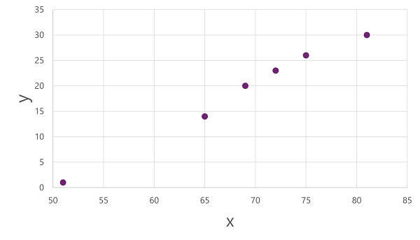
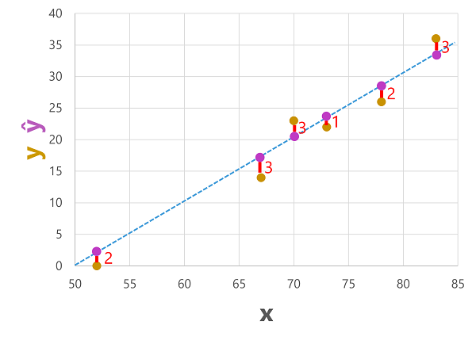

# Regression

* Regression models are trained to predict numeric label values based on training data that includes both features and known labels. 
* 
* The diagram shows four key elements of the training process for supervised ML models:
    1. Split the training data (randomly) to create a dataset with which to train the model while holding back a subset of the data that you'll use to validate the trained model.
    1. Use an algorithm to fit the training data to a model. Use a regression algorithm such as linear regression.
    1. Use the validation data you held back to test the model by predicting labels for the features.
    1. Compare the known actual labels in the validation dataset to the labels that the model predicted. Then aggregate the differences between the predicted and actual label values to calculate a metric that indicates how accurately the model predicted for the validation data.
* Example - regression
    1. the ice cream sales scenario to predict is the number of ice creams sold that day. 

            | Temperature (x) | Ice cream sales (y) |
            | --------------- | ------------------- |
            | 51              | 1 |
            | 52 | 0 |
            | 67 | 14 |
            | 65 | 14 |
            | 70 | 23 |
            | 69 | 20 |
            | 72 | 23 |
            | 75 | 26 |
            | 73 | 22 |
            | 81 | 30 |
            | 78 | 26 |
            | 83 | 36 |
    1. Training a regression model - splitting the data and using a subset of it to train a model. Here's the training dataset:

            | Temperature (x) | Ice cream sales (y) |
            | --------------- | ------------------- |
            | 51 | 1 |
            | 65 | 14 |
            | 69 | 20 |
            | 72 | 23 |
            | 75 | 26 |
            | 81 | 30 |
        
        1. Apply an algorithm (linear regression) to our training data
            
        1. Calculate the value of y for a given value of x. The line intercepts the x axis at 50, so when x is 50, y is 0. f(x) = x-50
        1. Use this function to predict the number of ice creams sold on a day with any given temperature. 
        1. For example, suppose the weather forecast tells us that tomorrow it will be 77 degrees. We can apply our model to calculate 77-50 and predict that we'll sell 27 ice creams tomorrow.
    1. Evaluating a regression model - To validate the model and evaluate how well it predicts, we held back some data for which we know the label (y) value. Here's the data we held back:

            | Temperature (x) | Ice cream sales (y) |
            | -- | -- |
            | 52 | 0 |
            | 67 | 14 |
            | 70 | 23 |
            | 73 | 22 |
            | 78 | 26 |
            | 83 | 36 |
        1. use the model to predict the label for each of the observations in this dataset based on the feature (x) value; and then compare the predicted label (ŷ) to the known actual label value (y).
        1. Using the model we trained earlier, which encapsulates the function f(x) = x-50, results in the following predictions:
           
            | Temperature (x) | Actual sales (y) | Predicted sales (ŷ) |
            | - | - | - |
            | 52 | 0 | 2 |
            | 67 | 14 | 17 |
            | 70 | 23 | 20 |
            | 73 | 22 | 23 |
            | 78 | 26 | 28 |
            | 83 | 36 | 22 |
            
* Regression evaluation metrics
    1. <b>Mean Absolute Error (MAE)</b>: The average difference between predicted values and true values. The mean (average) of the absolute errors (2, 3, 3, 1, 2, and 3) is 2.33. The lower this value is, the better the model is predicting.
    1. <b>Mean Squared Error (RMSE)</b>: The mean of the squared absolute values (which are 4, 9, 9, 1, 4, and 9) is 6..
    1. <b>Root Mean Squared Error (RMSE)</b>: In this case √6, which is 2.45 (ice creams). Compared to the MAE, a larger difference indicates greater variance in the individual errors (for example, with some errors being very small, while others are large).
    1. <b>Coefficient of Determination (R2)</b>: This metric is more commonly referred to as R-Squared, and summarizes how much of the variance between predicted and true values is explained by the model. The closer to 1 this value is, the better the model is performing. R2 = 1- ∑(y-ŷ)2 ÷ ∑(y-ȳ)2