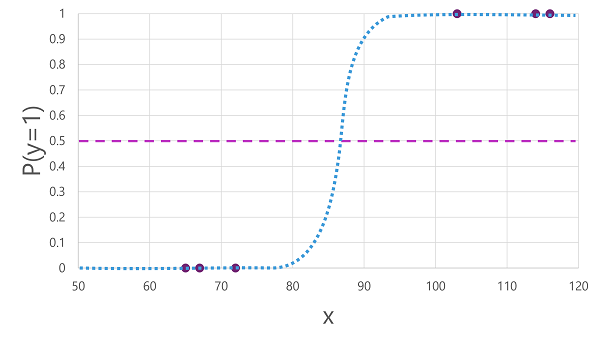
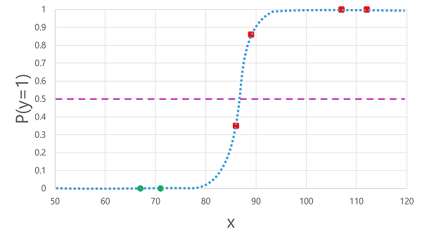
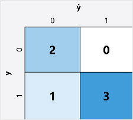

# Binary classification

* Like regression, follows the same iterative process of training, validating, and evaluating models. 
* the algorithms used to train classification models calculate probability values for class or category assignment and the evaluation metrics used to assess model performance compare the predicted classes to the actual classes.

* Binary classification algorithms are used to train a model that predicts one of two (true or false, 1 or 0) possible labels for a single class.

* Example - binary classification
    1. Use the blood glucose level of a patient to predict whether or not the patient has diabetes.
        | Blood glucose (x) | Diabetic? (y) | 
        | ----------------- | ------------- |
        | 67 | 0 |
        | 103 | 1 |
        | 114 | 1 |
        | 72 | 0 |
        | 116 |	1 |
        | 65 | 0 |
    1. Training a binary classification model - calculates the probability of the class label being true (diabetes). Probability is measured as a value between 0.0 and 1.0, such that the total probability for all possible classes is 1.0. So for example, if the probability of a patient having diabetes is 0.7, then there's a corresponding probability of 0.3 that the patient isn't diabetic.
        1. There are many algorithms that can be used for binary classification, such as logistic regression, which derives a sigmoid (S-shaped) function with values between 0.0 and 1.0, like this:
            
        1. the probability of y being true (y=1) for a given value of x : f(x) = P(y=1 | x)
        1. 3/6 observations in the training data, so y is definitely true, y=1 is 1.0. Other hand, y is definitely false, so the probability that y=1 is 0.0. The S-shaped curve describes the probability distribution so that plotting a value of x on the line identifies the corresponding probability that y is 1.
    1. Evaluating a binary classification model - a random subset of data with which to validate the trained model:
        | Blood glucose (x) | Diabetic? (y) |
        | ----------------- | ------------- |
        | 66 | 0 |
        | 107 | 1 |
        | 112 | 1 |
        | 71 | 0 |
        | 87 | 1
        | 89 | 1 |
        
        1. compare the predicted class labels (ŷ) to the actual class labels (y), as shown here:
            | Blood glucose (x)|	Actual diabetes diagnosis (y)|	Predicted diabetes diagnosis (ŷ)|
            |--|--|--| 
            | 66|	0|	0|
            | 107|	1|	1|
            | 112|	1|	1|
            | 71|	0|	0|
            | 87|	1|	0|
            | 89|	1|	1|
1. Binary classification evaluation metrics - create a matrix of the number of correct and incorrect predictions for each possible class label:
    
    1. This visualization is called a confusion matrix, and it shows the prediction totals where:
        ŷ=0 and y=0: True negatives (TN)
        ŷ=1 and y=0: False positives (FP)
        ŷ=0 and y=1: False negatives (FN)
        ŷ=1 and y=1: True positives (TP)

    1. Accuracy - The simplest metric you can calculate from the confusion matrix is accuracy - the proportion of predictions that the model got right. Accuracy is calculated as: (TN+TP) ÷ (TN+FN+FP+TP)
        1. In the case of our diabetes example, the calculation is: (2+3) ÷ (2+1+0+3) = 5 ÷ 6 = 0.83
        1. So for our validation data, the diabetes classification model produced correct predictions 83% of the time.
    1. Recall - is a metric that measures the proportion of positive cases that the model identified correctly. In other words, compared to the number of patients who have diabetes, how many did the model predict to have diabetes?
        1. The formula for recall is: TP ÷ (TP+FN) -> 3 ÷ (3+1) => = 0.75
        1. So our model correctly identified 75% of patients who have diabetes as having diabetes.
    1. Precision - is a similar metric to recall, but measures the proportion of predicted positive cases where the true label is actually positive. In other words, what proportion of the patients predicted by the model to have diabetes actually have diabetes?
        1. The formula for precision is: TP ÷ (TP+FP) => 3 ÷ (3+0) = 1.0
        1. So 100% of the patients predicted by our model to have diabetes do in fact have diabetes.
    1. F1-score - is an overall metric that combined recall and precision. The formula for F1-score is: (2 x Precision x Recall) ÷ (Precision + Recall) => (2 x 1.0 x 0.75) ÷ (1.0 + 0.75) => = 0.86

1. Area Under the Curve (AUC) - Another name for recall is the true positive rate (TPR), and there's an equivalent metric called the false positive rate (FPR) that is calculated as FP÷(FP+TN). 