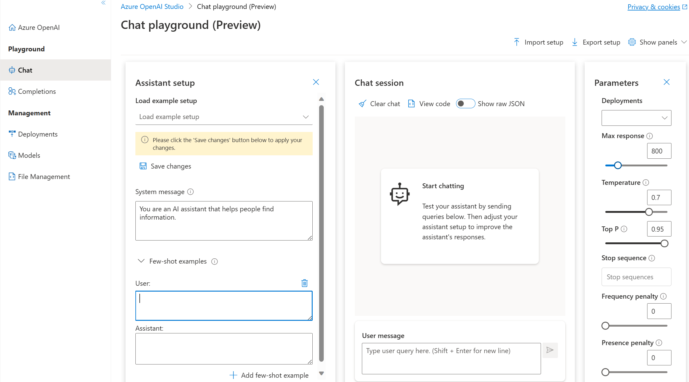

# Introduction to Azure OpenAI Service

* <b>OpenAI</b> created a chatbot known as <b>ChatGPT</b> and an image generation application known as <b>DALL-E</b>. These technologies were built with AI models which can take natural language input from a user and return a machine-created human-like response.
* <b>Azure OpenAI Service</b> enables users to build enterprise-grade solutions with OpenAI models. With Azure OpenAI, users can summarize text, get code suggestions, generate images for a web site, and much more. 
* Capabilities of OpenAI AI models
    1. <b>Generating natural language</b> - summarizing complex text for different reading levels, suggesting alternative wording for sentences, ...
    2. <b>Generating code</b> - translating code from one programming language into another, identifying and troubleshooting bugs in code, ...
    3. <b>Generating images</b> - generating images for publications from text descriptions, ...

# What is generative AI
* identify where OpenAI models fit into the AI landscape.
    1. <b>AI</b> imitates human behavior by relying on machines to learn and execute tasks without explicit directions on what to output.
    2. <b>ML</b> models take in data like weather conditions and fit the data to an algorithm, to make predictions like how much money a store might make in a given day.
    3. <b>DL</b> models use layers of algorithms in the form of artificial NN to return results for more complex use cases. Many Azure AI services are built on DL models. https://learn.microsoft.com/en-us/azure/machine-learning/concept-deep-learning-vs-machine-learning?view=azureml-api-2
    4. <b>Generative AI</b> models can produce new content based on what is described in the input. The OpenAI models are a collection of generative AI models that can produce language, code, and images.

# Describe Azure OpenAI
* Azure OpenAI Service combines Azure's enterprise-grade capabilities with OpenAI's generative AI model capabilities.
* Azure OpenAI is available for Azure users and consists of four components:
    1. Pre-trained generative AI models
    2. Customization capabilities; the ability to fine-tune AI models with your own data
    3. Built-in tools to detect and mitigate harmful use cases so users can implement AI responsibly
    4. Enterprise-grade security with role-based access control (RBAC) and private networks

* Understand Azure OpenAI workloads
    1. Azure OpenAI supports many common AI workloads include ML, computer vision, NLP, conversational AI, anomaly detection, and knowledge mining.
    2. Other AI workloads Azure OpenAI supports can be categorized by tasks they support:
        1. Generating Natural Language
            1. Text completion: generate and edit text
            2. Embeddings: search, classify, and compare text
        2. Generating Code: generate, edit, and explain code
        3. Generating Images: generate and edit images

* Azure OpenAI's relationship to Azure AI services
 

* Azure's AI services are tools for solving AI workloads and can be categorized into <b>three groupings: Azure's ML platform, Cognitive Services, and Applied AI Services</b>.
* Azure Cognitive Services has five pillars: <b>vision, speech, language, decision, and the Azure OpenAI Service</b>. 

# How to use Azure OpenAI
* <a href="https://customervoice.microsoft.com/Pages/ResponsePage.aspx?id=v4j5cvGGr0GRqy180BHbR7en2Ais5pxKtso_Pz4b1_xUOFA5Qk1UWDRBMjg0WFhPMkIzTzhKQ1dWNyQlQCN0PWcu">Apply for access to Azure OpenAI</a>.  Once granted access, you can use the service like other Azure services.

* <b>Azure OpenAI Studio</b>

    * In the Azure OpenAI Studio, you can build AI models and deploy them for public consumption in software applications. 
    * Azure OpenAI's capabilities are made possible by specific generative AI models. 
    * These Azure OpenAI models fall into a few main families: <b>GPT-4, GPT-3, Codex, Embeddings, DALL-E</b>
    * In the <b>Completions playground</b>, you can type in prompts, configure parameters, and see responses without having to code.
 
    * In the <b>Chat playground</b>, you can use the assistant setup to instruct the model about how it should behave. The assistant will try to mimic the responses you include in tone, rules, and format you've defined in your system message.

# Understand OpenAI's natural language capabilities
* Azure OpenAI's natural language models are able to take in natural language and generate responses.
* <b>Natural language learning models</b> are trained on words or chunks of characters known as <b>tokens</b>. For example, the word "hamburger" gets broken up into the tokens <b>ham, bur, and ger</b>, while a short and common word like "pear" is a single token. These tokens are mapped into vectors for a machine learning model to use for training. When a trained natural language model takes in a user's input, it also breaks down the input into tokens.

# Understanding GPT models for natural language generation
* <b>Generative pre-trained transformer (GPT)</b> models are excellent at both understanding and creating natural language. 
* OpenAI's generative AI takes an input, or prompt, to return a natural language, visual, or code response.
* GPT models are great at completing several natural language tasks, some of which include:
    1. Summarizing text	- "Summarize this text into a short blurb"
    2. Classifying text	- "What genre of book is this?"
    3. Generating names or phrases	- "Write a tagline for my flower company"
    4. Translation	- "Translate 'How are you' to French"
    5. Answering questions	- "What does Azure OpenAI do?"
    6. Suggesting content - 	"Give me the five best weddings songs"

* For example, given a prompt where the user types in text asking for a cooking recipe:
* Write a recipe based on these ingredients and instructions:
    * Fruit Pie
    * Ingredients:
    * Strawberries
    * Blueberries
    * Flour
    * Eggs
    * Milk
* Here's an example of the OpenAI API generated response:
* Instructions:
    1. Preheat your oven to 350 degrees Fahrenheit.
    2. In a medium bowl, mix together 1 cup of flour and 1 egg until it forms a dough.
    3. Grease a 9-inch pie dish with butter or non-stick cooking spray.
    4. Roll out the dough and place it in the pie dish.
    5. In a separate bowl, mix together 1 cup of strawberries, 1 cup of blueberries, and 1 cup of milk.
    6. Pour the fruit mixture into the pie dish.
    7. Bake

# Understand OpenAI code generation capabilities
* Code generation AI models are able to take natural language or code snippets and translate them into code. The OpenAI code generation model family, <b>Codex</b>, is proficient in over a dozen languages, such as C#, JavaScript, Perl, PHP, and is most capable in Python.
* <b>Codex</b> models have been trained on both natural language and billions of lines of code from public repositories. 
* Codex is able to generate code from natural language instructions such as code comments, and can suggest ways to complete code functions.
* For example, given the prompt "Write a for loop counting from 1 to 10 in Python," the following answer is provided:
    * Python
    * for i in range(1,11):
    *     print(i)
* Examples of code generation
    * Given the following code, it can generate unit tests:
        * def mult_numbers(a, b):
            *   return a * b

    * Codex builds out unit tests for our function:
        * def test_mult_numbers():
            *   assert mult_numbers(3, 4) == 12
            *   assert mult_numbers(0, 10) == 0
            *   assert mult_numbers(4, 0) == 0

        * def test_mult_numbers_negative():
            *   assert mult_numbers(-1, 10) == -10
            *   assert mult_numbers(10, -1) == -10

* Codex can also summarize functions that are already written, explain SQL queries or tables, and convert a function from one programming language into another.

* <b>GitHub Copilot</b>
    * OpenAI partnered with GitHub to create GitHub Copilot, which they call an AI pair programmer. 
    * GitHub Copilot integrates the power of OpenAI Codex into a plugin for developer environments like Visual Studio Code.
    * Once the plugin is installed and enabled, you can start writing your code, and GitHub Copilot starts automatically suggesting the remainder of the function based on code comments or the function name. For example, we have only a function name in the file, and the gray text is automatically suggested to complete it.
    * 
    * GitHub Copilot offers multiple suggestions for code completion, which you can tab through using keyboard shortcuts. When given informative code comments, it can even suggest a function name along with the complete function code.

# Understand OpenAI's image generation capabilities
* Image generation models can take a prompt, a base image, or both, and create something new. These generative AI models can create both realistic and artistic images, change the layout or style of an image, and create variations on a provided image.
* <b>DALL-E</b> - in addition to natural language capabilities, generative AI models can edit and create images. Image capabilities generally fall into the three categories of image creation, editing an image, and creating variations of an image.
    1. <b>Image generation</b> - Original images can be generated by providing a text prompt of what you would like the image to be of. The more detailed the prompt, the more likely the model will provide a desired result.
        1. With DALL-E, you can even request an image in a particular style, such as "a dog in the style of Vincent van Gogh". Styles can be used for edits and variations as well.
        2. For example, given the prompt "an elephant standing with a burger on top, style digital art", the model generates digital art images depicting exactly what is asked n
        
        
    * 2. <b>Editing an image</b> - by changing its style, adding or removing items, or generating new content to add. When given one of the above images of a pink fox, a mask covering the fox, and the prompt of "blue gorilla reading a book in a field", the model creates edits of the image based on the provided input.
        
    * 3. <b>Image variations</b> - can be created by providing an image and specifying how many variations of the image you would like. The general content of the image will stay the same, but aspects will be adjusted such as where subjects are located or looking, background scene, and colors may change.
        

# Describe Azure OpenAI's access and responsible AI policies
* Usage of Azure OpenAI should follow the six Microsoft AI principles: Fairness, Reliability and Safety, Privacy and Security, Inclusiveness, Accountability, Transparency

# Quiz
1. How are ChatGPT, OpenAI, and Azure OpenAI related?
    * [ ] Azure OpenAI is Microsoft's version of ChatGPT, a chatbot that uses generative AI models.
    * [ ] ChatGPT and OpenAI are chatbots that generate natural language, code, and images. Azure OpenAI provides access to these two chatbots.
    * [x] OpenAI is a research company that developed ChatGPT, a chatbot that uses generative AI models. Azure OpenAI provides access to many of OpenAI's AI models.

2. You would like to summarize a paragraph of text. Which generative AI model family would you use to solve for this workload?
    * [x] GPT.
    * [ ] Codex.
    * [ ] Dall-E.

3. What is one action Microsoft takes to support ethical AI practices in Azure OpenAI?
    * [x] Provides Transparency Notes that share how technology is built and asks users to consider its implications.
    * [ ] Logs users out of Azure OpenAI Studio after a period of inactivity to ensure it's only used by one user.
    * [ ] Allows users to build any application, regardless of harmful effects, to ensure fairness.

