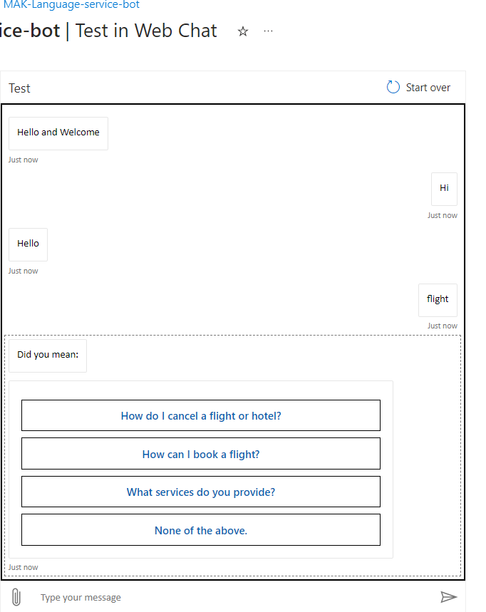

# Build a bot with the Language Service and Azure Bot Service

* Bots are a popular way to provide support through multiple communication channels. This module describes how to use a knowledge base(KB) and Azure Bot Service to create a bot that answers user questions.

Conversational AI (AI Agent) - To implement this kind of solution, you need:
  1. A KB of question and answer pairs - usually with some built-in NLP model to enable questions that can be phrased in multiple ways to be understood with the same semantic meaning.
  2. A bot service that provides an interface to the KB through one or more channels.

# Get started with the Language service and Azure Bot Service
* easily create a user support bot solution on MS Azure using a combination of two core services:
  1. Language service - includes a custom question answering feature that enables you to create a KB of question and answer pairs that can be queried using natural language input.
      1. Note: The question answering capability in the Language service is a newer version of the QnA Maker service - which is still available as a separate service.
  2. Azure Bot service. This service provides a framework for developing, publishing, and managing bots on Azure.

# Creating a custom question answering knowledge base
  1. The first challenge in creating a user support bot is to use the Language service to create a KB. use the Language Studio's custom question answering feature to create, train, publish, and manage KB.
  2. Note: Write code to create and manage KB using the Language service REST API or SDK. However, in most scenarios it is easier to use the Language Studio.

# Provision a Language service Azure resource
  1. To create a KB, first provision a Language service resource in Azure
  2. Define questions and answers
      1. use the Language Studio's custom question answering feature to create a KB that consists of question-and-answer pairs. These questions and answers can be:
          1. Generated from an existing FAQ document or web page.
          2. Entered and edited manually.
      2. In many cases, a KB is created using a combination of all of these techniques; starting with a base dataset of questions and answers from an existing FAQ document and extending the KB with additional manual entries.
      3. Questions in the KB can be assigned alternative phrasing to help consolidate questions with the same meaning. For example, you might include a question like: What is your head office location?
      4. Different ways by adding an alternative phrasing such as: Where is your head office located?
  3. Test the knowledge base - After creating a set of question-and-answer pairs, you must save it. This process analyzes your literal questions and answers and applies a built-in NLP model to match appropriate answers to questions, even when they are not phrased exactly as specified in your question definitions. Then you can use the built-in test interface in the Language Studio to test your KB by submitting questions and reviewing the answers that are returned.
  4. Use the KB - When you're satisfied with your KB, deploy it. Then you can use it over its REST interface. To access the KB, client applications require:
      1. The knowledge base ID
      2. The knowledge base endpoint
      3. The knowledge base authorization key
  5. Build a bot with the Azure Bot Service - After you've created and deployed a KB, you can deliver it to users through a bot.
      1. Create a bot for your KB - You can create a custom bot by using the MS Bot Framework SDK to write code that controls conversation flow and integrates with your KB. However, an easier approach is to use the automatic bot creation functionality, which enables you to create a bot for your deployed KB and publish it as an Azure Bot Service application with just a few clicks.
      2. Extend and configure the bot - After creating your bot, you can manage it in the Azure portal, where you can:
          1. Extend the bot's functionality by adding custom code.
          2. Test the bot in an interactive test interface.
          3. Configure logging, analytics, and integration with other services.
  6. Connect channels - When your bot is ready to be delivered to users, you can connect it to multiple channels; making it possible for users to interact with it through web chat, email, Microsoft Teams, and other common communication media. 

# Exercise - Explore question answering
  1. create a bot that can interpret and answer frequently asked questions through a website chat window, email, or voice interface. Underlying the bot interface is a KB of questions and appropriate answers that the bot can search for suitable responses.
  2. https://microsoftlearning.github.io/AI-900-AIFundamentals/instructions/04d-create-a-bot.html
  3. Create a custom question answering knowledge base
      1. The Language service’s custom question answering feature enables you to quickly create a KB, either by entering question and answer pairs or from an existing document or web page. It can then use some built-in NLP capabilities to interpret questions and find appropriate answers.
      
      2. Create a Language service resourc -> Default features: Keep the default features | Custom features: Select custom question answering | Pricing tier: S (1K Calls per minute) : Azure search pricing tier: Free F (3 Indexes) - (If this tier is not available, select Standard S (50 Indexes))
      3. open the Language Studio portal at https://language.azure.com. Resource Type : Language | Resurce name : choose priviously created
      4. Create new menu -> select Custom question answering.
      5. choose language setting -> I want to select the language when I create a project in this resource .
      6. Enter basic information page -> Name: MargiesTravel | Description: KB | Source language: English | Default answer when no answer is returned: No answer found
      7. Review -> Create project.
      8. Manage sources -> Add source -> URLs -> URL name: MargiesKB | URL: https://raw.githubusercontent.com/MicrosoftLearning/AI-900-AIFundamentals/main/data/qna/margies_faq.docx | Classify file structure: Auto-detect
  4. Edit the knowledge base
      1. Your KB is based on the details in the FAQ document and some pre-defined responses. You can add custom question-and-answer pairs to supplement these.
      2. Click Edit KB on the left hand panel -> + Add question pair -> Source: Editorial | Questions: Hello | Answer: Hello -> Submit
      3. Click + Add alternate questions and type Hi
      4. Then at the top of the page click Save changes.
  5. Train and test the KB
      1. click Test to test your KB.
      2. Enter "Hi". The response Hello should be returned.
      3. Enter "I want to book a flight". An appropriate response from the FAQ should be returned.
          1. Note The response includes a short answer as well as a more verbose answer passage - the answer passage shows the full text in the FAQ document for the closest matched question, while the short answer is intelligently extracted from the passage. You can control whether the short answer is from the response by using the Display short answer checkbox at the top of the test pane.
      4. How can I cancel a reservation?
  6. Create a bot for the KB
      1. The KB provides a back-end service that client applications can use to answer questions through some sort of user interface. Commonly, these client applications are bots. To make the KB available to a bot, you must publish it as a service that can be accessed over HTTP. You can then use the Azure Bot Service to create and host a bot that uses the KB to answer user questions.
      2. At the left of the Language Studio page, click Deploy KB -> Deploy -> Deploy -> Deployed, Create a bot.       3. In the Azure portal, create a Web App Bot. (Warning, leave it) -> handle: A unique name for your bot (pre-populated) | Pricing tier: Free (F0) | Creation type:  Create new User-assigned managed identity
      6. Select Next: Web App ->  App name: Same as the Bot handle with .azurewebsites.net appended automatically | SDK language: Choose either C# or Node.js | Creation Type: Select Create new app service plan | Language Resource Key: Language resource key 
      7. Create -> Completed -> click Go to resource -> Open Azure Bot Type -> Test in Web Chat (under settings) -> wait until the bot displays the message Hello and Welcome | I need to cancel my hotel.
      
      
# Quiz

1. Your organization has an existing frequently asked questions (FAQ) document. You need to create a knowledge base that includes the questions and answers from the FAQ with the least possible effort. What should you do?
  * [ ] Create an empty knowledge base, and then manually copy and paste the FAQ entries into it.
  * [x] Import the existing FAQ document into a new knowledge base.
  * [ ] Import a pre-defined chit-chat data source.
2. You want to create a knowledge base for bots. What capability would you use? 
  * [ ] Conversational Language Understanding
  * [x] Question Answering
  * [ ] Optical Character Recognition
3. You need to deliver a support bot for internal use in your organization. Some users want to be able to submit questions to the bot using Microsoft Teams, others want to use a web chat interface on an internal web site. What should you do?
  * [x] Create a knowledge base. Then create a bot for the knowledge base and connect the Web Chat and Microsoft Teams channels for your bot
  * [ ] Create a knowledge base. Then create two bots that use the same knowledge base - one bot connected to the Microsoft Teams channel, and the other to the Web Chat channel.
  * [ ] Create two knowledge bases with the same question and answer pairs. Then create a bot for each knowledge base; one connected to the Microsoft Teams channel, and the other to the Web Chat channel
