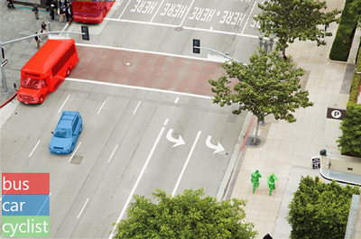

# What is AI?
* AI is the creation of software that imitates human behaviors and capabilities. Key workloads include:
  * <b>ML</b> - the foundation for an AI system, "teach" a computer model to make predictions and draw conclusions from data.
  * <b>Anomaly detection</b> - The capability to automatically detect errors or unusual activity in a system.
  * <b>Computer vision</b> - The capability of software to interpret the world visually through cameras, video, and images.
  * <b>Natural language processing (NLP)</b> - The capability for a computer to interpret written or spoken language, and respond in kind.
  * <b>Knowledge mining</b> - The capability to extract information from large volumes of often unstructured data to create a searchable knowledge store.

# Understand ML
* A real-world example of how ML can be used to solve a difficult problem.
  * Sustainable farming techniques to maximize food production while protecting a fragile environment. 
  * An agricultural technology company, uses sensors, data, and ML to help farmers make informed decisions related to weather, soil, and plant conditions.

* <b>How ML works</b>
  * So how do machines learn? from data. We create huge volumes of data from our everyday lives from homes, cars, cities,.. through like messages, emails, posts, photos, videos
  * Data scientists can use all of that data to train ML models that can make predictions and inferences based on the relationships they find in the data.
  * For example, to identify and catalog different species of wildflower using a phone app. 
    1. Collect data on wildflower samples,  then labels the samples with the correct species.
    2. The labeled data is processed using an algorithm that finds relationships between the features of the samples and the labeled species.
    3. The results of the algorithm are encapsulated in a model. When new samples are found, the model can identify the correct species label.

* <b>ML in MS Azure</b>
  1. <b>Automated ML</b> -	This feature enables non-experts to quickly create an effective ML model from data.
  2. <b>Azure ML designer</b>	- A graphical interface enabling no-code development of ML solutions.
  3. <b>Data and compute management</b> - 	Cloud-based data storage and compute resources that professional can use to run data experiment code at scale.
  4. <b>Pipelines</b>	- Professionals can define pipelines to orchestrate model training, deployment, and management tasks.

# Understand anomaly detection
* A software system to monitor credit card transactions and detect unusual usage patterns that might indicate fraud. 
* An application that tracks activity in an automated production line and identifies failures. 
* A racing car telemetry system that uses sensors to proactively warn engineers about potential mechanical failures before they happen.

* These kinds of scenario can be addressed by using <b>anomaly detection</b> - a ML based technique that analyzes data over time and identifies unusual changes.

* How anomaly detection might help in the racing car scenario.
  1. Sensors in the car collect telemetry, such as engine revolutions, brake temperature, and so on.
  2. An anomaly detection model is trained to understand expected fluctuations in the telemetry measurements over time.
  3. If a measurement occurs outside of the normal expected range, the model reports an anomaly that can be used to alert the race engineer to call the driver in for a pit stop to fix the issue before it forces retirement from the race.
 
 * Anomaly detection in MS Azure provides an API that developers can use to create anomaly detection solutions. https://azure.microsoft.com/en-us/products/cognitive-services/anomaly-detector/

# Understand computer vision
* Computer Vision is an area of AI that deals with visual processing. 
* The Seeing AI app designed for the blind and low vision community to describe nearby people, text and objects. https://www.microsoft.com/en-us/ai/seeing-ai?rtc=1
* Computer Vision models and capabilities are based on ML models that can be applied to visual input from cameras, videos, or images. The common computer vision tasks:
  1. <b>Image classification (IC)</b>	- a ML model to classify images based on their contents. For example, a traffic monitoring solution (TMS) use an IC model to classify images based on the type of vehicle (taxis, buses, cyclists, ...)
  2. <b>Object detection</b>	- ML models are trained to classify individual objects within an image, and identify their location with a bounding box. For example, a TMS might use object detection to identify the location of different classes of vehicle. 
    * 
  3. <b>Semantic segmentation</b>	- is an advanced ML technique in which individual pixels in the image are classified according to the object to which they belong. For example, a TMS might overlay traffic images with "mask" layers to highlight different vehicles using specific colors. 
    * 
  4. <b>Image analysis</b> - ML models with advanced image analysis techniques to extract information from images, including "tags" that could help catalog the image or even descriptive captions that summarize the scene shown in the image. the caption "A person with a dog on a street" 
    * 
  5. <b>Face detection</b> - is a specialized form of object detection that locates human faces in an image. This can be combined with classification and facial geometry analysis techniques to recognize individuals based on their facial features. 
    * 
  6. <b>Optical character recognition (OCR)</b>	- is a technique used to detect and read text in images. 
    * 

* Computer vision services in MS Azure
  1. <b>Computer Vision</b>	- to analyze images and video, and extract descriptions, tags, objects, and text.
  2. <b>Custom Vision</b>	 - to train custom image classification and object detection models using your own images.
  3. <b>Face</b>	 - to build face detection and facial recognition solutions.
  4. <b>Form Recognizer</b> - to extract information from scanned forms and invoices.

# Understand natural language processing
* NLP is the area of AI that deals with creating software that understands written and spoken language.
* NLP enables you to create software that can:
  1. Analyze and interpret text in documents, email messages, and other sources.
  2. Interpret spoken language, and synthesize speech responses.
  3. Automatically translate spoken or written phrases between languages.
  4. Interpret commands and determine appropriate actions.

* For example, VR Starship Commander game from Human Interact that takes place in a science fiction world. It uses NLP to enable players to control the narrative and interact with in-game characters and starship systems.

* <b>NLP in MS Azure</b>, use the following cognitive services to build NLP solutions:
  1. <b>Language</b>	- to access features for understanding and analyzing text, training language models that can understand spoken or text-based commands, and building intelligent applications.
  2. <b>Translator</b>	- to translate text between more than 60 languages.
  3. <b>Speech</b> - to recognize and synthesize speech, and to translate spoken languages.
  4. <b>Azure Bot</b> - provides a platform for conversational AI, the capability of a software "agent" to participate in a conversation. Developers can use the Bot Framework to create a bot and manage it with Azure Bot Service - integrating back-end services like Language, and connecting to channels for web chat, email, MS Teams, and others.

# Understand knowledge mining
* Extracting information from large volumes of unstructured data to create a searchable knowledge store.

* <b>Knowledge mining in MS Azure</b>
  1. <b>Azure Cognitive Search</b> - a private, enterprise, search solution that has tools for building indexes. The indexes can then be used for internal only use, or to enable searchable content on public facing internet assets. 
  2. Azure Cognitive Search can utilize the built-in AI capabilities of Azure Cognitive Services such as image processing, content extraction, and NLP to perform knowledge mining of documents. The product's AI capabilities makes it possible to index previously unsearchable documents and to extract and surface insights from large amounts of data quickly.

# Challenges and risks with AI
* Some of the potential challenges and risks facing an AI application developer.
  1. <b>Bias can affect results</b> - A loan-approval model discriminates by gender due to bias in the data with which it was trained
  2. <b>Errors may cause harm</b> - An autonomous vehicle experiences a system failure and causes a collision
  3. <b>Data could be exposed</b> - A medical diagnostic bot is trained using sensitive patient data, which is stored insecurely
  4. <b>Solutions may not work for everyone</b> - A home automation assistant provides no audio output for visually impaired users
  5. <b>Users must trust a complex system</b> - An AI-based financial tool makes investment recommendations - what are they based on?
  6. <b>Who's liable for AI-driven decisions?</b>	- An innocent person is convicted of a crime based on evidence from facial recognition – who's responsible?

# Understand Responsible AI
* AI software development is guided by a set of six principles.
  1. <b>Fairness</b> - For example, suppose you create a ML model to support a loan approval application for a bank. The model should predict whether the loan should be approved or denied without bias. This bias could be based on gender, ethnicity, or other factors that result in an unfair advantage or disadvantage to specific groups of applicants.
  2. <b>Reliability and safety</b> - For example, consider an AI-based software system for an autonomous vehicle or a ML model that diagnoses patient symptoms and recommends prescriptions. Unreliability in these kinds of systems can result in substantial risk to human life.
  3. <b>Privacy and security</b> - The ML models on which AI systems are based rely on large volumes of data, which may contain personal details that must be kept private. Even after the models are trained and the system is in production, privacy and security need to be considered. As the system uses new data to make predictions or take action, both the data and decisions made from the data may be subject to privacy or security concerns.
  4. <b>Inclusiveness</b> - AI systems should empower everyone and engage people. AI should bring benefits to all parts of society, regardless of physical ability, gender, sexual orientation, ethnicity, or other factors.
  5. <b>Transparency</b> - AI systems should be understandable. Users should be made fully aware of the purpose of the system, how it works, and what limitations may be expected.
  6. <b>Accountability</b> - People should be accountable for AI systems. Designers and developers of AI-based solutions should work within a framework of governance and organizational principles that ensure the solution meets ethical and legal standards that are clearly defined.

* For more resources to help you put the responsible AI principles into practice, see https://www.microsoft.com/ai/responsible-ai-resources.

# Quiz
1. You want to create a model to predict sales of ice cream based on historic data that includes daily ice cream sales totals and weather measurements. Which Azure service should you use?
  * [x] Azure ML -  That is correct. Azure Machine Learning enables you to train a predictive model from the existing data.
  * [ ] Azure Bot
  * [ ] Language

2. You are designing an AI application that uses images to detect cracks in car windshields and warn drivers when a windshield should be repaired or replaced. What AI workload is described? 
  * [x] Computer Vision - That is correct. Images of the car windshield can be analyzed with computer vision and classified into groups based on windshield condition.
  * [ ] Anomaly Detection
  * [ ] Natural Language Processing

3. A predictive app provides audio output for visually impaired users. Which principle of Responsible AI is reflected here?
  * [ ] Transparency
  * [x] Inclusiveness - That is correct. Inclusiveness is about how AI should bring benefits to all parts of society, regardless of physical ability, gender, sexual orientation, ethnicity, or other factors.
  * [ ] Fairness