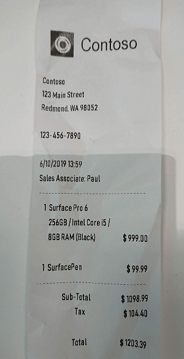

# Analyze receipts with the Form Recognizer service

* Processing handwritten documents, invoices and scanned receipts is a common task in many business scenarios. AI to automate data extraction from receipts or invoice data.

* Need to be digitized and routed to the correct accounts department. 

* Azure's Form Recognizer service can solve for this issue by digitizing fields from forms using optical character recognition (OCR). Azure's OCR technologies extract the contents and structure from forms, such as key, value pairs (eg. Quantity: 3).

* Using the Form Recognizer service, we can input an image of a receipt like the one above, and return useful information that might be required for an expense claim, including:
    1. The name, address, and telephone number of the merchant.
    2. The date and time of the purchase.
    3. The quantity and price of each item purchased.
    4. The subtotal, tax, and total amounts.

# Exercise - Explore form recognition
* https://microsoftlearning.github.io/AI-900-AIFundamentals/instructions/03e-analyze-receipts.html
* Form Recognizer uses ML models trained to extract text from images of invoices, receipts, and more. While other computer vision models can capture text, Form Recognizer also captures the structure of the text, such as key/value pairs and information in tables. This way, instead of having to manually type in entries from a form into a database, you can automatically capture the relationships between text from the original file.
* Create a Form Recognizer resource or a Cognitive Services (this) resource.
* Run Cloud Shell
* Configure and run a client application, cmds
    1.  git clone https://github.com/MicrosoftLearning/AI-900-AIFundamentals ai-900
    2. code .
    3. folder ai-900 -> form-recognizer.ps1
    4. replacing the YOUR_KEY and YOUR_ENDPOINT placeholder values respectively.
    5. cd ai-900
       ./form-recognizer.ps1
    
    6. The sample client application will analyze the following image & Review the returned results. See that Form Recognizer is able to interpret the data in the form, correctly identifying the merchant address and phone number, and the transaction date and time, as well as the line items, subtotal, tax, and total amounts.
