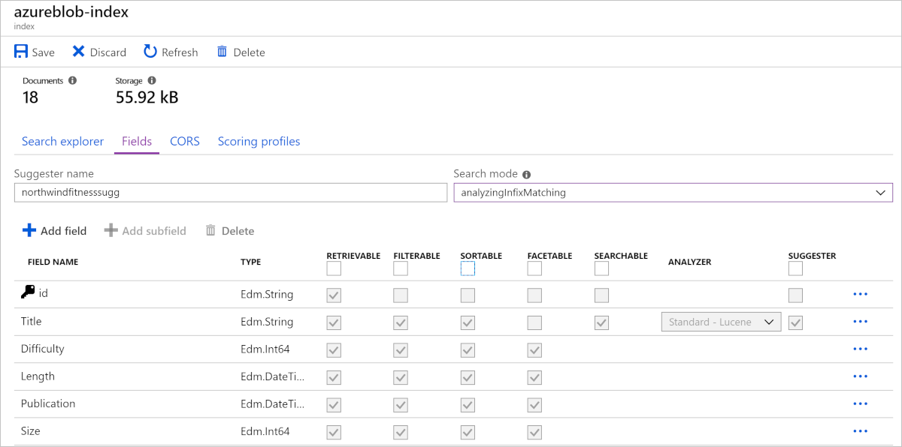

# Introduction to Azure Cognitive Search (ACS)

* Knowledge mining is the term used to describe solutions that involve extracting information from large volumes of often unstructured data. One of these knowledge mining solutions is ACS, a cloud search service that has tools for building user-managed indexes. The indexes can be used for internal only use, or to enable searchable content on public-facing internet assets.

* ACS can utilize the built-in AI capabilities of Azure Cognitive Services such as image processing, content extraction, and NLP to perform knowledge mining of documents. The product's AI capabilities makes it possible to index previously unsearchable documents and to extract and surface insights from large amounts of data quickly.

# What is Azure Cognitive Search?
* ACS provides the infrastructure and tools to create search solutions that extract data from various structured, semi-structured, and non-structured documents.

* ACS results contain only your data, which can include text inferred or extracted from images, or new entities and key phrases detection through text analytics. It's a Platform as a Service (PaaS) solution. MS manages the infrastructure and availability, allowing your organization to benefit without the need to purchase or manage dedicated hardware resources.

* Azure Cognitive Search features
    1. ACS exists to complement existing technologies and provides a programmable search engine built on Apache Lucene, an open-source software library. It's a highly available platform offering a 99.9% uptime SLA available for cloud and on-premises assets.
    2. ACS comes with the following features:
        1. Data from any source: ACS accepts data from any source provided in JSON format, with auto crawling support for selected data sources in Azure.
        2. Full text search and analysis: ACS offers full text search capabilities supporting both simple query and full Lucene query syntax.
        3. AI powered search: ACS has Cognitive AI capabilities built in for image and text analysis from raw content.
        4. Multi-lingual: ACS offers linguistic analysis for 56 languages to intelligently handle phonetic matching or language-specific linguistics. NL processors available in ACS are also used by Bing and Office.
        5. Geo-enabled: ACS supports geo-search filtering based on proximity to a physical location.
        5. Configurable user experience: ACS has several features to improve the user experience including autocomplete, autosuggest, pagination, and hit highlighting.

# Identify elements of a search solution
* A typical ACS solution starts with a data source that contains the data artifacts you want to search. This could be a hierarchy of folders and files in Azure Storage, or text in a database such as Azure SQL Database or Cosmos DB. The data format that Cognitive Search supports is JSON. Regardless of where your data originates, if you can provide it as a JSON document, the search engine can index it.

* If your data resides in supported data source, you can use an indexer to automate data ingestion, including JSON serialization of source data in native formats. An indexer connects to a data source, serializes the data, and passes to the search engine for indexing. Most indexers support change detection, which makes data refresh a simpler exercise.

* Besides automating data ingestion, indexers also support AI enrichment. You can attach a skillset that applies a sequence of AI skills to enrich the data, making it more searchable. A comprehensive set of built-in skills, based on Cognitive Services APIs, can help you derive new fields – for example by recognizing entities in text, translating text, evaluating sentiment, or predicting appropriate captions for images. Optionally, enriched content can be sent to a knowledge store, which stores output from an AI enrichment pipeline in tables and blobs in Azure Storage for independent analysis or downstream processing.

* Whether you write application code that pushes data to an index - or use an indexer that automates data ingestion and adds AI enrichment - the fields containing your content are persisted in an index, which can be searched by client applications. The fields are used for searching, filtering, and sorting to generate a set of results that can be displayed or otherwise used by the client application.

# Use a skillset to define an enrichment pipeline
* AI enrichment refers to embedded image and NLP in a pipeline that extracts text and information from content that can't otherwise be indexed for full text search.

* AI processing is achieved by adding and combining skills in a skillset. A skillset defines the operations that extract and enrich data to make it searchable. These AI skills can be either built-in skills, such as text translation or Optical Character Recognition (OCR), or custom skills that you provide.

* Built in skills
    1. Built-in skills are based on pre-trained models from MS, which means you can't train the model using your own training data. Skills that call the Cognitive Resources APIs have a dependency on those services and are billed at the Cognitive Services pay-as-you-go price when you attach a resource. Other skills are metered by ACS, or are utility skills that are available at no charge.
  
    2. Built-in skills fall into these categories:
      1. NLP skills: with these skills, unstructured text is mapped as searchable and filterable fields in an index. Some examples include:
        1. Key Phrase Extraction: uses a pre-trained model to detect important phrases based on term placement, linguistic rules, proximity to other terms, and how unusual the term is within the source data.
        2. Text Translation Skill: uses a pre-trained model to translate the input text into various languages for normalization or localization use cases.
      
     3. Image processing skills: creates text representations of image content, making it searchable using the query capabilities of Azure Cognitive Search. Some examples include:
        1. Image Analysis Skill: uses an image detection algorithm to identify the content of an image and generate a text description.
        2. Optical Character Recognition Skill: allows you to extract printed or handwritten text from images, such as photos of street signs and products, as well as from documents—invoices, bills, financial reports, articles, and more.

#Understand indexes
* An ACSh index can be thought of as a container of searchable documents. Conceptually you can think of an index (table), each row (document), columns (fields in a document),  Columns have data types, just as the fields do on the documents.
  
* Index schema
    1. In ACS, an index is a persistent collection of JSON documents and other content used to enable search functionality. The documents within an index can be thought of as rows in a table, each document is a single unit of searchable data in the index.

    2. The index includes a definition of the structure of the data in these documents, called its schema. An example of an index schema with AI-extracted fields keyphrases and imageTags is below:

    ``` mark
        {
          "name": "index",
          "fields": [
            {
              "name": "content", "type": "Edm.String", "analyzer": "standard.lucene", "fields": []
            }
            {
              "name": "keyphrases", "type": "Collection(Edm.String)", "analyzer": "standard.lucene", "fields": []
            },
            {
              "name": "imageTags", "type": "Collection(Edm.String)", "analyzer": "standard.lucene", "fields": []
            },
          ]
        }
    ```

* Index attributes
    1. ACS needs to know how you would like to search and display the fields in the documents. You specify that by assigning attributes, or behaviors, to these fields. For each field in the document, the index stores its name, the data type, and supported behaviors for the field such as, is the field searchable, can the field be sorted?

    2. The most efficient indexes use only the behaviors that are needed. If you forget to set a required behavior on a field when designing, the only way to get that feature is to rebuild the index.

The following image depicts the fields when designing an index in Azure:

