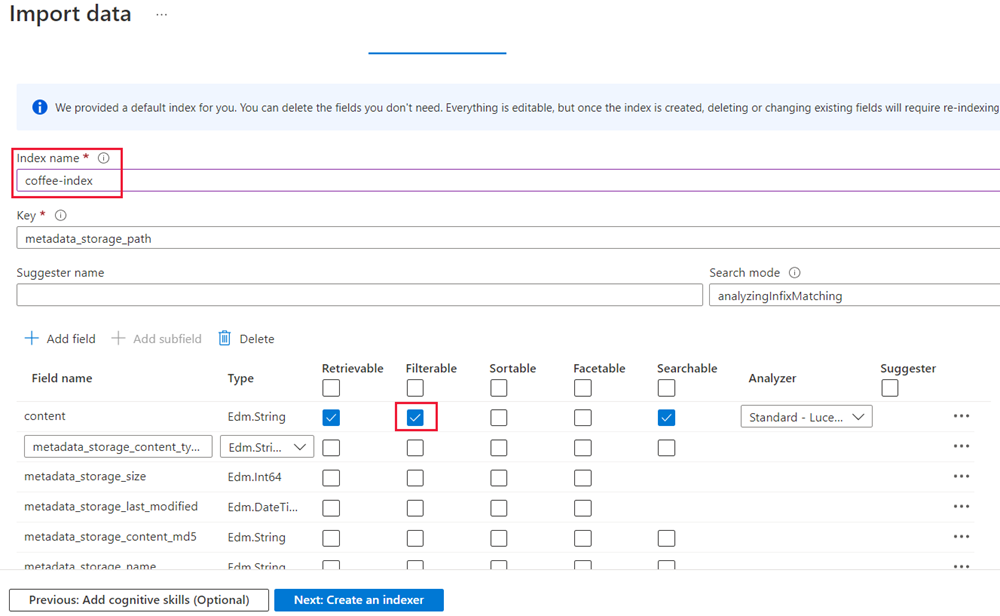

# Introduction to Azure Cognitive Search (ACS)

* Knowledge mining is the term used to describe solutions that involve extracting information from large volumes of often unstructured data. One of these knowledge mining solutions is ACS, a cloud search service that has tools for building user-managed indexes. The indexes can be used for internal only use, or to enable searchable content on public-facing internet assets.

* ACS can utilize the built-in AI capabilities of Azure Cognitive Services such as image processing, content extraction, and NLP to perform knowledge mining of documents. The product's AI capabilities makes it possible to index previously unsearchable documents and to extract and surface insights from large amounts of data quickly.

# What is Azure Cognitive Search?
* ACS provides the infrastructure and tools to create search solutions that extract data from various structured, semi-structured, and non-structured documents.

* ACS results contain only your data, which can include text inferred or extracted from images, or new entities and key phrases detection through text analytics. It's a Platform as a Service (PaaS) solution. MS manages the infrastructure and availability, allowing your organization to benefit without the need to purchase or manage dedicated hardware resources.

* Azure Cognitive Search features
    1. ACS exists to complement existing technologies and provides a programmable search engine built on Apache Lucene, an open-source software library. It's a highly available platform offering a 99.9% uptime SLA available for cloud and on-premises assets.
    2. ACS comes with the following features:
        1. Data from any source: ACS accepts data from any source provided in JSON format, with auto crawling support for selected data sources in Azure.
        2. Full text search and analysis: ACS offers full text search capabilities supporting both simple query and full Lucene query syntax.
        3. AI powered search: ACS has Cognitive AI capabilities built in for image and text analysis from raw content.
        4. Multi-lingual: ACS offers linguistic analysis for 56 languages to intelligently handle phonetic matching or language-specific linguistics. NL processors available in ACS are also used by Bing and Office.
        5. Geo-enabled: ACS supports geo-search filtering based on proximity to a physical location.
        5. Configurable user experience: ACS has several features to improve the user experience including autocomplete, autosuggest, pagination, and hit highlighting.

# Identify elements of a search solution
* A typical ACS solution starts with a data source that contains the data artifacts you want to search. This could be a hierarchy of folders and files in Azure Storage, or text in a database such as Azure SQL Database or Cosmos DB. The data format that Cognitive Search supports is JSON. Regardless of where your data originates, if you can provide it as a JSON document, the search engine can index it.

* If your data resides in supported data source, you can use an indexer to automate data ingestion, including JSON serialization of source data in native formats. An indexer connects to a data source, serializes the data, and passes to the search engine for indexing. Most indexers support change detection, which makes data refresh a simpler exercise.

* Besides automating data ingestion, indexers also support AI enrichment. You can attach a skillset that applies a sequence of AI skills to enrich the data, making it more searchable. A comprehensive set of built-in skills, based on Cognitive Services APIs, can help you derive new fields – for example by recognizing entities in text, translating text, evaluating sentiment, or predicting appropriate captions for images. Optionally, enriched content can be sent to a knowledge store, which stores output from an AI enrichment pipeline in tables and blobs in Azure Storage for independent analysis or downstream processing.

* Whether you write application code that pushes data to an index - or use an indexer that automates data ingestion and adds AI enrichment - the fields containing your content are persisted in an index, which can be searched by client applications. The fields are used for searching, filtering, and sorting to generate a set of results that can be displayed or otherwise used by the client application.

# Use a skillset to define an enrichment pipeline
* AI enrichment refers to embedded image and NLP in a pipeline that extracts text and information from content that can't otherwise be indexed for full text search.

* AI processing is achieved by adding and combining skills in a skillset. A skillset defines the operations that extract and enrich data to make it searchable. These AI skills can be either built-in skills, such as text translation or Optical Character Recognition (OCR), or custom skills that you provide.

* Built in skills
    1. Built-in skills are based on pre-trained models from MS, which means you can't train the model using your own training data. Skills that call the Cognitive Resources APIs have a dependency on those services and are billed at the Cognitive Services pay-as-you-go price when you attach a resource. Other skills are metered by ACS, or are utility skills that are available at no charge.
  
    2. Built-in skills fall into these categories:
      1. NLP skills: with these skills, unstructured text is mapped as searchable and filterable fields in an index. Some examples include:
        1. Key Phrase Extraction: uses a pre-trained model to detect important phrases based on term placement, linguistic rules, proximity to other terms, and how unusual the term is within the source data.
        2. Text Translation Skill: uses a pre-trained model to translate the input text into various languages for normalization or localization use cases.
      
     3. Image processing skills: creates text representations of image content, making it searchable using the query capabilities of Azure Cognitive Search. Some examples include:
        1. Image Analysis Skill: uses an image detection algorithm to identify the content of an image and generate a text description.
        2. Optical Character Recognition Skill: allows you to extract printed or handwritten text from images, such as photos of street signs and products, as well as from documents—invoices, bills, financial reports, articles, and more.

# Understand indexes
* An ACSh index can be thought of as a container of searchable documents. Conceptually you can think of an index (table), each row (document), columns (fields in a document),  Columns have data types, just as the fields do on the documents.
  
* Index schema
    1. In ACS, an index is a persistent collection of JSON documents and other content used to enable search functionality. The documents within an index can be thought of as rows in a table, each document is a single unit of searchable data in the index.

    2. The index includes a definition of the structure of the data in these documents, called its schema. An example of an index schema with AI-extracted fields keyphrases and imageTags is below:

    ``` mark
        {
          "name": "index",
          "fields": [
            {
              "name": "content", "type": "Edm.String", "analyzer": "standard.lucene", "fields": []
            }
            {
              "name": "keyphrases", "type": "Collection(Edm.String)", "analyzer": "standard.lucene", "fields": []
            },
            {
              "name": "imageTags", "type": "Collection(Edm.String)", "analyzer": "standard.lucene", "fields": []
            },
          ]
        }
    ```

* Index attributes
    1. ACS needs to know how you would like to search and display the fields in the documents. You specify that by assigning attributes, or behaviors, to these fields. For each field in the document, the index stores its name, the data type, and supported behaviors for the field such as, is the field searchable, can the field be sorted?

    2. The most efficient indexes use only the behaviors that are needed. If you forget to set a required behavior on a field when designing, the only way to get that feature is to rebuild the index.

The following image depicts the fields when designing an index in Azure:


# Use an indexer to build an index
* In order to index the documents in Azure Storage, they need to be exported from their original file type to JSON. In order to export data in any format to JSON, and load it into an index, we use an indexer.

* To create search documents, you can either generate JSON documents with application code or you can use Azure's indexer to export incoming documents into JSON.

* ACS lets you create and load JSON documents into an index with two approaches:

    1. Push method: JSON data is pushed into a search index via either the REST API or the .NET SDK. Pushing data has the most flexibility as it has no restrictions on the data source type, location, or frequency of execution.

    2. Pull method: Search service indexers can pull data from popular Azure data sources, and if necessary, export that data into JSON if it isn't already in that format.

* Use the pull method to load data with an indexer
ACS's indexer is a crawler that extracts searchable text and metadata from an external Azure data source and populates a search index using field-to-field mappings between source data and your index. Using the indexer is sometimes referred to as a 'pull model' approach because the service pulls data in without you having to write any code that adds data to an index. An indexer maps source fields to their matching fields in the index.

* Data import monitoring and verification
    1. The search services overview page has a dashboard that lets you quickly see the health of the search service. On the dashboard, you can see how many documents are in the search service, how may indexes have been used, and how much storage is in use.

    2. When loading new documents into an index, the progress can be monitored by clicking on the index's associated indexer. The document count will grow as documents are loaded into the index. In some instances, the portal page can take a few minutes to display up-to-date document counts. Once the index is ready for querying, you can then use Search explorer to verify the results. An index is ready when the first document is successfully loaded.

    3. Indexers only import new or updated documents, so it is normal to see zero documents indexed.

    4. The Search explorer can perform quick searches to check the contents of an index, and ensure that you are getting expected search results. Having this tool available in the portal enables you to easily check the index by reviewing the results that are returned as JSON documents.

* Making changes to an index
    1. You have to drop and recreate indexes if you need to make changes to field definitions. Adding new fields is supported, with all existing documents having null values. You'll find it faster using a code-based approach to iterate your designs, as working in the portal requires the index to be deleted, recreated, and the schema details to be manually filled out.

    2. An approach to updating an index without affecting your users is to create a new index under a different name. You can use the same indexer and data source. After importing data, you can switch your app to use the new index.

# Persist enriched data in a knowledge store
* A knowledge store is persistent storage of enriched content. The purpose of a knowledge store is to store the data generated from AI enrichment in a container. For example, you may want to save the results of an AI skillset that generates captions from images.

* Recall that skillsets move a document through a sequence of enrichments that invoke transformations, such as recognizing entities or translating text. The outcome can be a search index, or projections in a knowledge store. The two outputs, search index and knowledge store, are mutually exclusive products of the same pipeline; derived from the same inputs, but resulting in output that is structured, stored, and used in different applications.

* While the focus of an ACS solution is usually to create a searchable index, you can also take advantage of its data extraction and enrichment capabilities to persist the enriched data in a knowledge store for further analysis or processing.

A knowledge store can contain one or more of three types of projection of the extracted data:
    1. Table projections are used to structure the extracted data in a relational schema for querying and visualization
    2. Object projections are JSON documents that represent each data entity
    3. File projections are used to store extracted images in JPG format
    
# Create an index in the Azure portal
* Before using an indexer to create an index, you'll first need to make your data available in a supported data source. Supported data sources include:
    1. Cosmos DB (SQL API)
    2. Azure SQL (database, managed instance, and SQL Server on an Azure VM)
    3. Azure Storage (Blob Storage, Table Storage, ADLS Gen2)

* Using the Azure portal's Import data wizard
    1. Once your data is in an Azure data source, you can begin using ACS. Contained within the ACS service in Azure portal is the Import data wizard, which automates processes in the Azure portal to create various objects needed for the search engine. You can see it in action when creating any of the following objects using the Azure portal:
        1. Data Source: Persists connection information to source data, including credentials. A data source object is used exclusively with indexers.
        2. Index: Physical data structure used for full text search and other queries.
        3. Indexer: A configuration object specifying a data source, target index, an optional AI skillset, optional schedule, and optional configuration settings for error handling and base-64 encoding.
        4. Skillset: A complete set of instructions for manipulating, transforming, and shaping content, including analyzing and extracting information from image files. Except for very simple and limited structures, it includes a reference to a Cognitive Services resource that provides enrichment.
        5. Knowledge store: Stores output from an AI enrichment pipeline in tables and blobs in Azure Storage for independent analysis or downstream processing.


* To use ACS resource. manage components of your service from the resource Overview page in the portal.

* You can build Azure search indexes using the Azure portal or programmatically with the REST API or software development kits (SDKs).    

# Query data in an Azure Cognitive Search index
* Index and query design are closely linked. After we build the index, we can perform queries. A crucial component to understand is that the schema of the index determines what queries can be answered.

* ACS queries can be submitted as an HTTP or REST API. Queries can specify what fields are searched and returned, how search results are shaped, and how the results should be filtered or sorted. A query that doesn't specify the field to search will execute against all the searchable fields within the index.

* ACS supports two types of syntax: simple and full Lucene. Simple syntax covers all of the common query scenarios, while full Lucene is useful for advanced scenarios.

* Simple query requests
    1. A query request is a list or words (search terms) and query operators (simple or full) of what you would like to see returned in a result set. Let's look what components make up a search query. Consider this simple search example: coffee (-"busy" + "wifi")
    2. This query is trying to find content about coffee, excluding busy and including wifi.
    3. Breaking the query into components, it's made up of search terms, (coffee), plus two verbatim phrases, "busy" and "wifi", and operators (-, +, and ( )). The search terms can be matched in the search index in any order or location in the content. The two phrases will only match with exactly what is specified, so wi-fi would not be a match. Finally, a query can contain a number of operators. In this example, the - operator tells the search engine that these phrases should NOT be in the results. The parenthesis group terms together, and set their precedence.
    4. By default, the search engine will match any of the terms in the query. Content containing just coffee would be a match. In this example, using -"busy" would lead to the search results including all content that doesn't have the exact string "busy" in it.
    5. The simple query syntax in ACS excludes some of the more complex features of the full Lucene query syntax, and it's the default search syntax for queries.
    6. You can learn more about query syntax:  https://learn.microsoft.com/en-us/azure/search/query-odata-filter-orderby-syntax

# Exercise - Explore knowledge mining
* build a knowledge mining solution that makes it easy to search for insights about customer experiences. Create an ACS index using data extracted from customer reviews.
* https://microsoftlearning.github.io/AI-900-AIFundamentals/instructions/05-create-cognitive-search-solution.html

* Fourth Coffee, a national coffee chain, build a knowledge mining solution that makes it easy to search for insights about customer experiences. Build an ACSh index using data extracted from customer reviews.

1. Create Azure resources
    1. An Azure Cognitive Search resource, which will manage indexing and querying.
    2. A Cognitive Services resource, which provides AI services for skills that your search solution can use to enrich the data in the data source with AI-generated insights.
    3. Note Your Azure Cognitive Search and Cognitive Services resources must be in the same location!
    4. A Storage account with blob containers, which will store raw documents and other collections of tables, objects, or files.

2. Create an Azure Cognitive Search resource.  Completed add indexes, import data, and search created indexes.

3. Create a Cognitive Services resource

4. Create a storage account -> Performance: Standard | Redundancy: Locally redundant storage (LRS)

5. Upload Documents to Azure Storage Containers.
    1. Create Container -> Name: coffee-reviews | Public access level: Container (anonymous read access for containers and blobs) | Advanced: no changes.
    2. In a new browser tab, download the zipped documents from https://aka.ms/km-documents, and then extract the files to the reviews folder.
    
    3. select coffee-reviews container -> Upload -> all files.

6. Index the documents
    1. ACS resource -> Overview -> Import data.
    2. Connect to your data -> Data Source list -> Data Source: Azure Blob Storage | Data source name: coffee-customer-data | Data to extract: Content and metadata | Parsing mode: Default | Connection string: *Select Choose an existing connection. Select your storage account, select the coffee-reviews container, and then click Select. | Managed identity authentication: None | Container name: this setting is auto-populated after you choose an existing connection. | Blob folder: Leave this blank. | Description: Reviews for Fourth Coffee shops.
      3. Select Next: Add cognitive skills (Optional).
      4. In the ACS section, select your Cognitive Services resource. 
        1.  Add enrichments Sections ->  Skillset name : coffee-skillset | Select the checkbox Enable OCR and merge all text into merged_content field. (Note It’s important to select Enable OCR to see all of the enriched field options.) | Source data field :merged_content. | Enrichment granularity level : Pages (5000 character chunks). | Don’t select Enable incremental enrichment | Select the following enriched fields:
            1. Cognitive Skill          Parameter   Field name
            2. Extract location names	 	        locations
            3. Extract key phrases	 	            keyphrases
            4. Detect sentiment	 	                sentiment
            5. Generate tags from images	 	    imageTags
            6. Generate captions from images	 	imageCaption
        2. Under Save enrichments to a knowledge store, select: Image projections, Documents, Pages, Key phrases, Entities, Image details, Image references
            
            1. Note If a warning asking for a Storage Account Connection String appears.
            2. Select Choose an existing connection. Choose the storage account you created earlier.
            3. Click on + Container to create a new container called knowledge-store with the privacy level set to private, and select Create.
            4. Select the knowledge-store container, and then click Select at the bottom of the screen.
        3. Select Azure blob projects: Document. A setting for Container name with the knowledge-store container auto-populated displays. Don’t change the container name.
        4. Select Next: Customize target index. Change the Index name to coffee-index.
        5. Ensure that the Key is set to metadata_storage_path. Leave Suggester name blank and Search mode autopopulated.
        
        6. Review the index fields’ default settings. Select filterable for all the fields that are already selected by default.
        7. Select Next: Create an indexer -> Change the Indexer name to coffee-indexer | Leave the Schedule set to Once.
        8. Expand the Advanced options. Ensure that the Base-64 Encode Keys option is selected, as encoding keys can make the index more efficient.
        9. Select Submit to create the data source, skillset, index, and indexer. The indexer is run automatically and runs the indexing pipeline, which:
            1. Extracts the document metadata fields and content from the data source.
            2. Runs the skillset of cognitive skills to generate more enriched fields.
            3. Maps the extracted fields to the index.
        10. ACS resource -> Indexers tab (shows the newly created coffee-indexer)
        
        11. Select the indexer name to see more details.


7. Query the index
    1. Select Search explorer - to write and test queries. Easy way to validate the quality of your search index. 
    
    2. Notice how the index selected is the coffee-index you created.
    3. In the Query string field, enter search=*&$count=true, and then select Search. The search query returns all the documents in the search index, including a count of all the documents in the @odata.count field. The search index should return a JSON document containing your search results.
    4. Note If a To search in the portal, please allow the portal origin in your index CORS settings message appears, select Allow portal, and then select Search.
    5. Now let’s filter by location. Enter search=$filter=locations eq 'Chicago' in the Query string field, and then select Search. The query searches all the documents in the index and filters for reviews with a Chicago location.
    6. Now let’s filter by sentiment. Enter search=$filter=sentiment eq 'negative' in the Query string field, and then select Search. The query searches all the documents in the index and filters for reviews with a negative sentiment.
    7. Note See how the results are sorted by @search.score. This is the score assigned by the search engine to show how closely the results match the given query.
    8. One of the problems we might want to solve for is why there might be certain reviews. Let’s take a look at the key phrases associated with the negative review. What do you think might be the cause of the review?

8. Review the knowledge store
    1. Let’s see the power of the knowledge store in action. When you ran the Import data wizard, you also created a knowledge store. Inside the knowledge store, you’ll find the enriched data extracted by AI skills persists in the form of projections and tables.
    
    2. Azure storage account -> Containers -> knowledge-store -> Select any of the items, and then click the objectprojection.json file -
    
    3. Select Edit to see the JSON produced for one of the documents from your Azure data store.
    4. Storage account Containers -> select blob 
    5 .In the Containers, select the container coffee-skillset-image-projection. Select any of the items.
   
   6. Select any of the .jpg files. Select Edit to see the image stored from the document. Notice how all the images from the documents are stored in this manner.
    7. Select the storage blob breadcrumb at the top left of the screen to return to the Storage account Containers.
    8. Select Storage browser on the left-hand panel, and select Tables. There’s a table for each entity in the index. Select the table coffeeSkillsetKeyPhrases.
    9. Look at the key phrases the knowledge store was able to capture from the content in the reviews. Many of the fields are keys, so you can link the tables like a relational database. The last field shows the key phrases that were extracted by the skillset.

# Quiz
1. Which data format is accepted by Azure Cognitive Search when you're pushing data to the index?
* [ ] CSV.
* [x] SQL.
* [x] JSON. Correct. Cognitive Search can index JSON documents. JSON is also used to define index schemas, indexers, and data source objects.

2. Which explanation best describes an indexer and an index?
* [x] An indexer converts documents into JSON and forwards them to a search engine for indexing. Correct. An indexer serializes a source document into JSON before passing it to a search engine for indexing. An indexer automates several steps of data ingestion, reducing the amount of code you need to write.
* [ ] An indexer can be used instead of an index if the files are already in the proper format.
* [ ] An indexer is only used for AI enrichment and skillset execution.

3. If you set up a search index without including a skillset, which would you still be able to query?
* [ ] Sentiment.
* [x] Text content. Correct. Cognitive Search is used for full text search over indexes containing alphanumeric content.
* [ ] Image captions.

