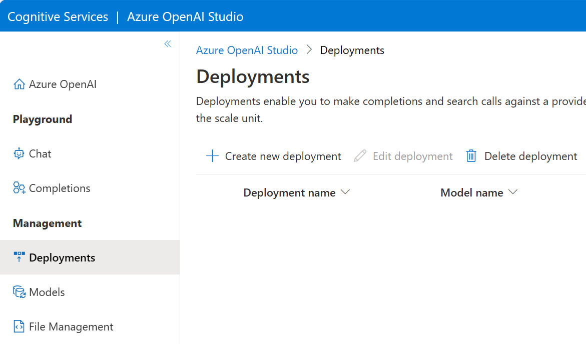
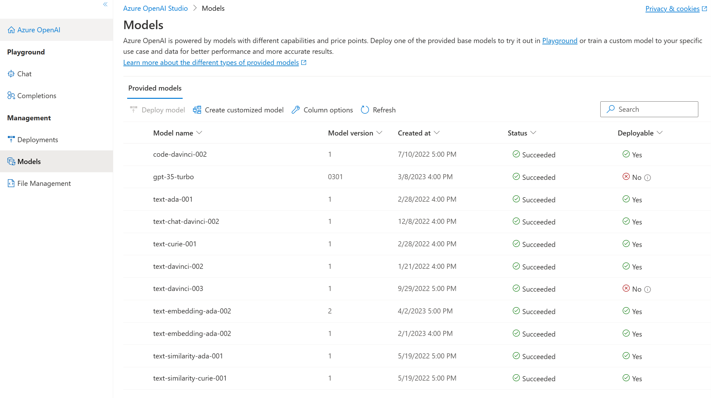

# Get started with Azure OpenAI Service


* Generative AI models power ChatGPT's ability to produce new content, such as text, code, and images, based on a natural language prompts. Many generative AI models are a subset of DL algorithms. These algorithms support various workloads across vision, speech, language, decision, search, and more.

# Access Azure OpenAI Service
* Building a generative AI solution with Azure OpenAI is to provision an Azure OpenAI resource. Azure OpenAI Service is currently in limited access. Users need to apply for service access at https://aka.ms/oai/access.

* Create an Azure OpenAI Service resource in the Azure portal or CLI

# Use Azure OpenAI Studio
* Azure OpenAI Studio provides access to model management, deployment, experimentation, customization, and learning resources.

* Access the Azure OpenAI Studio through the Azure portal after creating a resource, or at https://oai.azure.com by logging in with your Azure OpenAI resource instance.


* Create new deployment. 

* Once in the studio, your next steps include:
    1. Choosing a base model.
    2. Deploying a base model.
    3. Testing the model. An easy way to do this is in one of the studio playgrounds.
    4. Experimenting with prompts and parameters to see their effect on completions, or the generated output.

# Explore types of generative AI models
* Building with Azure OpenAI, choose a base model and deploy it. 
* Family |	Description |	Base models within the Family
    1. GPT-4 | Models that generate NL and code. | gpt-4, gpt-4-32k
    2. GPT-3 | Models that can understand and generate NL. | text-davinci-003, text-curie-001, text-babbage-001, text-ada-001, gpt-35-turbo
    3. Codex | Models that can understand and generate code, including translating NL to code. | code-davinci-002, code-cushman-001
    4. Embeddings | Embeddings are further broken down into three families of models for different functionalities: similarity, text search, and code search. | See the list https://learn.microsoft.com/en-us/azure/cognitive-services/openai/concepts/models#embeddings-models?portal=true
 
* Choosing a model
    1. The models within the family differ by speed, cost, and how well they complete tasks. 
    2. In general, models with the name davinci are stronger than models with the name curie, babbage, and ada, but may be slower.
    3. Pricing is determiend by tokens and by model type. [Learn more about the latest pricing here](https://azure.microsoft.com/en-us/pricing/details/cognitive-services/openai-service/)


* Azure OpenAI Studio navigation

# Deploy generative AI models
* first need to deploy a model to make API calls to receive completions to prompts. When you create a new deployment, you need to indicate which base model to deploy. You can only deploy one instance of each model. There are several ways you can deploy your base model.
  
  1. Deploy using Azure OpenAI Studio - create a new deployment by selecting a model name from the menu.
  2. Deploy using Azure CLI
  3. Deploy using the REST API

# Use prompts to get completions from models
* Once the model is deployed, you can test how it completes prompts. 
* A prompt is the text portion of a request that is sent to the deployed model's completions endpoint. 
* Responses are referred to as completions, which can come in form of text, code, or other formats.
* Prompt types
* Task type | Prompt example | Completion example
    1. Classifying content | Tweet: I enjoyed the trip.
    Sentiment: |	Positive
    2. Generating new content |	List ways of traveling | 1. Bike
    2. Car ...
    3. Holding a conversation |	A friendly AI assistant |	See examples
    4. Transformation (translation and symbol conversion) |	English: Hello
    French: |	bonjour
    5. Summarizing content | Provide a summary of the content
    {text} | The content shares methods of machine learning.
    6. Picking up where you left off | One way to grow tomatoes | is to plant seeds.
    7. Giving factual responses |	How many moons does Earth have? |	One

* Completion quality
    1. The way a prompt is engineered. 
    2. The model parameters
    3. The data the model is trained on, which can be adapted through model fine-tuning with customization

# Test models in Azure OpenAI Studio's playgrounds


* Completions playground - allows you to make calls to your deployed models through a text-in, text-out interface and to adjust parameters. 
Screenshot of the Azure OpenAI Studio portal's completions playground.
* Completions Playground parameters - adjust to change the performance of your model:
    1. Temperature: Controls randomness. Lowering the temperature means that the model produces more repetitive and deterministic responses. Increasing the temperature results in more unexpected or creative responses. Try adjusting temperature or Top P but not both.
    2. Max length (tokens): Set a limit on the number of tokens per model response. The API supports a maximum of 4000 tokens shared between the prompt (including system message, examples, message history, and user query) and the model's response. One token is roughly four characters for typical English text.
    3. Stop sequences: Make responses stop at a desired point, such as the end of a sentence or list. Specify up to four sequences where the model will stop generating further tokens in a response. The returned text won't contain the stop sequence.
    4. Top probabilities (Top P): Similar to temperature, this controls randomness but uses a different method. Lowering Top P narrows the model’s token selection to likelier tokens. Increasing Top P lets the model choose from tokens with both high and low likelihood. Try adjusting temperature or Top P but not both.
    5. Frequency penalty: Reduce the chance of repeating a token proportionally based on how often it has appeared in the text so far. This decreases the likelihood of repeating the exact same text in a response.
    6. Presence penalty: Reduce the chance of repeating any token that has appeared in the text at all so far. This increases the likelihood of introducing new topics in a response.
    7. Pre-response text: Insert text after the user’s input and before the model’s response. This can help prepare the model for a response.
    8. Post-response text: Insert text after the model’s generated response to encourage further user input, as when modeling a conversation.

* Chat playground - is based on a conversation-in, message-out interface. You can initialize the session with a system message to set up the chat context.
    
    1. In the Chat playground, you're able to add few-shot examples. The term few-shot refers to providing a few of examples to help the model learn what it needs to do. You can think of it in contrast to zero-shot, which refers to providing no examples.
    2. In the Assistant setup, you can provide few-shot examples of what the user input may be, and what the assistant response should be. The assistant tries to mimic the responses you include here in tone, rules, and format you've defined in your system message.
    3. Chat playground parameters
        1. Max response: Set a limit on the number of tokens per model response. supports a maximum of 4000 tokens.
        2. Top P: Similar to temperature.
        3. Past messages included: Select the number of past messages to include in each new API request. Including past messages helps give the model context for new user queries. Setting this number to 10 will include five user queries and five system responses.
        4. The Current token count is viewable from the Chat playground. Since the API calls are priced by token and it's possible to set a max response token limit, you'll want to keep an eye out for the current token count to make sure the conversation-in doesn't exceed the max response token count.

# Exercise - Get started with Azure OpenAI Service
* https://microsoftlearning.github.io/mslearn-openai/Instructions/Labs/01-get-started-azure-openai.html

1. Create an Azure OpenAI resource

2. Deploy a model through Azure OpenAI Studio portal
    1. Explore -> create a new deployment -> Model name: text-davinci-003 | Deployment name: text-davinci
    2. the Davinci model from the GPT-3 family of text generation models. text-davinci-003 is a good general model for summarizing and generating NL.

3. Explore a model in the Completions playground
    1. experiment with your deployed models without needing to develop your own client application.
    2. Under Playground -> Completions -> ensure your text-davinci deployment is selected -> Examples list, select Summarize an article (abstractive).
    3. The summarize text sample consists of a prompt that provides some text, starting with the line Provide a summary of the text below…. Starting the prompt with this sentence tells the model to summarize the following block of text.
    4. the the number of tokens detected in the text. Tokens are the basic units of a prompt - essentially words or word-parts in the text.
    5. Use the Generate button to submit the prompt to the model and retrieve a response.
    6. The response consists of a summary of the original text. The summary should communicate the key points from the original text in less verbose language.
    7. Use the Regenerate button to resubmit the prompt, and note that the response may vary from the original one. A generative AI model can produce new language each time it’s called.
    8. Under the summarized response, add a new line and enter the following text: How has AI advanced?
    9. Use the Generate button to submit the new prompt and review the response. The previous prompt and response provide context in an ongoing dialog with the model, enabling the model to generate an appropriate answer to your question.
    10. Replace the entire contents of the prompt with the following text: Provide a summary of the text below that captures its main idea. Azure OpenAI Service provides REST API access.
    11. Use the Generate button to submit the new prompt and verify that the model summarizes the text appropriately.

4. Use a model to classify text - the generative models in Azure OpenAI can support a range of different types of task. Let’s explore a different example; text classification.
    1. In the Completions page, ensure your text-davinci deployment is selected and then in the Examples list, select Classify text.
    2. The classify text sample prompt describes the context for the model in the form of an instruction to classify a news article into one of a range of categories. It then provides the text for the news article (prefixed by News article:) and ends with Classified category:. The intention is that the model “completes” the final line of the prompt by predicting the appropriate category.
    3. Use the Generate button to submit the prompt to the model and retrieve a response. The model should predict an appropriate category for the news article.
    4. Under the predicted category, add the following text: news article: MS releases Azure OpenAI service. MS corporation has released an Azure service that makes OpenAI models available for application developers building apps and services in the Azure cloud. Classified category:
    5. Use the Generate button to continue the dialog with the model and generate an appropriate categorization for the new news article.

5. Explore prompts and parameters - Up until now, you’ve based your prompts on examples that are provided in Azure OpenAI Studio. Let’s try something different.
    1. Replace all of the text in the prompt area with the following text:
      1. You are a teacher creating a test for your students.
      2. Write three multiple choice questions based on the following text.
      3. Most computer vision solutions are based on machine learning models that can be applied to visual input from cameras, videos, or images.
      4. - Image classification involves training a machine learning model to classify images based on their contents. For example, in a traffic monitoring solution you might use an image classification model to classify images based on the type of vehicle they contain, such as taxis, buses, cyclists, and so on.
      5. - Object detection machine learning models are trained to classify individual objects within an image, and identify their location with a bounding box. For example, a traffic monitoring solution might use object detection to identify the location of different classes of vehicle.
      6. - Semantic segmentation is an advanced machine learning technique in which individual pixels in the image are classified according to the object to which they belong. For example, a traffic monitoring solution might overlay traffic images with “mask” layers to highlight different vehicles using specific colors.
      7. In the Parameters pane, set the following parameter values: Temperature: 0 | Max length (tokens): 500 | Pre-response text: Auto-generated questions. Validate before using in a test:
      8. Use the Generate button to submit the prompt and review the results, which should consist of the value in the pre-response text parameter followed by multiple-choice questions that a teacher could use to test students on the computer vision topics in the prompt. The total response should be smaller than the maximum length you specified as a parameter.
      9. Observe the following about the prompt and parameters you used:
          1. The prompt includes natural language context information that instructs the model on how to behave. Specifically, it indicates that the model should assume the role of a teacher creating a test for students.
          2. The parameters include Temperature, which controls the degree to which response generation includes an element of randomness. The value of 0 used in your submission minimizes randomness, resulting in stable, predictable responses.
      10. Use the Regenerate button to regenerate the response. It should be similar to the previous response.
      11. Change the Temperature parameter value to 0.9 and then use the Regenerate button to regenerate the response. This time the increased degree of randomness should result in a different response. However, the questions are more likely to contain inaccuracies than the ones in the previously generated response.

6. Explore code-generation - The text-davinci model you deployed is a good general model that can handle most tasks well. However, in some cases it’s better to choose a model that is optimized for a specific kind of task. For example, Azure openAI models can be used to generate computer code rather than natural language text, and some models have been optimized for that task.

      1. In Azure OpenAI Studio, view the Models page; which lists all of the available models in your Azure OpenAI service resource.
      2. Select the code-davinci-002 model and use the Deploy model button to deploy it with the deployment name code-davinci.
      3. After deployment is complete, in Azure OpenAI Studio, view the Deployments page; which lists the models you’ve deployed.
      4. Select the code-davinci model deployment and use the Open in Playground button to open it in the playground.     
      5. In the Completions page, ensure your code-davinci deployment is selected and then in the Examples list, select Natural language to SQL.
      6. The natural language to SQL sample prompt provides details of tables in a database, and a description of the query that is required followed by the SELECT keyword. The intention is for the model to complete the SELECT statement to create a query that satisfies the requirement.
      7. Use the Generate button to submit the prompt to the model and retrieve a response, which consists of a SQL SELECT query.
Replace the entire prompt and response with the following new prompt: 
      ``` mark
        # Python 3

        # Create a function to print “Hello “ and a specified string

        def print_hello(s):
      ```
      8. Use the Generate button to submit the prompt and view the code that gets generated. The prompt included an indication of the programming language to be generated (Python 3), a comment describing the desired functionality, and the first part of the function definition. The code-davinci model should have completed the function with appropriate Python code.

7. Explore models for chat - ChatGPT is a chatbot developed by OpenAI that can provide a wide variety of natural language responses in a conversational scenario. The model used by ChatGPT and APIs for using it are included in Azure OpenAI.
    1. In Azure OpenAI Studio, view the Models page; which lists all of the available models in your Azure OpenAI service resource.
    2. Select the gpt-35-turbo model and use the Deploy model button to deploy it with the deployment name gpt-chat.
    3. After the model is deployed, in the Playground section, select the Chat page, and ensure that the gpt-chat model is selected in the pane on the right.
    4. In the Assistant setup section, in the System message box, replace the current text with the following: The system is an AI teacher that helps people learn about AI
    5. Below the System message box, click on Add few-shot examples, and enter the following message and response in the designated boxes:
        1. User: What are different types of artificial intelligence?
        2. Assistant: There are three main types of artificial intelligence: Narrow or Weak AI (such as virtual assistants like Siri or Alexa, image recognition software, and spam filters), General or Strong AI (AI designed to be as intelligent as a human being. This type of AI does not currently exist and is purely theoretical), and Artificial Superintelligence (AI that is more intelligent than any human being and can perform tasks that are beyond human comprehension. This type of AI is also purely theoretical and has not yet been developed).
      3. Note: Few-shot examples are used to provide the model with examples of the types of responses that are expected. The model will attempt to reflect the tone and style of the examples in its own responses.

     6. Save the changes to start a new session and set the behavioral context of the chat system.
     7. In the query box at the bottom of the page, enter the following text: What is artificial intelligence?
     8. Use the Send button to submit the message and view the response.
     9. Note: You may receive a response that the API deployment is not yet ready. If so, wait for a few minutes and try again.
    10. Review the response and then submit the following message to continue the conversation: How is it related to machine learning?
    11. Review the response, noting that context from the previous interaction is retained (so the model understands that “it” refers to artificial intelligence).

8. In this exercise, you’ve learned how to provision the Azure openAI service in an Azure subscription, and how to use Azure OpenAI Studio to deploy and explore models.
9. As a developer, you can use the REST interface and language-specific APIs to create apps and services that consume Azure OpenAI models; enabling you to leverage generative AI models in your own applications. Coding against Azure OpenAI is covered in other exercises.

# Quiz 
1. What Azure OpenAI base model can you deploy to access the capabilities of ChatGPT?
  * [ ] text-davinci-003
  * [x] gpt-35-turbo
  * [ ] text-embedding-ada-002 (Version 2)

2. Which parameter could you adjust to change the randomness or creativeness of the completions returned?
  * [x] Temperature
  * [ ] Frequency penalty
  * [ ] Stop sequence

3. Which Azure OpenAI Studio playground is able to support conversation-in, message-out scenarios?
  * [ ] Completions
  * [x] Chat
  * [ ] Bot
