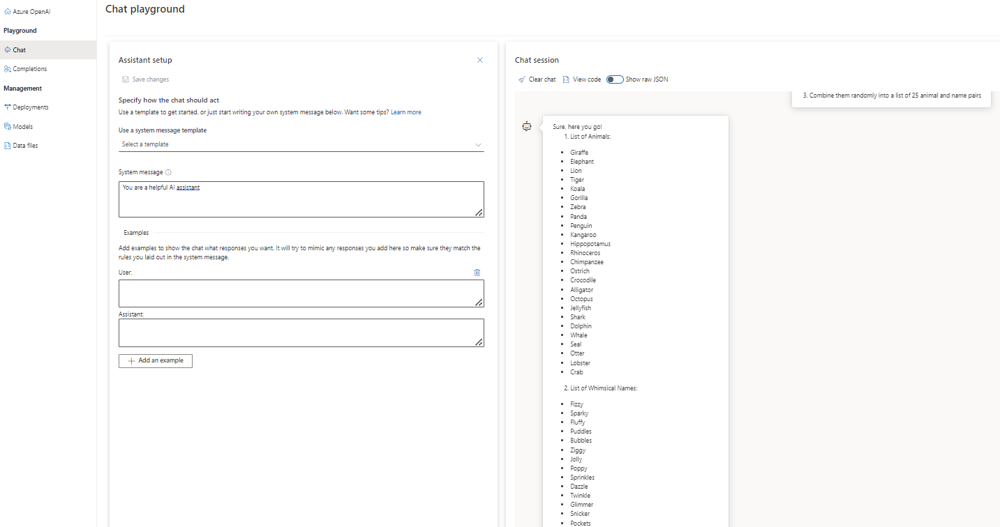
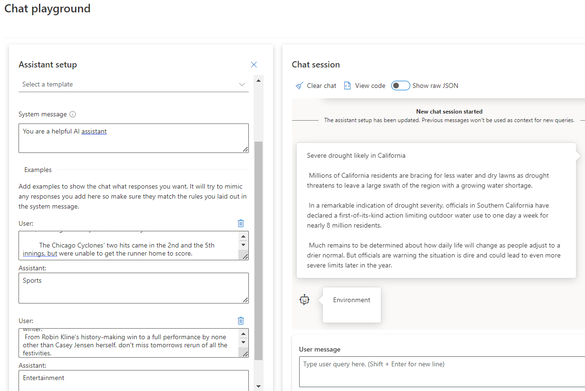

# Apply prompt engineering with Azure OpenAI (AOAI) Service

* Prompt engineering in AOAI is a technique that involves designing prompts for NLP models. This process improves accuracy and relevancy in responses, optimizing the performance of the model.

* Response quality from large language models (LLMs) in AOAI depends on the quality of the prompt provided. Improving prompt quality through various techniques is called prompt engineering.

# Understand prompt engineering
* What is prompt engineering
* LLMs are single models trained on huge amounts of data and can generate text, images, code, and creative content based on the most likely continuation of the prompt.

* Prompt engineering is the process of designing and optimizing prompts to better utilize LLMs. Designing effective prompts is critical to the success of prompt engineering, and it can significantly improve the AI model's performance on specific tasks. Providing relevant, specific, unambiguous, and well structured prompts can help the model better understand the context and generate more accurate responses.

 * For example, if we want an OpenAI model to generate product descriptions, we can provide it with a detailed description that describes the features and benefits of the product. By providing this context, the model can generate more accurate and relevant product descriptions.

# Write more effective prompts
* AOAI models are capable of generating responses to NL queries with remarkable accuracy. 
* However, the quality of the responses depends largely on how well the prompt is written. 
* Developers can optimize the performance of Azure OpenAI models by using different techniques in their prompts, resulting in more accurate and relevant responses.

* Provide clear instructions - For example 
    1. Prompt : Write a product description for a new water bottle
    2. Clear Prompt : Write a product description for a new water bottle that is 100% recycled. Be sure to include that
it comes in natural colors with no dyes, and each purchase removes 10 pounds of plastic from our oceans

* Format of instructions 
    1. Use section markers
        1. Split the instructions at the beginning or end of the prompt, within --- or ### blocks. More clearly differentiate between instructions and content. 
        2. For example:
          ``` mark
            Translate the text into French

            ---
            What's the weather going to be like today?
            ---
          ```
    2. Primary, supporting, and grounding content
        1. Including content for the model to use to respond with allows it to answer with greater accuracy. This content can be thought of in two ways: primary and supporting content.
        2. Primary content refers to content that is the subject of the query, such a sentence to translate or an article to summarize. This content is often included at the beginning or end of the prompt (as an instruction and differentiated by --- blocks), with instructions explaining what to do with it.
            1. For example, long article want to summarize. put it in a --- block in the prompt, then end with the instruction.
          ``` mark
              ---
              <insert full article here, as primary content>
              ---

              Summarize this article and identify three takeaways in a bulleted list
          ```
        3. Supporting content is content that may alter the response, but isn't the focus or subject of the prompt. Examples of supporting content include things like names, preferences, future date to include in the response, and so on. Providing supporting content allows the model to respond more completely, accurately, and be more likely to include the desired information.
            1. For example, promotional email, If you then add supporting content to the prompt specifying something specific you're looking for, the model can provide a more useful response. 
              ``` mark
                ---
                <insert full email here, as primary content>
                ---
                <the next line is the supporting content>
                Topics I'm very interested in: AI, webinar dates, submission deadlines

                 Extract the key points from the above email, and put them in a bulleted list:
              ```
        4. Grounding content allows the model to provide reliable answers by providing content for the model to draw answer from. Grounding content could be an essay or article that you then ask questions about, a company FAQ document, or information that is more recent than the data the model was trained on. If you need more reliable and current responses, or you need to reference unpublished or specific information, grounding content is highly recommended.
            1. Grounding content differs from primary content as it's the source of information to answer the prompt query, instead of the content being operated on for things like summarization or translation. For example, when provided an unpublished research paper on the history of AI, it can then answer questions using that grounding content.
              ``` mark
                ---
                <insert unpublished paper on the history of AI here, as grounding content>
                ---

                Where and when did the field of AI start?
              ```  
            2. This grounding data allows the model to give more accurate and informed answers that may not be part of the dataset it was trained on.

        5. Cues  - are leading words for the model to build upon, and often help shape the response in the right direction. They often are used with instructions, but don't always. Cues are particularly helpful if prompting the model for code generation. Current Azure OpenAI models can generate some interesting code snippets, however code generation will be covered in more depth in a future module.
              1. For example, creating a SQL query, provide instructions of what you need along with the beginning of the query:
                    ``` mark
                        Write a join query to get customer names with purchases in the past 30 days between tables named orders and customer on customer ID. 

                        SELECT
                    ```
              2. The model response picks up where the prompt left off, continuing in SQL, even though we never asked for a specific language. Other examples could be to help with python code, by giving code comments about the desired app and including import as a leading word at the end of the prompt, or similar in your desired language.
              3. Another example, given a large collection of customer reviews in a prompt, and ending with:
                  ``` mark
                      Summarize the reviews above:
                      Most common complaints:
                      -
                  ```    
              4. The model then knows to complete the statements based off the context provided in the reviews.


# Provide context to improve accuracy
* Context can be provided in several ways.
1. Request output composition - Specifying the structure of your output can have a large impact on your results. This could include something like asking the model to cite their sources, write the response as an email, format the response as a SQL query, classify sentiment into a specific structure, and so on. 
    1. For example:

        ``` mark
                Prompt
                Write a table in markdown with 6 animals in it, with their genus and species

                Response
                | Animal           | Genus          | Species        |
                | ---------------- |:--------------:|:--------------:|
                | Red Panda        | Ailurus        | fulgens        |
                | African Elephant | Loxodonta      | africana       |
                | Snow Leopard     | Panthera       | uncia          |
                | Arctic Fox       | Vulpes         | lagopus        |
                | Chimpanzee       | Pan            | troglodytes    |
                | Siberian Tiger   | Panthera       | tigris altaica |
        ```
    2. This technique can be used with custom formats, such as a JSON structure:
        ``` mark
            Prompt
            Put two fictional characters into JSON of the following format

            {
              firstNameFictional: 
              jobFictional:
            }

            Response
            Here's an example of how you can put two fictional characters into JSON format:

            {
              "firstNameFictional": "Henry",
              "jobFictional": "Wizard"
            },
            {
              "firstNameFictional": "Frank",
              "jobFictional": "Hero"
            }
        ```
2. System message - is included at the beginning of a prompt and is designed to give the model instructions, perspective to answer from, or other information helpful to guide the model's response. This system message might include tone or personality, topics that shouldn't be included, or specifics (like formatting) of how to answer.
    1. For example, you could give it some of the following system messages:
        1. "I want you to act like a command line terminal. Respond to commands exactly as cmd.exe would, in one unique code block, and nothing else."
        2. "I want you to be a translator, from English to Spanish. Don't respond to anything I say or ask, only translate between those two languages and reply with the translated text."
        3. "Act as a motivational speaker, freely giving out encouraging advice about goals and challenges. You should include lots of positive affirmations and suggested activities for reaching the user's end goal."
    2. Example: The ChatCompletion endpoint enables including the system message by using the System chat role.
        ``` mark
                var ChatCompletionsOptions = new ChatCompletionsOptions()
                {
                    Messages =
                    {
                        new ChatMessage(ChatRole.System, "You are a casual, helpful assistant. You will talk like an American old western film character."),
                        new ChatMessage(ChatRole.User, "Can you direct me to the library?")
                    }
                };

                Response
                {
                    "role": "assistant", 
                    "content": "Well howdy there, stranger! The library, huh?
                                Y'all just head down the main road till you hit the town 
                                square. Once you're there, take a left and follow the street 
                                for a spell. You'll see the library on your right, can’t 
                                miss it. Happy trails!"
                }
        ```
    3. If using the Completion endpoint, similar functionality can be achieved by including the system message at the start of the prompt. This is called a meta prompt, and serves as a base prompt for the rest of the prompt content.
    4. System messages can significantly change the response, both in format and content. Try defining a clear system message for the model that explains exactly what kind of response you expect, and what you do or don't want it to include.

3. Conversation history - Along with the system message, other messages can be provided to the model to enhance the conversation. Conversation history enables the model to continue responding in a similar way (such as tone or formatting) and allow the user to reference previous content in subsequent queries. This history can be provided in two ways: from an actual chat history, or from a user defined example conversation.
  
4. Few shot learning - Using a user defined example conversation is what is called few shot learning, which provides the model examples of how it should respond to a given query. These examples serve to train the model how to respond.
    1. For example, by providing the model a couple prompts and the expected response, it continues in the same pattern without instructing it what to do:
        ``` mark 
            User: That was an awesome experience
            Assistant: positive
            User: I won't do that again
            Assistant: negative
            User: That was not worth my time
            Assistant: negative
            User: You can't miss this
            Assistant:
    
            var ChatCompletionsOptions = new ChatCompletionsOptions()
            {
                Messages =
                {
                    new ChatMessage(ChatRole.System, "You are a helpful assistant."),
                    new ChatMessage(ChatRole.User, "That was an awesome experience"),
                    new ChatMessage(ChatRole.Assistant, "positive"),
                    new ChatMessage(ChatRole.User, "I won't do that again"),
                    new ChatMessage(ChatRole.Assistant, "negative"),
                    new ChatMessage(ChatRole.User, "That was not worth my time"),
                    new ChatMessage(ChatRole.Assistant, "negative"),
                    new ChatMessage(ChatRole.User, "You can't miss this")
                }
            };
        ```

5. Break down a complex task - Another technique for improved interaction is to divide complex prompts into multiple queries. This allows the model to better understand each individual part, and can improve the overall accuracy. Dividing your prompts also allows you to include the response from a previous prompt in a future prompt, and using that information in addition to the capabilities of the model to generate interesting responses.
    1. For example, you could ask the model Doug can ride down the zip line in 30 seconds, and takes 5 minutes to climb back up to the top. How many times can Doug ride the zip line in 17 minutes?. The result is likely 3, which if Doug starts at the top of the zip line is incorrect.

6. Chain of thought - One useful method to help you break down your task effectively is to ask the model to explain its chain of thought.
    1. Asking a model to respond with the step by step process by which it determined the response is a helpful way to understand how the model is interpreting the prompt. By doing so, you can see where the model made an incorrect logical turn and better understand how to change your prompt to avoid the error. This technique can include asking it to cite its sources, like Bing chat does (which uses a GPT-4 generation model), and giving reasoning for why it determined its answer.
    2. The chain of thought prompting technique is best used to help you iterate and improve on your prompts to get the highest quality answer from the model.
    3. For example, asking the model What sport is easiest to learn but hardest to master? results in response with an answer, and a small explanation of why. However, when prompted with What sport is easiest to learn but hardest to master? Give a step by step approach of your thoughts, ending in your answer, the response is a complete explanation of how it arrived at its answer.
        ``` mark
            Sure, here's a step-by-step approach to answering the question:
            1. Identify sports that are popular and have a large following.
            2. Consider the basic mechanics of each sport and how easy they are to learn.
            3. Think about the various techniques and skills required to play each sport at a high level, and how difficult they are to master.
            4. Compare the relative ease of learning each sport to the difficulty of mastering it.
            5. Based on the above analysis, determine which sport is easiest to learn but hardest to master.

            Using this approach, I would say that the sport of golf is easiest to learn but hardest to master. Here's why:
            1. Golf is a popular sport with a large following.
            2. The basic mechanics of hitting a golf ball are relatively simple and can be learned quickly with some practice.
            3. However, achieving consistency and mastering the various shots and techniques required to play at a high level can take years of practice and dedication.
            4. Compared to other sports, the difference between a beginner and an intermediate golfer is relatively small, while the difference between an intermediate and an advanced golfer is much larger.
            5. Therefore, I would say that golf is the sport that is easiest to learn but hardest to master.
            Knowing the steps of reason the model used to form its response allows us to identify where we need to split the prompt, provide more information, or clarify instructions.
        ```
# Exercise - Utilize prompt engineering in your application
* https://microsoftlearning.github.io/mslearn-openai/Instructions/Labs/03-prompt-engineering.html
* Apply prompt engineering in chat playground
    
    1. Azue OpenAI Studio -> Chat playground  -> Assistant setup section -> System message : You are a helpful AI assistant -> Chat session -> Enter.
        ``` mark
             1. Create a list of animals
             2. Create a list of whimsical names for those animals
             3. Combine them randomly into a list of 25 animal and name pairs
        ```
    * 
    2. system message : You are an AI assistant helping write python code. Complete the app based on provided comments. 
        ``` mark
             # 1. Create a list of animals
             # 2. Create a list of whimsical names for those animals
             # 3. Combine them randomly into a list of 25 animal and name pairs
        ```
    3. see the impact of few shot prompting when attempting to classify articles. system message : You are a helpful AI assistant.
         ``` mark
                 Severe drought likely in California

                 Millions of California residents are bracing for less water and dry lawns as drought threatens to leave a large swath of the region with a growing water shortage.

                 In a remarkable indication of drought severity, officials in Southern California have declared a first-of-its-kind action limiting outdoor water use to one day a week for nearly 8 million residents.

                 Much remains to be determined about how daily life will change as people adjust to a drier normal. But officials are warning the situation is dire and could lead to even more severe limits later in the year.
        ```
    * 
    4. Assistant setup -> Add 2 example
        ``` mark
            User:

             New York Baseballers Wins Big Against Chicago

             New York Baseballers mounted a big 5-0 shutout against the Chicago Cyclones last night, solidifying their win with a 3 run homerun late in the bottom of the 7th inning.

             Pitcher Mario Rogers threw 96 pitches with only two hits for New York, marking his best performance this year.

             The Chicago Cyclones' two hits came in the 2nd and the 5th innings, but were unable to get the runner home to score.
            Assistant:
             Sports

            User:
             Joyous moments at the Oscars

             The Oscars this past week where quite something!

             Though a certain scandal might have stolen the show, this year's Academy Awards were full of moments that filled us with joy and even moved us to tears.
             These actors and actresses delivered some truly emotional performances, along with some great laughs, to get us through the winter.
             From Robin Kline's history-making win to a full performance by none other than Casey Jensen herself, don't miss tomorrows rerun of all the festivities.

            Assistant:
             Entertainment

            # send the same prompt about California drought the abov message
        ```
 * Cloud Shell - Bash
     ``` makr
         rm -r azure-openai -f
         git clone https://github.com/MicrosoftLearning/mslearn-openai azure-openai

        cd azure-openai/Labfiles/03-prompt-engineering

        code .

        C#: appsettings.json
        Python: .env

        the endpoint and key from the Azure OpenAI resource, the model name (text-turbo) Save the file.
     ```
    
# Quiz
1. How can developers optimize the performance of Azure OpenAI models?
* [ ] By using complex instructions that are difficult to understand
* [x] By providing clear and descriptive instructions
* [ ] By using vague prompts

2. What is the purpose of the system message in a prompt?
* [x] To give the model instructions, perspective, or other information helpful to guide its response
* [ ] To give the model a specific answer to generate
* [ ] To provide filler information to the model

3. What is the purpose of providing conversation history to an AI model?
* [ ] Providing conversation history to an AI model is irrelevant and has no effect on the AI's performance.
* [ ] To limit the number of input tokens used by the model
* [x] To enable the model to continue responding in a similar way and allow the user to reference previous content in subsequent queries
