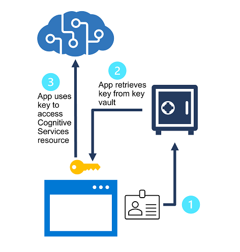
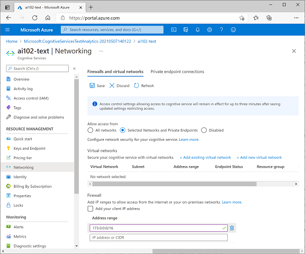

# Secure Cognitive Services
* Securing Cognitive Services can help prevent data loss and privacy violations for user data that may be a part of the solution.

# Consider authentication
* Regenerate keys - protect against the risk of keys being shared with or accessed by unauthorized users. 


* Protect keys with Azure Key Vault - is an Azure service in which you can securely store secrets (such as passwords and keys). 

* Token-based authentication - When using the REST interface, some Cognitive Services support (or even require) token-based authentication. In these cases, the subscription key is presented in an initial request to obtain an authentication token, which has a valid period of 10 minutes. Subsequent requests must present the token to validate that the caller has been authenticated.

* Azure Active Directory authentication - Some Cognitive Services support Azure Active Directory authentication, enabling you to grant access to specific service principals or managed identities for apps and services running in Azure.

# Implement network security
* Network security is an important measure to ensure unauthorized users cannot reach the services that you are protecting. Limiting what users can see is always a great idea, since they can’t compromise what they can’t see.


* Apply network access restrictions - By default, Cognitive Services are accessible from all networks. Some individual Cognitive Services resources (such as Text Analytics, Face, Computer Vision, and others) can be configured to restrict access to specific network addresses - either public Internet addresses or addresses on virtual networks. With network restrictions enabled, a client trying to connect from an IP address that is not allowed will receive an Access Denied error.

# Exercise - Manage Cognitive Services Security
1. Start Visual Studio Code. Open the palette (SHIFT+CTRL+P) and run a Git: Clone command to clone the https://github.com/MicrosoftLearning/AI-102-AIEngineer repository to a local folder (it doesn't matter which folder).
2. Provision a Cognitive Services resource
3. Manage authentication keys
    1. 02-cognitive-security -> open an integrated terminal ->  az login
    2. multiple subscriptions, choose one -> az account show -> az account set --subscription <Your_Subscription_Id>
    3. list of cognitive services keys -> az cognitiveservices account keys list --name <resourceName> --resource-group <resourceGroup>
    4. test your cognitive service, 02-cognitive-security/rest-test.cmd (Edit) -> rest-test (run)
    5. curl -X POST "<yourEndpoint>/text/analytics/v3.0/languages?" -H "Content-Type: application/json" -H "Ocp-Apim-Subscription-Key: <yourKey>" --data-ascii "{'documents':[{'id':1,'text':'hello'}]}"
    6. regenerate your key1 key -> az cognitiveservices account keys regenerate --name <resourceName> --resource-group <resourceGroup> --key-name key1
    7. rest-test (Re Run) -> error fail

4. Secure key access with Azure Key Vault
    1. Create Key Vault resource -> Accesss Congiguraiton tab -> Permission model: Vault access policy
    2. Secrtes -> Generate/Import (add a new secret) -> Upload options: Manual | Name: Cognitive-Services-Key (it's important to match this exactly, because later you'll run code that retrieves the secret based on this name) | Value: Your key1 cognitive services key

5. Create a service principal
    1. 02-cognitive-security folder/integrated terminal -> az ad sp create-for-rbac -n "api://<spName>" --role owner --scopes subscriptions/<subscriptionId>/resourceGroups/<resourceGroup>
      ``` mark
        The output new service principal:
        {
            "appId": "abcd12345efghi67890jklmn",
            "displayName": "ai-app",
            "name": "http://ai-app",
            "password": "1a2b3c4d5e6f7g8h9i0j",
            "tenant": "1234abcd5678fghi90jklm"
        }
      ```
    2. Get the object ID of your service principal -> az ad sp show --id <appId> --query objectId --out tsv

    3. Assign permission for your new service principal -> az keyvault set-policy -n <keyVaultName> --object-id <objectId> --secret-permissions get list

  6. Use the service principal in an application
            1. 02-cognitive-security/keyvault-client -> integrated terminal. 
              ``` mark
                  C#

                  dotnet add package Azure.AI.TextAnalytics --version 5.1.0
                  dotnet add package Azure.Identity --version 1.5.0
                  dotnet add package Azure.Security.KeyVault.Secrets --version 4.2.0-beta.3

                  Python

                  pip install azure-ai-textanalytics==5.1.0
                  pip install azure-identity==1.5.0
                  pip install azure-keyvault-secrets==4.2.0
              ```
            2. keyvault-client -> C#: appsettings.json or Python: .env
            3. view the code C#: Program.cs or  
Python: keyvault-client.py
            4. Run C# dotnet run Python python keyvault-client.py
            5. entering "Hello", "Bonjour", and "Gracias".
  
  
# Quiz 

  1. You need to regenerate the primary subscription key for a Cognitive Services resource that an app uses. What should you do first to minimize service interruption for the app?
* [x] Switch the app to use the secondary key
* [ ] Change the resource endpoint
* [ ] Enable a firewall

2. You want to store the subscription keys for a Cognitive Services resource securely, so that authorized apps can retrieve them when needed. What kind of Azure resource should you provision.
* [ ] Azure Storage
* [x] Azure Key Vault
* [ ] Azure App Service

3. When running code on your computer that connects to Cognitive Services, you receive an error that access is denied due to Virtual Network/Firewall rules. What configuration do you need to set in the Cognitive Services instance?
* [ ] In the Networking properties, configure Selected Networks and Private Endpoints.
* [x] In Networking properties, add your client IP address to the Firewall allowed list.
* [ ] In Access control, add your Azure Active Directory user account to a role.
