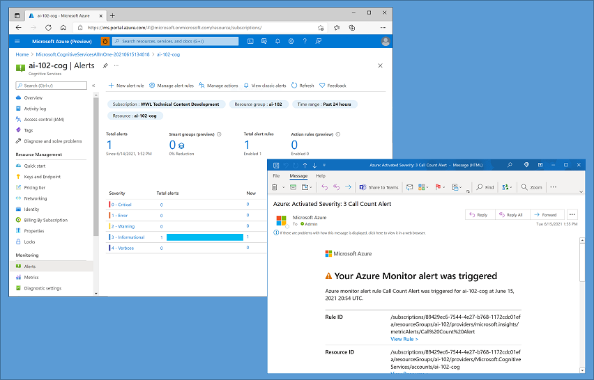
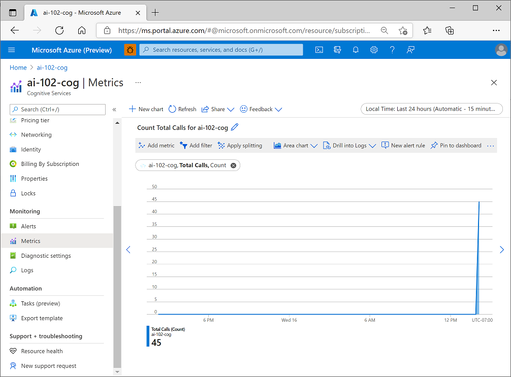
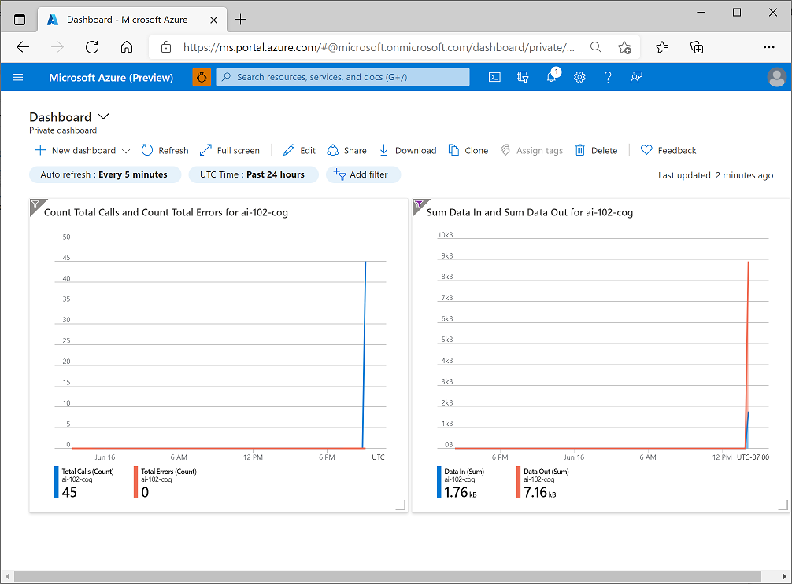
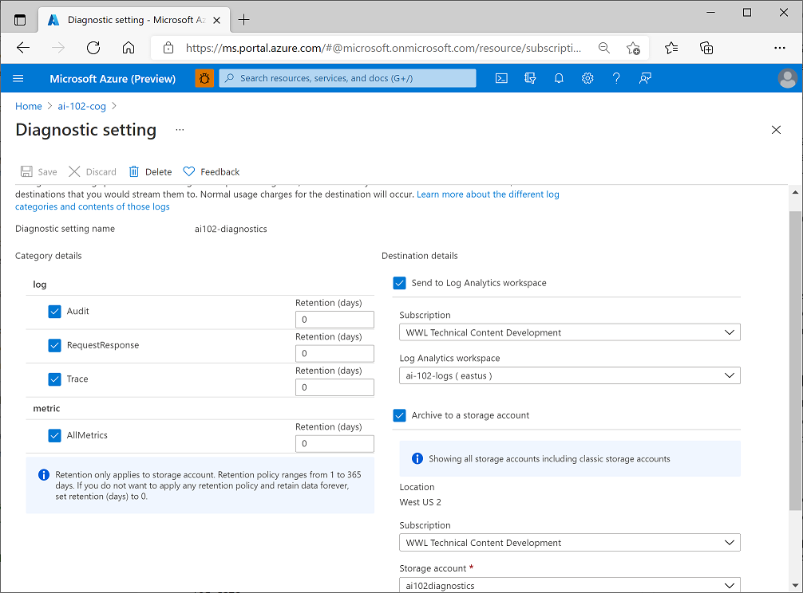

# Monitor Cognitive Services
* Azure Cognitive Services enable you to integrate AI into your applications and services. 

* Monitor cost
  1. only paying for services as you use them. Some offer a free tier with restrictions on use, which is useful for development and testing

  2. Plan costs for Cognitive Services. Before deploying, estimate costs by using the Azure Pricing Calculator.

  3. View costs for Cognitive Services

* 
* Create alerts: Cognitive Services resource -> Alerts tab, add a new alert rule. To define the alert rule, you must specify:
    1. The scope of the alert rule ( the resource you want to monitor).
    2. A condition on which the alert is triggered. The specific trigger for the alert is based on a signal type, which can be Activity Log (an entry in the activity log created by an action performed on the resource, such as regenerating its subscription keys) or Metric (a metric threshold such as the number of errors exceeding 10 in an hour).
    3. Optional actions, such as sending an email to an administrator notifying them of the alert, or running an Azure Logic App to address the issue automatically.
    4. Alert rule details, such as a name for the alert rule and the resource group in which it should be defined.

* View metrics - collects metrics at regular intervals so that you can track indicators of resource utilization, health, and performance.
    1. View metrics in the Azure portal -> selecting the resource -> add resource-specific metrics to charts
    * 
    2. shows the Metrics page for an Azure Cognitive Services resource, showing the count of total calls to the service over a period of time.
    * 
    3. Add metrics to a dashboard -> select Dashboard in the Azure portal menu -> add up to 100 named dashboards. two charts showing metrics for an Azure Cognitive Services resource have been added to a dashboard.

* Manage diagnostic logging - capture rich operational data for a Cognitive Services resource, which can be used to analyze service usage and troubleshoot problems.
    1. Create resources for diagnostic log storage - To capture, need a destination for the log data. Azure Event Hub as a destination in order to then forward the data on to a custom telemetry solution, and connect directly third-party solutions; but in most cases you'll use one (or both) of the following kinds of resource within your Azure subscription:
        1. Azure Log Analytics - a service that enables you to query and visualize log data within the Azure portal.
        2. Azure Storage - a cloud-based data store that you can use to store log archives (which can be exported for analysis in other tools as needed). 
    2. intend to archive log data to Azure Storage, create the Azure Storage account in the same region as your Cognitive Services resource.

* Configure diagnostic settings
    1. With your log destinations in place, you can configure diagnostic settings for your Cognitive Services resource.  When you add diagnostic settings, you must specify:
        1. A name for your diagnostic settings.
        2. The categories of log event data that you want to capture.
        3. Details of the destinations in which you want to store the log data.
        *
        5. the diagnostic settings store all available log data and metrics in Azure Log Analytics and Azure Storage.

* 
* View log data in Azure Log Analytics - take an hour or more before diagnostic data starts flowing to the destinations, but when the data has been captured, you can view it in your Azure log Analytics resource by running queries

* Exercise - Monitor Cognitive Services
    1. clone https://github.com/MicrosoftLearning/AI-102-AIEngineer
    2. create a Cognitive Services resource 
    3. Configure an alert -> Alerts (Monitoring section) -> Create Alert rule
        1. under Scope, verify that the your cognitive services resource is listed.
        2.  Condition tab -> Select a signal list -> filtered by  List Keys | over the past 6 hours.
        3. Actions tab -> group (enables you to configure automated actions when an alert is fired - for example, sending an email notification)
        4. Details ->Alert rule name to Key List Alert -> Create
    5. 03-monitor/integrated terminal -> az login
    6. multiple subscriptions, choose one -> az account show -> az account set --subscription <subscriptionName>
    7. list of the keys cognitive services -> az cognitiveservices account keys list --name <resourceName> --resource-group <resourceGroup>
    8. refresh your Alerts page -> see a Sev 4 alert listed in the table -> Select the alert to see its details.

* Visualize a metric
    1. Metrics -> create New chart -> Metric list : Total calls | Aggregation :  Count
    2. to generate some requests to your cognitive service -> curl -X POST "<yourEndpoint>/text/analytics/v3.1/languages?" -H "Content-Type: application/json" -H "Ocp-Apim-Subscription-Key: <yourKey>" --data-ascii "{'documents':           [{'id':1,'text':'hello'}]}"
    3. re run couple of times
    4. Return to the Metrics page - >  refresh the Total Calls count chart.
