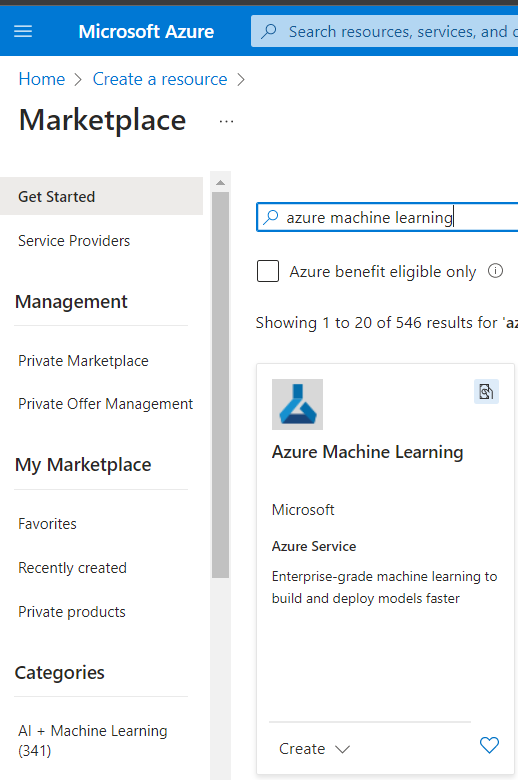
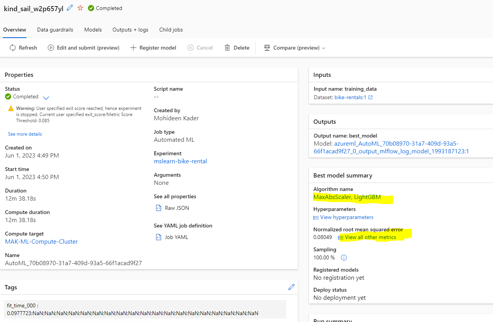
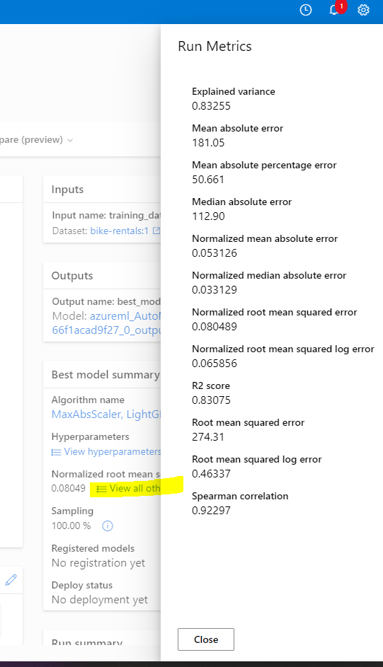

# What is machine learning?
* ML is a technique that uses mathematics and statistics to create a model that can predict unknown values.
* For example, Cycle rental company could use historic data to train a model that predicts daily rental demand in order to make sure sufficient staff and cycles are available.
* To do this, create a ML model that takes information about a specific day (the day of week, weather, ...) as an input (x), the number of rentals for that day is the label (y), and predicts the expected number of rentals as an output.The function (f) that calculates the number of rentals based on the information about the day is encapsulated in a machine learning model. f(x) = y

* <b>Types of ML</b> : supervised and unsupervised ML
    1. <b>The supervised ML</b> approach requires you to start with a dataset with known label values. Two types of supervised ML tasks include regression and classification.
        1. <b>Regression</b>: used to predict a continuous value; like a price, a sales total, or some other measure.
        2. <b>Classification</b>: used to determine a class label; an example of a binary class label is whether a patient has diabetes or not; an example of multi-class labels is classifying text as positive, negative, or neutral.
    2. <b>The unsupervised ML</b> approach starts with a dataset without known label values. One type of unsupervised ML task is clustering.
        1. <b>Clustering:</b> used to determine labels by grouping similar information into label groups; like grouping measurements from birds into species.

# What is Azure Machine Learning?
* Training and deploying an effective ML model involves a lot of work, much of it time-consuming and resource-intensive. 
* Azure ML is a cloud-based service that helps simplify some of the tasks it takes to prepare data, train a model, and deploy a predictive service.

# Azure Machine Learning workspace
* Crreate a workspace resource. 
* Develop solutions with the Azure ML service either with developer tools or the Azure ML studio web portal.
* <b>Azure Machine Learning studio</b> - is a web portal for ML solutions in Azure. 
        

# Azure Machine Learning compute
* At its core, Azure ML is a service for training and managing ML models, for which you need compute on which to run the training process.
* Compute targets are cloud-based resources on which you can run model training and data exploration processes.
* In Azure Machine Learning studio, you can manage the compute targets for your data science activities. 4 compute resource you can create:
    1. <b>Compute Instances</b>: Development workstations that data scientists can use to work with data and models.
    2. <b>Compute Clusters</b>: Scalable clusters of virtual machines for on-demand processing of experiment code.
    3. <b>Inference Clusters</b>: Deployment targets for predictive services that use your trained models.
    4. <b>Attached Compute</b>: Links to existing Azure compute resources, such as Virtual Machines or Azure Databricks clusters.

# What is Azure Automated Machine Learning?
* Azure ML includes an automated ML capability that automatically tries multiple pre-processing techniques and model-training algorithms in parallel. These automated capabilities use the power of cloud compute to find the best performing supervised ML model for your data.

* create an automated machine learning job in Azure Machine Learning studio.
    

* In Azure ML, operations that you run are called <b>jobs</b>. You can configure multiple settings for your job before starting an automated ML run. The run configuration provides the information needed to specify your training script, compute target, and Azure ML environment in your run configuration and run a training job.
    

# Understand the AutoML process

* ## The steps in a machine learning process as:
    1. <b>Prepare data</b>: Identify the features and label in a dataset. Pre-process, or clean and transform, the data as needed.
    2. <b>Train model</b>: Split the data into two groups, <b>a training and a validation set</b>. 
        1. Train a machine learning model using the training data set. 
        2. Test the machine learning model for performance using the validation data set.
    3. <b>Evaluate performance</b>: Compare how close the model's predictions are to the known labels.
    4. <b>Deploy a predictive service</b>: After you train a ML model, deploy the model as an application on a server so that others can use it.

* These are the same steps in the automated ML process with Azure ML
    1. <b>Prepare data</b> - ML models must be trained with existing data. In Azure ML, data for model training and other operations is usually encapsulated in an object called a <b>data asset</b>. You can create your own data asset in Azure Machine Learning studio.
        
    2. <b>Train model</b> - The automated ML capability in Azure ML supports supervised ML models, means models for which the training data includes known label values. You can use automated ML to train models for:
        1. <b>Classification</b> (predicting categories or classes)
        2. <b>Regression</b> (predicting numeric values)
        3. <b>Time series forecasting</b> (predicting numeric values at a future point in time)

* In Automated Machine Learning you can select from several types of tasks:
    

* In Automated ML, select configurations for the primary metric, type of model used for training, exit criteria, and concurrency limits.
    

* AutoML will split data into a training set and a validation set. You can configure the details in the settings before you run the job.
    

* <b>Evaluate performance</b> - After the job has finished you can review the best performing model. Thus the "best" model the job generated might not be the best possible model, just the best one found within the time allowed for this exercise.

    * The best model is identified based on the evaluation metric you specified, Normalized root mean squared error.

    * A technique called <b>cross-validation</b> is used to calculate the evaluation metric. After the model is trained using a portion of the data, the remaining portion is used to iteratively test, or cross-validate, the trained model. The metric is calculated by comparing the predicted value from the test with the actual known value, or label.

    * <b>The difference between the predicted and actual value, known as the residuals</b>, indicates the amount of error in the model. 
    * The <b>performance metric root mean squared error (RMSE)</b>, is calculated by squaring the errors across all of the test cases, finding the mean of these squares, and then taking the square root. What all of this means is that smaller this value is, the more accurate the model's predictions. 
    * <b>The normalized root mean squared error (NRMSE)</b> standardizes the RMSE metric so it can be used for comparison between models which have variables on different scales.

    * <n>The Residual Histogram</b> shows the frequency of residual value ranges. Residuals represent variance between predicted and true values that can't be explained by the model, in other words, errors. You should hope to see the most frequently occurring residual values clustered around zero. You want small errors with fewer errors at the extreme ends of the scale.
        

    * <b>The Predicted vs. True chart</b> should show a diagonal trend in which the predicted value correlates closely to the true value. The dotted line shows how a perfect model should perform. The closer the line of your model's average predicted value is to the dotted line, the better its performance. A histogram below the line chart shows the distribution of true values. 
        

    * After you've used automated ML to train some models, you can deploy the best performing model as a service for client applications to use.

* <b>Deploy a predictive service</b> - In Azure ML, you can deploy a service as an Azure Container Instances (ACI) or to an Azure Kubernetes Service (AKS) cluster. For production scenarios, an AKS deployment is recommended, for which you must create an inference cluster compute target.

# Exercise - Explore Automated ML in Azure ML
* use a dataset of historical bicycle rental details to train a model that predicts the number of bicycle rentals that should be expected on a given day, based on seasonal and meteorological features.

https://microsoftlearning.github.io/AI-900-AIFundamentals/instructions/02-module-02.html

1. <b>Create an Azure ML workspace</b>: The Azure portal, create a new "Azure Machine Learning" resource with an Azure ML plan. Use the following settings:
    1. Subscription, Resource group, Workspace name, Region
    2. Storage account, Key vault, Application insights: Note the default will be created for your workspace.
    3. Container registry: None (one will be created automatically the first time you deploy a model to a container).
    4. Create. Go to the deployed resource. Select Launch studio (navigate to https://ml.azure.com),  you should see your newly created workspace. 
        1. If that is not the case, select Azure directory -> Workspaces -> select the one you created.
            

* 
2. <b>Create compute</b>: In Azure ML studio, select the ≡ icon -> Compute (under Manage) -> Compute clusters -> add a new compute cluster. Use this to train a machine learning model:
    
    1. Select Location | VM tier: Dedicated | VM type: CPU | VM size: Choose from all options, select Standard_DS11_v2 | Next
    
    2. Compute name: enter a unique name | Minimum number of nodes: 0 | Maximum number of nodes: 2 | Idle seconds before scale down: 120 | Enable SSH access: Clear | Create
    3. Note Compute instances and clusters are based on standard Azure VM images. For this module, the Standard_DS11_v2 image is recommended to achieve the optimal balance of cost and performance. 

3. <b>Create a data asset</b> - [View the comma-separated data](3.1.daily-bike-share.csv). https://capitalbikeshare.com/system-data
    1. In Azure ML studio, View the Data page (under Assets). The Data page contains specific data files or tables that you plan to work with in Azure ML. 
    
    2. Create datasets: the Data page -> Create -> Then configure a data asset with the following settings:
        
        1. Data type => Name: bike-rentals | Description: Bicycle rental data | Dataset type: Tabular
        
        2. Data source: From Web Files
        * 
        3. Web URL =>  Web URL: https://aka.ms/bike-rentals | Skip data validation: do not select
        
        4. Settings => File format: Delimited | Delimiter: Comma | Encoding: UTF-8 | Column headers: Only first file has headers | Skip rows: None | Dataset contains multi-line data: do not select
        
        5. Schema= > Include all columns other than Path | Review the automatically detected types
        
        6. Review -> Select Create
    
    3. After the dataset has been created, open it and view the Explore page to see a sample of the data. This data contains historical features and labels for bike rentals.

4. <b>Run an automated machine learning job</b> - to train a regression model that predicts bicycle rentals.
    1. In Azure ML studio, Select - > Automated ML (under Author) -> New Automated ML Job:
        1. Select data asset => Dataset: bike-rentals
        
        2. Configure job => New experiment name: mslearn-bike-rental | Target column: rentals (this is the label that the model is trained to predict) | Select Azure ML compute cluster: the compute cluster that you created previously.
        
        3. Select task and settings => Task type: Regression (the model predicts a numeric value)
            
            1. Additional configuration settings:
                1. Primary metric: Select Normalized root mean squared error
                2. Explain best model: Selected — this option causes automated ML to calculate feature importance for the best model which makes it possible to determine the influence of each feature on the predicted label.
                3. Use all supported models: Unselected. You’ll restrict the job to try only a few specific algorithms.
                4. Allowed models: Select only RandomForest and LightGBM — normally you’d want to try as many as possible, but each model added increases the time it takes to run the job.
                5. Exit criterion:
                    1. Training job time (hours): 0.5 — ends the job after a maximum of 30 minutes.
                    2. Metric score threshold: 0.085 — if a model achieves a normalized root mean squared error metric score of 0.085 or less, the job ends.
                6. Concurrency: do not change
            
            2. Featurization settings => Enable featurization: Selected — automatically preprocess the features before training.
        
        6. Click Next -> Validate and test type =>  Validation type: Auto | Test data asset (preview): No test data asset required
        7. When you finish submitting the automated ML job details, it starts automatically. Wait for the status to change from Preparing to Running.
        8. When the status changes to Running, view the Models tab and observe as each possible combination of training algorithm and pre-processing steps is tried and the performance of the resulting model is evaluated. 

* 
5. <b>Review the best model</b> - On the Overview tab of the automated ML job, note the best model summary. 
    1. A message under the status “Warning: User specified exit score reached…”. This is an expected message. Please continue to the next step.
    
    2. Select the text under <b>Algorithm name</b> for the best model to view its details.
        
        1. Select the Metrics tab and select the residuals and predicted_true charts if they are not already selected.
            1. Review the charts which show the performance of the model. The first chart shows the residuals, the differences between predicted and actual values, as a histogram, the second chart compares the predicted values against the true values.
        
        2. Select the Explanations tab. Select an Explanation ID and then select Aggregate feature importance. This chart shows how much each feature in the dataset influences the label prediction:
    * 
    3. Next to the <b>Normalized root mean squared error</b> value, select View all other metrics to see values of other possible evaluation metrics for a regression model.
    
6. <b>Deploy a predictive service</b>
    * 
    1. In Azure ML studio, Select Automated ML (under Authoring) -> Display name -> Algorithm Name (Overview tab under Best model summary) -> Model tab -> Deploy button -> Web service option:
        * 
        1. Name: predict-rentals | Description: Predict cycle rentals | Compute type: Azure Container Instance | Enable authentication: Selected
        2. Wait for the deployment to start - this may take a few seconds. 
    2. Then, in the Model summary section, observe the Deploy status for the predict-rentals service, which should be Running. Wait for this status to change to Succeeded, which may take some time. You may need to select Refresh periodically.

* 
7. <b>Test the deployed service</b> - In Azure ML studio, select Endpoints (under Assest). Now you can test your deployed service.
    1. On the Endpoints page, open the predict-rentals real-time endpoint. view the Test tab.
    2. In the Input data to test real-time endpoint pane, replace the template JSON with the following input data. Click on the Test button.
            {
            "Inputs": { 
                "data": [
                {
                    "day": 1,
                    "mnth": 1,   
                    "year": 2022,
                    "season": 2,
                    "holiday": 0,
                    "weekday": 1,
                    "workingday": 1,
                    "weathersit": 2, 
                    "temp": 0.3, 
                    "atemp": 0.3,
                    "hum": 0.3,
                    "windspeed": 0.3 
                }
                ]    
            },   
            "GlobalParameters": 1.0
            }
    
    3. Review the test results, which include a predicted number of rentals based on the input features. The test pane took the input data and used the model you trained to return the predicted number of rentals.

8. <b>Review what you have done</b>. Used a dataset of historical bicycle rental data to train a model. The model predicts the number of bicycle rentals expected on a given day, based on seasonal and meteorological features. In this case, the labels are number of bicycle rentals.

9. Ready to be connected to a client application using the credentials in the Consume tab.

10. <b>Clean-up</b>
    1. The web service you created is hosted in an Azure Container Instance. If no use further,delete the endpoint to avoid accruing unnecessary Azure usage. 
    2. Stop the compute instance until you need it again.
        1. In Azure ML studio, Select Endpoint -> chekc predict-rentals -> Delete.
        2. Select Compute -> Compute Instances tab -> select your compute instance and then select Stop.
    3. Note: Stopping your compute ensures your subscription won’t be charged for compute resources. You will however be charged a small amount for data storage as long as the Azure ML workspace exists in your subscription. 

11. <b>To delete your workspace</b> - In the Azure portal -> Resource groups page -> select Azure Machine Learning workspace -> Delete resource group.

# Quiz
1. An automobile dealership wants to use historic car sales data to train a machine learning model. The model should predict the price of a pre-owned car based on its make, model, engine size, and mileage. What kind of machine learning model should the dealership use automated machine learning to create?
    * [ ] Classification
    * [x] Regression : Correct. To predict a numeric value, use a regression model.
    * [ ] Time series forecasting
2. A bank wants to use historic loan repayment records to categorize loan applications as low-risk or high-risk based on characteristics like the loan amount, the income of the borrower, and the loan period. What kind of machine learning model should the bank use automated machine learning to create?
    * [x] Classification: Correct. To predict a category, or class, use a classification model.
    * [ ] Regression
    * [ ] Time series forecasting
3. You want to use automated machine learning to train a regression model with the best possible R2 score. How should you configure the automated machine learning experiment?
    * [x] Set the Primary metric to R2 score : Correct. The primary metric determines the metric used to evaluate the best performing model.
    * [ ] Block all algorithms other than GradientBoosting
    * [ ] Enable featurization