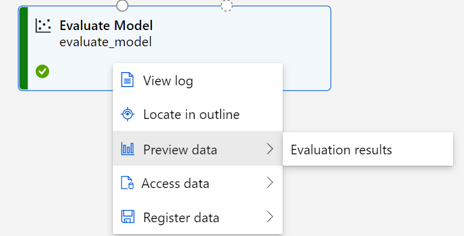
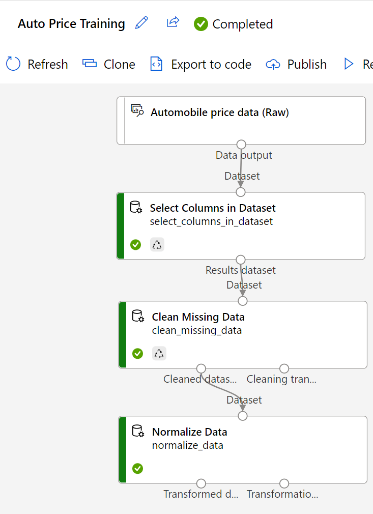
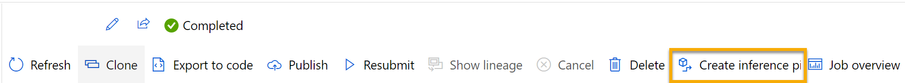

* Regression is a supervised machine learning technique used to predict numeric values.
* Use Azure ML designer to create regression models by using a drag and drop visual interface, without needing to write any code.

# Identify regression ML scenarios
1. Regression is a form of ML used to understand the relationships between variables to predict a desired outcome. 
2. Regression predicts a numeric label or outcome based on variables, or features. 
    1. For example, an automobile sales company might use the characteristics of a car (such as engine size, number of seats, mileage ...) to predict its likely selling price. In this case, the characteristics of the car are the features, and the selling price is the label.
3. Train a model using data that includes both the features and known values for the label, so that the model learns to fit the feature combinations to the label. Then, after training has been completed, you can use the trained model to predict labels for new items for which the label is unknown.
4. Scenarios for regression machine learning models: Using characteristics of
    1. houses, such as square footage and number of rooms, to predict home prices.
    2. farm conditions, such as weather and soil quality, to predict crop yield.
    3. a past campaign, such as advertising logs, to predict future advertisement clicks.

# What is Azure Machine Learning designer?
1. In Azure M studio, there are several ways to author regression ML models. 
2. <b>One way is to use a visual interface called designer</b> that you can use to train, test, and deploy machine learning models.The drag-and-drop interface makes use of clearly defined inputs and outputs that can be shared, reused, and version controlled.

* 
3. Each designer project, known as a <b>pipeline</b>, has a left panel for navigation and a canvas on your right hand side. To use designer, identify the building blocks, or components, needed for your model, place and connect them on your canvas, and run a machine learning job.

* 
4. <b>Pipelines</b> let you organize, manage, and reuse complex ML workflows across projects and users. A pipeline starts with the dataset from which you want to train the model. Each time you run a pipeline, the configuration of the pipeline and its results are stored in your workspace as a pipeline job.

* 
5. <b>Components</b> - encapsulates one step in a ML pipeline. You can think of a component as a programming function and as a building block for Azure ML pipelines. In a pipeline project, you can access data assets and components from the left panel's Asset Library tab.

* 
6. <b>Datasets</b>. create data assets on the Data page from local files, a datastore, web files, and Open Datasets. These data assets will appear along with standard sample datasets in designer's Asset Library. 

7. <b>Azure Machine Learning Jobs</b> - job executes a task against a specified compute target. Jobs enable systematic tracking for your ML experimentation and workflows. Once a job is created, Azure ML maintains a run record for the job. All of your jobs' run records can be viewed in Azure ML studio.
    
    1. In your designer project, you can access the status of a pipeline job using the Submitted jobs tab on the left pane.
    
    2. You can find all the jobs you have run in a workspace on the Jobs page.

# Understand steps for regression
* Steps to train and evaluate a regression machine learning model as: [Refer ](https://github.com/mkader/Azure-AI/blob/main/3.Use%20Automated%20ML%20in%20Azure%20ML.MD#the-steps-in-a-machine-learning-process-as)
  
* Follow these four steps as they appear in Azure designer.
    * 
    1. <b>Prepare data</b> - Azure ML designer has several pre-built components that can be used to prepare data for training. These components enable you to clean data, normalize features, join tables, and more. 
   
    * 
    2. <b>Train model</b> - To train a regression model, you need a dataset that includes historical features, characteristics of the entity for which you want to make a prediction, and known label values. The label is the quantity you want to train a model to predict.
        1. It's common practice to train the model using a subset of the data, while holding back some data with which to test the trained model. This enables you to compare the labels that the model predicts with the actual known labels in the original dataset.
        2. You will use designer's Score Model component to generate the predicted class label value. Once you connect all the components, you will want to run an experiment, which will use the data asset on the canvas to train and score a model.
   
    *     
    3. <b>Evaluate performance</b> - After training a model, it is important to evaluate its performance. There are many performance metrics and methodologies for evaluating how well a model makes predictions. You can review evaluation metrics on the completed job page by right-clicking on the Evaluate model component.
        1. <b>Mean Absolute Error (MAE)</b>: The average difference between predicted values and true values. This value is based on the same units as the label, in this case dollars. The lower this value is, the better the model is predicting.
        2. <b>Root Mean Squared Error (RMSE)</b>: The square root of the mean squared difference between predicted and true values. The result is a metric based on the same unit as the label (dollars). When compared to the MAE (above), a larger difference indicates greater variance in the individual errors (for example, with some errors being very small, while others are large).
        3. <b>Relative Squared Error (RSE)</b>: A relative metric between 0 and 1 based on the square of the differences between predicted and true values. The closer to 0 this metric is, the better the model is performing. Because this metric is relative, it can be used to compare models where the labels are in different units.
        4. <b>Relative Absolute Error (RAE)</b>: A relative metric between 0 and 1 based on the absolute differences between predicted and true values. The closer to 0 this metric is, the better the model is performing. Like RSE, this metric can be used to compare models where the labels are in different units.
        5. <b>Coefficient of Determination (R2)</b>: This metric is more commonly referred to as R-Squared, and summarizes how much of the variance between predicted and true values is explained by the model. The closer to 1 this value is, the better the model is performing.
   
    4. <b>Deploy a predictive service</b> - You have the ability to deploy a service that can be used in real-time. In order to automate your model into a service that makes continuous predictions, you need to create and deploy an inference pipeline.
        
        1. <b>Inference pipeline</b> - To deploy your pipeline, you must first convert the training pipeline into a real-time inference pipeline. This process removes training components and adds web service inputs and outputs to handle requests.
            1. The inference pipeline performs the same data transformations as the first pipeline for new data. Then it uses the trained model to infer, or predict, label values based on its features. This model will form the basis for a predictive service that you can publish for applications to use.
            2. You can create an inference pipeline by selecting the menu above a completed job. 
        2. <b>Deployment</b> - After creating the inference pipeline, you can deploy it as an endpoint. In the endpoints page, you can view deployment details, test your pipeline service with sample data, and find credentials to connect your pipeline service to a client application.
            
            1. It will take a while for your endpoint to be deployed. The Deployment state on the Details tab will indicate Healthy when deployment is successful.
            
            2. On the Test tab, you can test your deployed service with sample data in a JSON format. The test tab is a tool you can use to quickly check to see if your model is behaving as expected. Typically it is helpful to test the service before connecting it to an application.
            
            3. You can find credentials for your service on the Consume tab. These credentials are used to connect your trained machine learning model as a service to a client application.

# Exercise - Explore regression with Azure Machine Learning designer
* In this exercise, you will train a regression model that predicts the price of an automobile based on its characteristics.
* https://microsoftlearning.github.io/AI-900-AIFundamentals/instructions/02a-create-regression-model.html

1. Create an Azure Machine Learning workspace -> Select Launch studio (or open https://ml.azure.com) -> Create compute
2. Create a pipeline in Designer
    
    1. Select Designer page (under Author) -> create a new pipeline using classic prebuilt components
    
    2. select Settings. If the Settings pane is not visible, select the wheel icon next to the pipeline name at the top.
        1. specify a compute target on which to run the pipeline. compute type : Compute cluster | Azure ML compute cluster : select the compute cluster you created previously.
        2. Draft : change the draft name (Pipeline-Created-on-date) to Auto Price Training.
        3. Select the close icon on the top right of the Settings pane to close the pane.
3. Add and explore a dataset
    1. Azure ML includes a sample dataset that you can use for your regression model.
    * 
    2. Select <b>Asset library (books) icon (default)</b> at the top -> Click on <b>Component</b> -> Search and place the <b>Automobile price data (Raw)</b> dataset onto the canvas.
        
        1. Right-click the Automobile price data (Raw) dataset on the canvas, and click on <b>Preview data</b>.
        2. Review the Dataset output schema of the data, noting that you can see the distributions of the various columns as histograms.
        3. Scroll to the right of the dataset until you see the Price column, which is the label that your model predicts.
        4. Scroll back to the left and select the normalized-losses column header. Then review the statistics for this column. Note there are quite a few missing values in this column. Missing values limit the column’s usefulness for predicting the price label so you might want to exclude it from training.
        5. Close the Automobile price data (Raw) result visualization window so that you can see the dataset on the canvas like this:
4. Add data transformations
    1. You typically apply data transformations to prepare the data for modeling. In the case of the automobile price data, you add transformations to address the issues you identified when you explored the data.
    * 
    2. click on Component, which contain a wide range of modules you can use for data transformation and model training.
    3. Search for a <b>Select Columns in Dataset</b> module and place it to the canvas, below the Automobile price data (Raw) module. Then connect the output at the bottom of the Automobile price data (Raw) module to the input at the top of the Select Columns in Dataset module
    
    4. Double click on the <b>Select Columns in Dataset</b> module to access a settings pane on the right. Select <b>Edit column</b>. Then in the <b>Select columns</b> window, select <b>By name</b> and <b>Add all</b> to add all the columns. Then remove <b>normalized-losses</b>.
    5. Click on the Save button.
    * 
    6. In the rest of this exercise, you go through steps to create a pipeline. Follow the remaining steps, use the image for reference as you add and configure the required modules.
        
        1. Add & connect a <b>Clean Missing Data</b> module.
            1. Double click -> Edit column -> With rules -> <b>Column names</b> - enter bore, stroke, and horsepower -> Save
            2. set the following configuration settings => Minimum missing value ratio: 0.0 | Maximum missing value ratio: 1.0 | Cleaning mode: Remove entire row
                1. <b>Tip</b> If you view the statistics for the bore, stroke, and horsepower columns, you’ll see a number of missing values. These columns have fewer missing values than normalized-losses, so they might still be useful in predicting price once you exclude the rows where the values are missing from training.
        2. Add & connect <b>Normalize Data</b> module.
            
            1. Double click -> You will need to specify the transformation method and the columns to be transformed. Set the transformation method to <b>MinMax</b>. Apply a rule by selecting Edit column to include the following Column names: symboling, wheel-base, length, width, height, curb-weight, engine-size, bore, stroke, compression-ratio, horsepower, peak-rpm, city-mpg, highway-mpg
                1. Tip If you compare the values in the stroke, peak-rpm, and city-mpg columns, they are all measured in different scales, and it is possible that the larger values for peak-rpm might bias the training algorithm and create an over-dependency on this column compared to columns with lower values, such as stroke. Typically, data scientists mitigate this possible bias by normalizing the numeric columns so they’re on the similar scales.

* 
5. <b>Run the pipeline</b> - To apply your data transformations, you must run the pipeline.
    1. Select Submit, and create a new experiment named <b>mslearn-auto-training</b> on your compute cluster.
    2. Wait for the run to finish, which might take 5 minutes or more.
    
    3. When the run has completed, click on Job detail. A new tab will open, and you will see the components that have completed with check marks.
    4. The dataset is now prepared for model training. Close the Job detail tab to return to the pipeline.

* 
6. Create training pipeline
    1. After you’ve used data transformations to prepare the data, you can use it to train a ML model. Work through the following steps to extend the Auto Price Training pipeline.
    2. Add & connect <b>Split Data</b> module. Double click -> Splitting mode: Split Rows | Fraction of rows in the first output dataset: 0.7 | Randomized split: True | Random seed: 123 | Stratified split: False
    3. Add & connect <b>Train Model</b> module - The model you are training will predict the price value. Double click -> Label column to price (matching the case and spelling exactly!)
    4. The price label the model will predict is a numeric value, so we need to train the model using a regression algorithm.
    5. Add & connect <b>Linear Regression</b>.
        1. Note There are multiple algorithms you can use to train a regression model. For help choosing one, take a look at the <a href="https://learn.microsoft.com/en-us/azure/machine-learning/algorithm-cheat-sheet?azure-portal=true&view=azureml-api-1">ML Algorithm Cheat Sheet for Azure Machine Learning designer</a>.
    6. To test the trained model, we need to use it to score the validation dataset we held back when we split the original data - in other words, predict labels for the features in the validation dataset.
    7. Add & connect <b>Score Model</b> module

7. Run the training pipeline and train the model.
    1. Select <b>Submit</b>, and run the pipeline using the existing experiment named <b>mslearn-auto-training</b>.
    2. When the experiment run has completed, click on <b>Job details</b>. You will be taken to a new tab.
    3. In the new window, right click on the <b>Score Model</b> module and select <b>Preview data</b> and then <b>Scored dataset</b> to view the results.
    4. <b>price</b> column (which contains the known true values of the label), a new column named <b>Scored Labels</b>, which contains the predicted label values.
    5. Close the <b>Score Model result visualization</b> tab. The model is predicting values for the price label, but how reliable are its predictions? To assess that, you need to evaluate the model.

* 
8. Evaluate model
    1. One way to evaluate a regression model is to compare the predicted labels to the actual labels in the validation dataset to held back during training. Another way is to compare the performance of multiple models.
    2. Add & connect <b>Evaluate Model</b> module. <b>Submit</b>. Wait for the experiment run to complete.
    
    3. When the experiment run has completed, select <b>Job detail</b>, which will open another tab. Find and right click on the <b>Evaluate Model</b> module. Select <b>Preview data</b> and then <b>Evaluation results</b>. Review the regression performance metrics:
        1. Mean Absolute Error (MAE)
        2. Root Mean Squared Error (RMSE)
        3. Relative Squared Error (RSE)
        4. Relative Absolute Error (RAE)
        5. Coefficient of Determination (R2)
    4. Close the Evaluation_results pane. When you’ve identified a model with evaluation metrics that meet your needs, you can prepare to use that model with new data.

9. Create and run an inference pipeline
    
    1. In Azure ML studio, Click on <b>Jobs (under Assets)</b> to view all of the jobs you have run. Select the experiment mslearn-auto-training, then select the mslearn-auto-training pipeline.
    
    2. click on <b>Create inference pipeline</b> drop-down list, click Real-time inference pipeline. After a few seconds, a new version of your pipeline named <b>Auto Price Training-real time inference</b> will be opened.
        1. If the pipeline doesn’t include Web Service Input and Web Service Output modules, go back to the Designer page and then reopen the Auto Price Training-real time inference pipeline.
    
    3. Rename the new pipeline to <b>Predict Auto Price</b>, and then review the new pipeline. It contains a web service input for new data to be submitted, and a web service output to return results. Some of the transformations and training steps are a part of this pipeline. The trained model will be used to score the new data.
    
    4. Make the following changes to the inference pipeline in the next steps. Use the image for reference as you modify.
    
    5. The inference pipeline assumes that new data will match the schema of the original training data, so the <b>Automobile price data (Raw) dataset</b> from the training pipeline is included. However, this input data includes the <b>price</b> label that the model predicts, which is unintuitive to include in new car data for which a price prediction hasn’t yet been made. Delete this module and replace it with an <b>Enter Data Manually</b> module, containing the following CSV data, which includes feature values without labels for three cars (copy and paste the entire block of text):
        ``` mark
        symboling,normalized-losses,make,fuel-type,aspiration,num-of-doors,body-style,drive-wheels,engine-location,wheel-base,length,width,height,curb-weight,engine-type,num-of-cylinders,engine-size,fuel-system,bore,stroke,compression-ratio,horsepower,peak-rpm,city-mpg,highway-mpg
        3,NaN,alfa-romero,gas,std,two,convertible,rwd,front,88.6,168.8,64.1,48.8,2548,dohc,four,130,mpfi,3.47,2.68,9,111,5000,21,27
        3,NaN,alfa-romero,gas,std,two,convertible,rwd,front,88.6,168.8,64.1,48.8,2548,dohc,four,130,mpfi,3.47,2.68,9,111,5000,21,27
        1,NaN,alfa-romero,gas,std,two,hatchback,rwd,front,94.5,171.2,65.5,52.4,2823,ohcv,six,152,mpfi,2.68,3.47,9,154,5000,19,26
        ```
    6. Now that you’ve changed the schema of the incoming data to exclude the price field, you need to remove any explicit uses of this field in the remaining modules. Select the <b>Select Columns in Dataset</b> module and then in the settings pane, edit the columns to remove the <b>price</b> field.
    7. The inference pipeline includes the <b>Evaluate Model</b> module, which isn’t useful when predicting from new data, so delete this module.
    8. Add & conntect <b>Score Model</b> module includes all of the input features and the predicted label.
    9. Add an <b>Execute Python Script</b> module, replacing the below python script (which selects only the Scored Labels column and renames it to predicted_price):
        ``` mark
            import pandas as pd

            def azureml_main(dataframe1 = None, dataframe2 = None):

                scored_results = dataframe1[['Scored Labels']]
                scored_results.rename(columns={'Scored Labels':'predicted_price'},
                                    inplace=True)
                return scored_results
        ```    
    * 
    10. <b>Submit</b> the pipeline as a new experiment named mslearn-auto-inference on your compute cluster. 
    11. When the pipeline has completed, select <b>Job detail</b>. right click on the <b>Execute Python Script</b> module. Select <b>Preview data</b> and then <b>Result</b> dataset to see the predicted prices for the three cars in the input data.
    12. Close the visualization tab. Your inference pipeline predicts prices for cars based on their features. Now you’re ready to publish the pipeline so that client applications can use it.

9. Deploy model
    1. After you’ve created and tested an inference pipeline for real-time inferencing, you can publish it as a service for client applications to use.
        1. Note In this exercise, you’ll deploy the web service to an Azure Container Instance (ACI). This type of compute is created dynamically, and is useful for development and testing. For production, you should create an inference cluster, which provides an Azure Kubernetes Service (AKS) cluster that provides better scalability and security.
    2. Deploy a service
        1. View the Predict Auto Price inference pipeline you created in the previous unit.
        
        
        2. Select Job detail on the left hand pane, which will open a new tab. In the new tab, select Deploy.
            1. In the configuration screen, select Deploy a new real-time endpoint, using the following settings:
                Name: predict-auto-price | Description: Auto price regression | Compute type: Azure Container Instance

10. Test the service - test our model with new data
    1. On the Endpoints page, open the predict-auto-price real-time endpoint. select the Test tab. 
        ``` mark
            {
            "Inputs": {
                        "WebServiceInput0":
                        [
                            {
                                "symboling": 3,
                                "normalized-losses": 1.0,
                                "make": "alfa-romero",
                                "fuel-type": "gas",
                                "aspiration": "std",
                                "num-of-doors": "two",
                                "body-style": "convertible",
                                "drive-wheels": "rwd",
                                "engine-location": "front",
                                "wheel-base": 88.6,
                                "length": 168.8,
                                "width": 64.1,
                                "height": 48.8,
                                "curb-weight": 2548,
                                "engine-type": "dohc",
                                "num-of-cylinders": "four",
                                "engine-size": 130,
                                "fuel-system": "mpfi",
                                "bore": 3.47,
                                "stroke": 2.68,
                                "compression-ratio": 9,
                                "horsepower": 111,
                                "peak-rpm": 5000,
                                "city-mpg": 21,
                                "highway-mpg": 27
                            }
                        ]
                    },
            "GlobalParameters": {}
            }
        ``` 
    
    2. Select Test. you should see the output ‘predicted_price’. The output is the predicted price for a vehicle with the particular input features specified in the data.

11. Review what you have done. You cleaned and transformed a dataset of automobile data, then used the car features to train a model. The model predicts the price of an automobile, which is the label.
12. You also tested a service that is ready to be connected to a client application using the credentials in the Consume tab.
13. Clean-up. 

# Quiz
1. In Azure Machine Learning studio, what can you use to author regression machine learning pipelines using a drag-and-drop interface?
    * [ ] Notebooks
    * [ ] Automated machine learning
    * [x] Designer
2. You are creating a training pipeline for a regression model. You use a dataset that has multiple numeric columns in which the values are on different scales. You want to transform the numeric columns so that the values are all on a similar scale. You also want the transformation to scale relative to the minimum and maximum values in each column. Which module should you add to the pipeline?
    * [ ] Select Columns in a Dataset
    * [ ] Clean Missing Data
    * [x] Normalize Data.  Correct. When you transform numeric data to be on a similar scale, use a Normalize Data module.
3. Why do you split data into training and validation sets?
    * [ ] Data is split into two sets in order to create two models, one model with the training set and a different model with the validation set.
    * [x] Splitting data into two sets enables you to train the model with the training set and test the model on unseen data from the test set. Correct. When you test the model with unseen data from the test set, you can compare the model's predicted labels against the test set's labels.
    * [ ] Only split data when you use the Azure Machine Learning Designer, not in other machine learning scenarios.