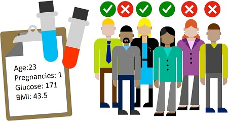

# Create a classification model with Azure ML designer

* Classification is a supervised ML technique used to predict categories or classes. 

* Use Azure ML designer to create classification models by using a drag and drop visual interface, without needing to write any code.

# Identify classification machine learning scenarios

* Classification is a form of ML that is used to predict which category, or class, an item belongs to. This ML technique can be applied to binary and multi-class scenarios. 

* For example, a health clinic might use the characteristics of a patient (such as age, weight, blood pressure, and so on) to predict whether the patient is at risk of diabetes. In this case, the characteristics of the patient are the features, and the label is a binary classification of either 0 or 1, representing non-diabetic or diabetic.

* Diagram of patients with clinical data, classified as diabetic and non-diabetic.
* 

* Like regression, classification is an example of a supervised ML technique in which you train a model using data that includes both the features and known values for the label, so that the model learns to fit the feature combinations to the label. Then, after training has been completed, you can use the trained model to predict labels for new items for which the label is unknown.

* Scenarios for classification machine learning models:
    1. Using clinical data to predict whether a patient will become sick or not.
    2. Using historical data to predict whether text sentiment is positive, negative, or neutral.
    3. Using characteristics of small businesses to predict if a new venture will succeed.

# Understand steps for classification
* Steps to train and evaluate a regression machine learning model as: [Refer ](https://github.com/mkader/Azure-AI/blob/main/3.Use%20Automated%20ML%20in%20Azure%20ML.MD#the-steps-in-a-machine-learning-process-as)

    1. <u>Prepare data</u> (refer previous 4 MD)
    
    2. <u>Train model</u> - To train a classification model, you need a dataset that includes historical features, characteristics of the entity for which you want to make a prediction, and known label values. The label is the class indicator you want to train a model to predict.
    
    3. <u>Evaluate performance</u>
        1. <u>Confusion matrix</u> - is a tool used to assess the quality of a classification model's predictions. It compares predicted labels against actual labels.
            * 
            1. In a binary classification model where you're predicting one of two possible values, the confusion matrix is a 2x2 grid showing the predicted and actual value counts for classes 1 and 0. It categorizes the model's results into four types of outcomes. Using our diabetes example these outcomes can look like:
                1. <u>True Positive</u>: The model predicts the patient has diabetes, and the patient does actually have diabetes.
                2. <u>False Positive</u>: The model predicts the patient has diabetes, but the patient doesn't actually have diabetes.
                3. <u>False Negative</u>: The model predicts the patient doesn't have diabetes, but the patient actually does have diabetes.
                4. <u>True Negative</u>: The model predicts the patient doesn't have diabetes, and the patient actually doesn't have diabetes.
            
            2. data for 100 patients. create a model that predicts a patient doesn't have diabetes 15% of the time, so it predicts 15 people have diabetes and predicts 85 people do not have diabetes. In actuality, suppose 25 people actually do have diabetes and 75 people actually do not have diabetes. Refer image.
            3. For a multi-class classification model (where there are more than two possible classes), the same approach is used to tabulate each possible combination of actual and predicted value counts - so a model with three possible classes would result in a 3x3 matrix with a diagonal line of cells where the predicted and actual labels match.
            4. Metrics that can be derived from the confusion matrix include:
                1. <u>Accuracy</u>: The number of correct predictions (true positives + true negatives) divided by the total number of predictions.
                2. <u>Precision</u>: The number of the cases classified as positive that are actually positive: the number of true positives divided by (the number of true positives plus false positives).
                3. <u>Recall</u>: The fraction of positive cases correctly identified: the number of true positives divided by (the number of true positives plus false negatives).
                4. <u>F1 Score</u>: An overall metric that essentially combines precision and recall.
            5. Of these metrics, accuracy may be the most intuitive. However, you need to be careful about using accuracy as a measurement of how well a model performs. Using the model that predicts 15% of patients have diabetes, when actually 25% of patients have diabetes, we can calculate the following metrics:
                1. The accuracy of the model is: (10+70)/ 100 = 80%.
                2. The precision of the model is: 10/(10+5) = 67%.
                3. The recall of the model is 10/(10+15) = 40%
        2. <u>Choosing a threshold</u> - A classification model predicts the probability for each possible class. In other words, the model calculates a likelihood for each predicted label. In the case of a binary classification model, the predicted probability is a value between 0 and 1. By default, a predicted probability including or above 0.5 results in a class prediction of 1, while a prediction below this threshold means that there's a greater probability of a negative prediction (remember that the probabilities for all classes add up to 1), so the predicted class would be 0.
            * 
            1. Designer has a useful threshold slider for reviewing how the model performance would change depending on the set threshold. 
        * 
        3. <u>ROC curve and AUC metric</u> - Another term for recall is True positive rate, and it has a corresponding metric named False positive rate, which measures the number of negative cases incorrectly identified as positive compared between the number of actual negative cases. Plotting these metrics against each other for every possible threshold value between 0 and 1 results in a curve, known as the <u>ROC curve (ROC stands for receiver operating characteristic, but most data scientists just call it a ROC curve)</u>. In an ideal model, the curve would go all the way up the left side and across the top, so that it covers the full area of the chart. The larger the area under the curve, of AUC metric, (which can be any value from 0 to 1), the better the model is performing. You can review the ROC curve in Evaluation Results.
    4. <u>Deploy a predictive service</u>

# Exercise - Explore classification with Azure Machine Learning designer
* create a classification model that predicts whether a patient is likely to contract diabetes based on factors such as their BMI, age, glucose level, and other indicators.
* https://microsoftlearning.github.io/AI-900-AIFundamentals/instructions/02b-create-classification-model.html

1. Create workspace, compute, pipeline (<u>Draft Details: </u> Diabetes Training) (Refer 4 MD)
2. Create a dataset
    1. Data (under Assets) -> Create -> Name: diabetes-data | Description: Diabetes data | Dataset type: Tabular | From Web Files : https://aka.ms/diabetes-data : Skip data validation: do not select | File format: Delimited | Delimiter: Comma | Encoding: UTF-8 | Column headers: Only first file has headers | Skip rows: None | Dataset contains multi-line data: do not select | Include all columns other than Path | Review | Create
    2. After the dataset has been created, <u>Explore</u> tab to see a sample data,  it represents details from patients who have been tested for diabetes.
3. Load data to canvas
    1. select the <u>Diabetes Training</u> pipeline.
    2. Click on Data -> <u>diabetes-data</u> dataset -> <u>Preview data</u> and close it.
    3. Review the columns
        1. the <u>Diabetic</u> column: the two possible classes for the label that your model will predict, <u>0</u> (the patient does not have diabetes) and <u>1</u> (the patient is diabetic).
        2. Other columns, which represent the features that will be used to predict the label. Note that most of these columns are numeric, but each feature is on its own scale. For example, Age values range from 21 to 77, while DiabetesPedigree values range from 0.078 to 2.3016. When training a machine learning model, it is sometimes possible for larger values to dominate the resulting predictive function, reducing the influence of features that on a smaller scale.

4. Add transformations
    1. Before you can train a model, you typically need to apply some pre-processing transformations to the data.
    2. click on <u>Component</u>. Add & connect module
        1. <u>Select Columns in Dataset</u>. Double click -> <u>Edit column<u> -> <u>columns window</u> -> <u>By name</u> -> <u>Add all</u> the columns. Then remove <u>PatientID</u> and click <u>Save</u>.
    
    2. <u>Normalize Data</u>. Double click. Set the Transformation method to <u>MinMax</u> and the Use 0 for constant columns when checked to <u>True</u>. <u>Edit columns</u>. Select columns <u>With Rules</u> and copy the following list. Click Save and close the selection box
        1. Pregnancies, PlasmaGlucose, DiastolicBloodPressure, TricepsThickness, SerumInsulin, BMI, DiabetesPedigree, Age
        2. The data transformation is normalizing the numeric columns to put them on the same scale, which should help prevent columns with large values from dominating model training. 

5. Run the pipeline as an experiment- To apply your data transformations. Select Submit. named <u>mslearn-diabetes-training</u>

6. View the transformed data
    1. When the run has completed, the dataset is now prepared for model training. Click on <u>Job detail</u>.
    2. <u>Normalize Data</u> -> <u>Preview data</u> -> <u>Transformed dataset</u>.
    3. View the data, noting that the numeric columns you selected have been normalized to a common scale. Close.
    4. After you’ve used data transformations to prepare the data, you can use it to train a ML model.

7. Add training modules
    1. It’s common practice to train the model using a subset of the data....
    
    2. Add more steps to extend the Diabetes Training pipeline as shown figure.
    1. <u>Split Data</u> module. Splitting mode: Split Rows | Fraction of rows in the first output dataset: 0.7 | Randomized split: True | Random seed: 123 | Stratified split: False
    2. <u>Train Model</u>. The model we’re training will predict the <u>Diabetic</u> value, set the <u>Label column</u> to <u>Diabetic</u>. The Diabetic label the model will predict is a class (0 or 1), so we need to train the model using a classification algorithm. Specifically, there are two possible classes, so we need a binary classification algorithm.
    3. <u>Two-Class Logistic Regression</u> module. To test the trained model, use it to score the validation dataset we held back when we split the original data - in other words, predict labels for the features in the validation dataset.
    5. <u>Score Model</u> module

8. Run the training pipeline
    1. Now you’re ready to run the training pipeline and train the model.
    2. Select Submit, and run the pipeline using the existing experiment named mslearn-diabetes-training.
    3. When the experiment run has finished, select <u>Job detail</u> -> <u>the Score Model</u> -> Preview data -> <u>Scored dataset</u> to view the results.
    5. note that next to the <u>Diabetic</u> column (which contains the known true values of the label) there is a new column named <u>Scored Labels</u>, which contains the predicted label values, and a <u>Scored Probabilities</u> column containing a probability value between 0 and 1. This indicates the probability of a positive prediction, so probabilities greater than 0.5 result in a predicted label of 1 (diabetic), while probabilities between 0 and 0.5 result in a predicted label of 0 (not diabetic).
    6. Close the Score Model result visualization tab.
    7. The model is predicting values for the <u>Diabetic</u> label, but how reliable are its predictions? To assess that, you need to evaluate the model.
    8. The validation data you held back and used to score the model includes the known values for the label. So to validate the model, you can compare the true values for the label to the label values that were predicted when you scored the validation dataset. Based on this comparison, you can calculate various metrics that describe how well the model performs.

* 
9. Add an Evaluate Model module
    1. Add <u>Evaluate Model</u> module. Select Submit, and run the pipeline using the existing experiment.
    2. When the experiment run has finished, select Job detail -> Evaluate Model module -> Preview data -> Evaluation results to view the performance metrics. These metrics can help data scientists assess how well the model predicts based on the validation data.
    3. view the confusion matrix for the model. Observe the predicted and actual value counts for each possible class.
        1. <u>Accuracy</u>: In other words, what proportion of diabetes predictions did the model get right?
        2. <u>Precision</u>: In other words, out of all the patients that the model predicted as having diabetes, the percentage of time the model is correct.
        3. <u>Recall</u>: In other words, out of all the patients who actually have diabetes, how many diabetic cases did the model identify correctly?
        4. <u>F1 Score</u>
    4. Use the <u>Threshold</u> slider located above the list of metrics. Try moving the threshold slider and observe the effect on the confusion matrix. If you move it all the way to the left (0), the Recall metric becomes 1, and if you move it all the way to the right (1), the Recall metric becomes 0.
    5. Look above the Threshold slider at the <u>ROC curve</u> and <u>AUC metric</u> listed with the other metrics below. To get an idea of how this area represents the performance of the model, imagine a straight diagonal line from the bottom left to the top right of the ROC chart. This represents the expected performance if you just guessed or flipped a coin for each patient - you could expect to get around half of them right, and half of them wrong, so the area under the diagonal line represents an AUC of 0.5. If the AUC for your model is higher than this for a binary classification model, then the model performs better than a random guess.
    6. The performance of this model isn’t all that great, partly because we performed only minimal feature engineering and pre-processing. You could try a different classification algorithm, such as <u>Two-Class Decision Forest</u>, and compare the results. You can connect the outputs of the <u>Split Data</u> module to multiple <u>Train Model</u> and <u>Score Model</u> modules, and you can connect a second Score Model module to the <u>Evaluate Model</u> module to see a side-by-side comparison. 

10. Create an inference pipeline
    1. Jobs ->  the experiment <u>mslearn-diabetes-training</u> -> the <u>Diabetes Training</u> pipeline.
    2. <u>Create inference pipeline</u> -> <u>Real-time inference pipeline</u>. -> Draft: rename <u>Predict Diabetes</u>, and then review the new pipeline. Some of the transformations and training steps are a part of this pipeline. The trained model will be used to score the new data. The pipeline also contains a web service output to return results.
    
    3. make the following changes to the inference pipeline
        1. Add a <u>web service input</u> component for new data to be submitted.
        2. Replace the <u>diabetes-data</u> dataset with an <u>Enter Data Manually</u> module that doesn’t include the label column (<u>Diabetic</u>).
        3. Edit the columns selected in the <u>Select Columns in Dataset</u> module.
        4. Remove the <u>Evaluate Model</u> module.
        5. Insert an <u>Execute Python Script</u> module before the web service output to return only the patient ID, predicted label value, and probability.
    4. The inference pipeline assumes that new data will match the schema of the original training data, so the <u>diabetes-data</u> dataset from the training pipeline is included. However, this input data includes the <u>Diabetic</u> label that the model predicts, which is not included in new patient data for which a diabetes prediction hasn’t yet been made. Delete this module and replace it with an <u>Enter Data Manually</u> module, containing the following CSV data, which includes feature values without labels for three new patient observations:
    ``` mark
        PatientID,Pregnancies,PlasmaGlucose,DiastolicBloodPressure,TricepsThickness,SerumInsulin,BMI,DiabetesPedigree,Age
        1882185,9,104,51,7,24,27.36983156,1.350472047,43
        1662484,6,73,61,35,24,18.74367404,1.074147566,75
        1228510,4,115,50,29,243,34.69215364,0.741159926,59
    ```     
    5. Edit the <u>Select Columns in Dataset</u> module. Remove <u>Diabetic</u> from the Selected Columns.
    6. Delete <u>Evaluate Model</u> module
    7. <u>Execute Python Script</u> module, replacing python script (which selects only the <u>PatientID, Scored Labels and Scored Probabilities</u> columns and renames them appropriately):
    ``` mark
        import pandas as pd

        def azureml_main(dataframe1 = None, dataframe2 = None):

            scored_results = dataframe1[['Scored Labels', 'Scored Probabilities']]
            scored_results.rename(columns={'Scored Labels':'DiabetesPrediction',
                                        'Scored Probabilities':'Probability'},
                                inplace=True)
            return scored_results
    ``` 
    8. Run the pipeline as a new experiment named <u>mslearn-diabetes-inference</u>.
    9. When the pipeline has completed, select <u>Job detail</u> -> <u>Execute Python Script</u> -> <u>Preview data</u> -> <u>Result dataset</u> to see the predicted labels and probabilities for the three patient observations in the input data.
    10. Your inference pipeline predicts whether or not patients are at risk for diabetes based on their features. Now you’re ready to publish the pipeline so that client applications can use it.
    11. After you’ve created and tested an inference pipeline for real-time inferencing, you can publish it as a service for client applications to use.

11. Deploy a service - View the <u>Predict Diabetes</u> inference pipeline -> <u>Job detail</u> -> <u>Deploy</u> -> deploy a new real-time endpoint => Name: predict-diabetes | Description: Classify diabetes | Compute type: Azure Container Instance
    
12. Test the service
    1. On the <u>Endpoints</u> page, open the <u>predict-diabetes</u> real-time endpoint.
    2. select the Test tab. Test the below json
    ``` mark
         {
           "Inputs": {
             "input1":
               [
                 { "PatientID": 1882185,
                   "Pregnancies": 9,
                   "PlasmaGlucose": 104,
                   "DiastolicBloodPressure": 51,
                   "TricepsThickness": 7,
                   "SerumInsulin": 24,
                   "BMI": 27.36983156,
                   "DiabetesPedigree": 1.3504720469999998,
                   "Age": 43 }
                 ]
               },
           "GlobalParameters":  {}
         }
    ```      
    3. Note The JSON above defines features for a patient, and uses the predict-diabetes service you created to predict a diabetes diagnosis.
    4. see the output ‘DiabetesPrediction’. The output is 1 if the patient is predicted to have diabetes, and 0 if the patient is predicted not to have diabetes.
    5. ready to be connected to a client application using the credentials in the Consume tab.

13. Clean-up
    
# Quiz
    
1. You're using Azure Machine Learning designer to create a training pipeline for a binary classification model. You've added a dataset containing features and labels, a Two-Class Decision Forest module, and a Train Model module. You plan to use Score Model and Evaluate Model modules to test the trained model with a subset of the dataset that wasn't used for training. What's another module should you add?
    * [ ] Join Data
    * [x] Split Data. Correct. Use a Split Data module to randomly split a dataset into training and validation subsets.
    * [ ] Select Columns in Dataset
2. You use an Azure Machine Learning designer pipeline to train and test a binary classification model. You review the model's performance metrics in an Evaluate Model module, and note that it has an AUC score of 0.3. What can you conclude about the model?
    * [ ] The model can explain 30% of the variance between true and predicted labels.
    * [ ] The model predicts accurately for 70% of test cases.
    * [x] The model performs worse than random guessing. Correct. An AUC of 0.5 is what you'd expect with random prediction of a binary model.

3. You use Azure Machine Learning designer to create a training pipeline for a classification model. What must you do before deploying the model as a service?
    * [x] Create an inference pipeline from the training pipeline. Correct. You must create an inference pipeline to deploy as a service.
    * [ ] Add an Evaluate Model module to the training pipeline
    * [ ] Clone the training pipeline with a different name    
