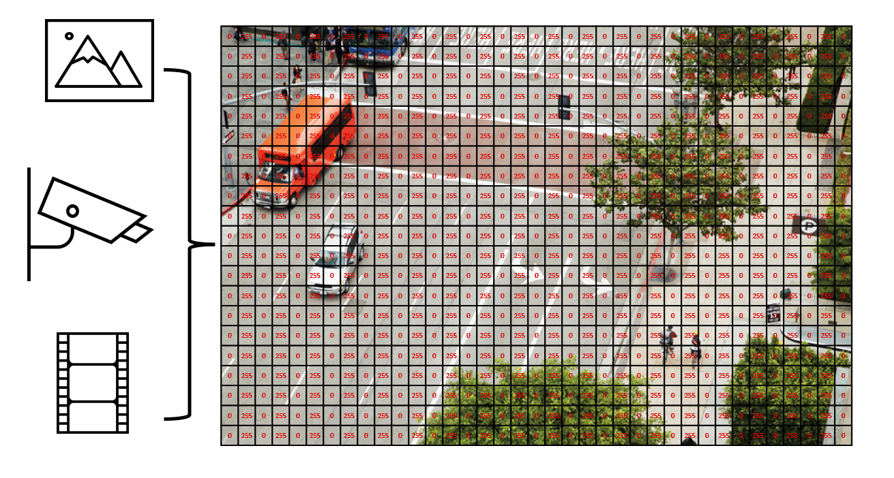
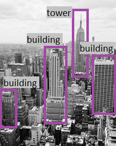
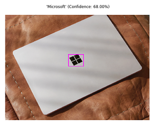
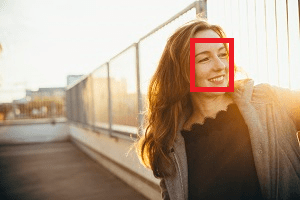

* The Computer Vision service enables software engineers to create intelligent solutions that extract information from images; a common task in many artificial intelligence (AI) scenarios.

* Computer vision is one of the core areas of AI), and focuses on creating solutions that enable AI applications to "see" the world and make sense of it.

* To process images (live camera feed or digital photographs or videos) is the key to creating software that can emulate human visual perception.

* Some potential uses for computer vision include:
    1. Content Organization: Identify people or objects in photos and organize them based on that identification. Photo recognition applications like this are commonly used in photo storage and social media applications.
    2. Text Extraction: Analyze images and PDF documents that contain text and extract the text into a structured format.
    3. Spatial Analysis: Identify people or objects, such as cars, in a space and map their movement within that space.


* To an AI application, an image is just an array of pixel values. These numeric values can be used as features to train ML models that make predictions about the image and its contents.

* Training ML models from scratch can be very time intensive and require a large amount of data. MS's Computer Vision service gives you access to pre-trained computer vision capabilities.

# Get started with image analysis on Azure
   
1. The Computer Vision service is a cognitive service in MS Azure that provides pre-built computer vision capabilities. The service can analyze images, and return detailed information about an image and the objects it depicts.
    
2. Azure resources for Computer Vision
    1. To use the Computer Vision service, you need to create a resource in Azure. Use use either of the following resource types:
        1. Computer Vision: A specific resource for the Computer Vision service. Use this resource type if you don't intend to use any other cognitive services, or if you want to track utilization and costs for your Computer Vision resource separately.
        2. Cognitive Services: A general cognitive services resource that includes Computer Vision along with many other cognitive services; such as Text Analytics, Translator Text, and others. Use this resource type if you plan to use multiple cognitive services and want to simplify administration and development.
    2. Whichever type of resource you choose to create, it will provide two pieces of information that you will need to use it:
        1. A key that is used to authenticate client applications.
        2. An endpoint that provides the HTTP address at which your resource can be accessed.
    
    3. Analyzing images with the Computer Vision service - Resoruce created, submit images to the Computer Vision service to perform a wide range of analytical tasks.
    
    4. Describing an image - Computer Vision has the ability to analyze an image, evaluate the objects that are detected, and generate a human-readable phrase or sentence that can describe what was detected in the image. Depending on the image contents, the service may return multiple results, or phrases. Each returned phrase will have an associated confidence score, indicating how confident the algorithm is in the supplied description. The highest confidence phrases will be listed first. 
        * 
        1. For example, the image of the Empire State building in New York. The returned phrases are listed below the image in the order of confidence.
            1. A black and white photo of a city
            2. A black and white photo of a large city
            3. A large white building in a city

    5. Tagging visual features - The image descriptions generated by Computer Vision are based on a set of thousands of recognizable objects, which can be used to suggest tags for the image. These tags can be associated with the image as metadata that summarizes attributes of the image; and can be particularly useful if you want to index an image along with a set of key terms that might be used to search for images with specific attributes or contents.
        1.  For example, the tags returned for the Empire State building image include: skyscraper, tower, building

    * 
    6. Detecting objects - The object detection capability is similar to tagging, in that the service can identify common objects; but rather than tagging, or providing tags for the recognized objects only, this service can also return what is known as bounding box coordinates. Not only will you get the type of object, but you will also receive a set of coordinates that indicate the top, left, width, and height of the object detected, which you can use to identify the location of the object in the image

    7. Detecting brands - This feature provides the ability to identify commercial brands. The service has an existing database of thousands of globally recognized logos from commercial brands of products.
        1. When you call the service and pass it an image, it performs a detection task and determine if any of the identified objects in the image are recognized brands. The service compares the brands against its database of popular brands spanning clothing, consumer electronics, and many more categories. If a known brand is detected, the service returns a response that contains the brand name, a confidence score (from 0 to 1 indicating how positive the identification is), and a bounding box (coordinates) for where in the image the detected brand was found.
        * 
        2. For example, a laptop imag has a Microsoft logo on its lid, which is identified and located by the Computer Vision service.

    8. Detecting faces - The Computer Vision service can detect and analyze human faces in an image, including the ability to determine age and a bounding box rectangle for the location of the face(s). The facial analysis capabilities of the Computer Vision service are a subset of those provided by the dedicated Face Service. If you need basic face detection and analysis, combined with general image analysis capabilities, you can use the Computer Vision service; but for more comprehensive facial analysis and facial recognition functionality, use the Face service.
        * 
        1. example shows an image of a person with their face detected and approximate age estimated.
    
    9. Categorizing an image - Computer Vision can categorize images based on their contents. The service uses a parent/child hierarchy with a "current" limited set of categories. When analyzing an image, detected objects are compared to the existing categories to determine the best way to provide the categorization. As an example, one of the parent categories is people_. 
        * 
        1. This image of a person on a roof is assigned a category of people_.
        * 
        2. A slightly different categorization is returned for the following image, which is assigned to the category people_group because there are multiple people in the image:

    10. Detecting domain-specific content - When categorizing an image, the Computer Vision service supports two specialized domain models:
        1. Celebrities - The service includes a model that has been trained to identify thousands of well-known celebrities from the worlds of sports, entertainment, and business.
        2. Landmarks - The service can identify famous landmarks, such as the Taj Mahal and the Statue of Liberty.
        * 
        3. For example, when analyzing the following image for landmarks, the Computer Vision service identifies the Eiffel Tower, with a confidence of 99.41%.

    11. Optical character recognition (OCR) - The Computer Vision service can use OCR capabilities to detect printed and handwritten text in images. This capability is explored in the Read text with the Computer Vision service module on Microsoft Learn.

    12. Additional capabilities, the Computer Vision service can:
        1. Detect image types - for example, identifying clip art images or line drawings.
        2. Detect image color schemes - specifically, identifying the dominant foreground, background, and overall colors in an image.
        3. Generate thumbnails - creating small versions of images.
        4. Moderate content - detecting images that contain adult content or depict violent, gory scenes.

# Exercise - Explore Computer Vision
   1. Use a simple command-line application to see the Computer Vision service in action. The same principles and functionality apply in real-world solutions, such as web sites or phone apps.

   2. For example, suppose the fictitious retailer Northwind Traders has decided to implement a “smart store”, in which AI services monitor the store to identify customers requiring assistance, and direct employees to help them. By using the Computer Vision service, images taken by cameras throughout the store can be analyzed to provide meaningful descriptions of what they depict.

   3. Create a Cognitive Services resource
        1. use the Computer Vision service by creating either a Computer Vision resource or a Cognitive Services resource.
        2. Create a Cognitive Services resource -> Pricing tier: Standard S0.

   4. Run Cloud Shell -> Select PowerShell -> Create storage

   5. Configure and run a client application
        1. In the command shell, enter the following command to download the sample application and save it to a folder called ai-900.
        ``` makr
            git clone https://github.com/MicrosoftLearning/AI-900-AIFundamentals ai-900
        ```
        * 
        2. The files are downloaded to a folder named ai-900. See all of the files in your Cloud Shell storage and work with them. Type the following command into the shell:
        ``` mark
            code .
        ```
        * 
        3. select analyze-image.ps1. This file contains some code that uses the Computer Vision service to analyze an image, as shown here:
        4. it needs the endpoint URL and either of the keys for your Cognitive Services resource (the Keys and Endpoints), replacing the YOUR_KEY and YOUR_ENDPOINT placeholder values respectively.
        5. Save to save your changes.
        * 
        6. The sample client application will use your Computer Vision service to analyze the following image, taken by a camera in the Northwind Traders store:
        7. In the PowerShell pane, enter the following commands to run the code:
        ``` mark
            cd ai-900
            ./analyze-image.ps1 store-camera-1.jpg
        ```
        8. Review the results of the image analysis, which include:
            1. A suggested caption that describes the image.
            2. A list of objects identified in the image.
            3. A list of “tags” that are relevant to the image.
        9. Now let’s try another image: ./analyze-image.ps1 store-camera-2.jpg .Review the results of the image analysis.
        10. Let’s try one more: ./analyze-image.ps1 store-camera-3.jpg
 .Review the results of the image analysis
