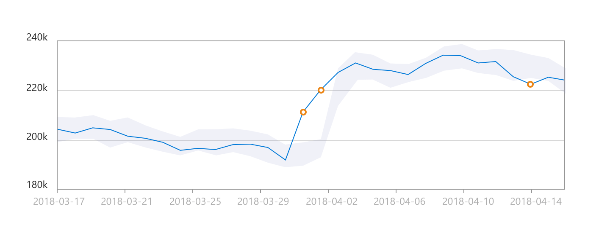

# Introduction to Anomaly Detector
* Discover the services available on Azure to detect anomalies in your time-series, or real-time data.
* Anomaly detection is an AI technique used to determine whether values in a series are within expected parameters.
* There are many scenarios where anomaly detection is helpful. For example, a smart HVAC system might use anomaly detection to monitor temperatures in a building and raise an alert if the temperature goes above or below the expected value for a given period of time.
* Other scenarios include:
    1. monitoring blood pressure
    2. evaluating mean time between failures for hardware products
    3. comparing month-over-month expenses for product costs

# What is Anomaly Detector?
* Anomalies are values that are outside the expected values or range of values.

* In the graphic depicting the time series data, there is a light shaded area that indicates the boundary, or sensitivity range. The solid blue line is used to indicate the measured values. When a measured value is outside of the shaded boundary, an orange dot is used to indicate the value is considered an anomaly. The sensitivity boundary is a parameter that you can specify when calling the service. It allows you to adjust that boundary settings to tweak the results.
* Anomaly detection is considered the act of identifying events, or observations, that differ in a significant way from the rest of the data being evaluated. Accurate anomaly detection leads to prompt troubleshooting, which helps to avoid revenue loss and maintain brand reputation.

# Azure's Anomaly Detector service
* Anomaly Detector is a part of the Decision Services category within Azure Cognitive Services. It is a cloud-based service that enables you to monitor time series data, and to detect anomalies in that data. It does not require you to know ML. The service uses the concept of a "one parameter" strategy. The main parameter you need to customize is “Sensitivity”, which is from 1 to 99 to adjust the outcome to fit the scenario. The service can detect anomalies in historical time series data and also in real-time data such as streaming input from IoT devices, sensors, or other streaming input sources.

# How Anomaly Detector works
* The Anomaly Detector service identifies anomalies that exist outside the scope of a boundary. The boundary is set using a sensitivity value. By default, the upper and lower boundaries for anomaly detection are calculated using concepts known as expectedValue, upperMargin, and lowerMargin. The upper and lower boundaries are calculated using these three values. If a value exceeds either boundary, it will be identified as an anomaly. You can adjust the boundaries by applying a marginScale to the upper and lower margins as demonstrated by the following formula.

``` mark
upperBoundary = expectedValue + (100 - marginScale) * upperMargin
```

# Data format (JSON)
* The granularity is set as hourly and is used to represent temperatures in degrees Celsius that were recorded at the timestamps indicated.
``` mark
    {
        "granularity": "hourly",
        "series": [
          {
            "timestamp": "2021-03-02T01:00:00Z",
            "value": -10.56
          },
          {
            "timestamp": "2021-03-02T02:00:00Z",
            "value": -8.30
          },
          {
            "timestamp": "2021-03-02T03:00:00Z",
            "value": -10.30
          },
          {
            "timestamp": "2021-03-02T04:00:00Z",
            "value": 5.95
          },
        ]
    }
```
* The service will support a maximum of 8640 data points however, sending this many data points in the same JSON object, can result in latency for the response. Improve the response by breaking your data points into smaller chunks (windows) and sending these in a sequence.
* The same JSON object format is used in a streaming scenario. The main difference is that you will send a single value in each request. The streaming detection method will compare the current value being sent and the previous value sent.

# Data consistency recommendations
* If your data may have missing values in the sequence, consider the following recommendations.
    1. Sampling occurs every few minutes and has less than 10% of the expected number of points missing. In this case, the impact should be negligible on the detection results.
    2. If you have more than 10% missing, there are options to help "fill" the data set. Consider using a linear interpolation method to fill in the missing values and complete the data set. This will fill gaps with evenly distributed values.
* The Anomaly Detector service will provide the best results if your time series data is evenly distributed. If the data is more randomly distributed, you can use an aggregation method to create a more even distribution data set.

# When to use Anomaly Detector
   1. The Anomaly Detector service supports batch processing of time series data and last-point anomaly detection for real-time data.
   2. Batch detection - involves applying the algorithm to an entire data series at one time. The concept of time series data involves evaluation of a data set as a batch. Use your time series to detect any anomalies that might exist throughout your data. This operation generates a model using your entire time series data, with each point analyzed using the same model.
   3. Batch detection is best used when your data contains:
        1. Flat trend time series data with occasional spikes or dips
        2. Seasonal time series data with occasional anomalies
            1. Seasonality is considered to be a pattern in your data, that occurs at regular intervals. Examples would be hourly, daily, or monthly patterns. Using seasonal data, and specifying a period for that pattern, can help to reduce the latency in detection.
   4. When using the batch detection mode, Anomaly Detector creates a single statistical model based on the entire data set that you pass to the service. From this model, each data point in the data set is evaluated and anomalies are identified.

# Batch detection example
   1. Consider a pharmaceutical company that stores medications in storage facilities where the temperature in the facilities needs to remain within a specific range. To evaluate whether the medication remained stored in a safe temperature range in the past three months we need to know:
        1. the maximum allowable temperature
        2. the minimum allowable temperature
        3. the acceptable duration of time for temperatures to be outside the safe range
    2. If you are interested in evaluating compliance over historical readings, you can extract the required time series data, package it into a JSON object, and send it to the Anomaly Detector service for evaluation. You will then have a historical view of the temperature readings over time.

# Real-time detection
   1. Real-time detection uses streaming data by comparing previously seen data points to the last data point to determine if your latest one is an anomaly. This operation generates a model using the data points you send, and determines if the target (current) point is an anomaly. By calling the service with each new data point you generate, you can monitor your data as it's created.

   2. Real-time detection example 
        1. carbonated beverage industry where real-time anomaly detection may be useful. The carbon dioxide added to soft drinks during the bottling or canning process needs to stay in a specific temperature range.
        2. Bottling systems use a device known as a carbo-cooler to achieve the refrigeration of the product for this process. If the temperature goes too low, the product will freeze in the carbo-cooler. If the temperature is too warm, the carbon dioxide will not adhere properly. Either situation results in a product batch that cannot be sold to customers.
        3. This carbonated beverage scenario is an example of where you could use streaming detection for real-time decision making. It could be tied into an application that controls the bottling line equipment. You may use it to feed displays that depict the system temperatures for the quality control station. A service technician may also use it to identify equipment failure potential and servicing needs.
        4. You can use the Anomaly Detector service to create a monitoring application configured with the above criteria to perform real-time temperature monitoring. You can perform anomaly detection using both streaming and batch detection techniques. Streaming detection is most useful for monitoring critical storage requirements that must be acted on immediately. Sensors will monitor the temperature inside the compartment and send these readings to your application or an event hub on Azure. Anomaly Detector will evaluate the streaming data points and determine if a point is an anomaly.

# Exercise - Explore Cognitive Services
   1. https://microsoftlearning.github.io/AI-900-AIFundamentals/instructions/01-module-01.html
   2. Anomaly Detector is used to analyze data values over time, and to detect any unusual values that might indicate a problem or an issue for further investigation. For example, a sensor in a temperature-controlled storage facility might monitor the temperature every minute and log the measured values. You can use the Anomaly Detector service to analyze the logged temperature values and flag any that fall significantly outside of the normal range of expected temperatures.
   3. Create an Anomaly Detector resource
   4. Run Cloud Shell -> Select PowerShell -> Create storage (if it ask)
   5. Configure and run a client application
        1. run a simple application that uses the Anomaly Detector service to analyze data.
        2. download the sample application and save it to a folder called ai-900.
        ``` mark
            git clone https://github.com/MicrosoftLearning/AI-900-AIFundamentals ai-900
        ```           
        3. open editor code .
        4. folder ai-900 -> detect-anomalies.ps1 -> replacing the YOUR_KEY and YOUR_ENDPOINT (code that uses the Anomaly Detection service)
        5. Save & Close Editor.
        6. Remember, anomaly detection is an AI technique used to determine whether values in a series are within expected parameters. The sample client application will use your Anomaly Detector service to analyze a file containing a series of date/times and numeric values. The application should return results indicating at each time point, whether the numeric value is within expected parameters.
        7. Run in Powershell 
         ``` mark
            cd ai-900
            .\detect-anomalies.ps1
        ```     
        8. the final column in the results is True or False to indicate if the value recorded at each date/time is considered an anomaly or not.
